# The tsecon gallery — every method, worked

Each section: what the method is, **when you reach for it**, runnable code on
synthetic data, and the figure it produces. All figures are generated by
[showcase.py](showcase.py) in the library's house style ([Module 13](../roadmap/13-visualization.md))
and regenerate with one command:

```sh
.venv/bin/python docs/examples/showcase.py
```

Every number these methods produce is validated against a reference
implementation (statsmodels, SciPy, NumPy, `arch`) in the test suite — the
[fixtures](../../fixtures/) pin the golden values.

---

## 1 · Exploration: ACF and PACF

**Use case:** the first look at any series — how persistent is it, and what
lag structure should a model have? The classic Box-Jenkins identification
pattern: an AR(p) shows geometric ACF decay and a PACF that cuts off after
lag p; an MA(q) shows the mirror image.

```python
import tsecon
r = tsecon.acf(y, nlags=24)        # dict: acf, bartlett_se
p = tsecon.pacf(y, nlags=24)       # Yule-Walker ("yw") or "ols"
```

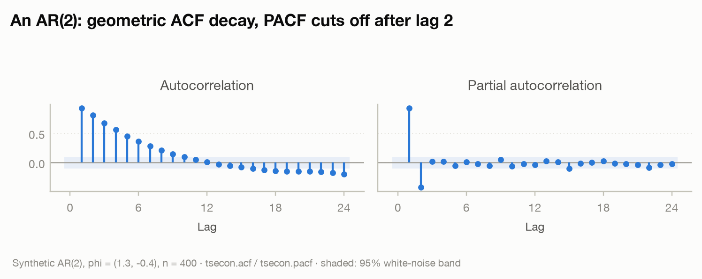

The synthetic series is an AR(2) with φ = (1.3, −0.4): the ACF decays
smoothly (with a hint of oscillation), while the PACF shows exactly two
spikes and then dies — read "fit an AR(2)" straight off the plot.
Matches statsmodels at 1e-12.

---

## 2 · The stationarity workflow

**Use case:** before fitting anything, decide whether the series needs
differencing. Running ADF alone is a common mistake — ADF's null is a unit
root, KPSS's null is stationarity, and only *together* do they give a
confident answer. `check_stationarity()` runs both and classifies the
confirmatory quadrant.

```python
rep = tsecon.check_stationarity(y)
rep["quadrant"]         # "Stationary" | "UnitRoot" | "Conflict" | "Inconclusive"
rep["recommendation"]   # "Proceed" | "Difference" | "Detrend"
rep["interpretation"]   # a plain-language explanation of the evidence
```

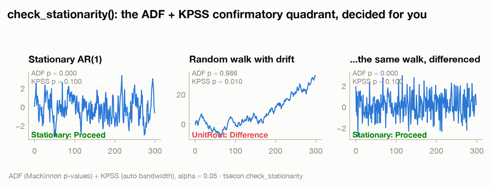

Left to right: a stationary AR(1) (both tests agree: proceed), a random walk
with drift (both tests agree: difference it), and the differenced walk
(proceed) — the workflow loop closes. The underlying `tsecon.adf` carries the
full MacKinnon p-value response surfaces; `tsecon.kpss` uses the
Hobijn-Franses-Ooms automatic bandwidth. Both match statsmodels at 1e-8.

---

## 3 · Robust standard errors (HAC / Newey-West)

**Use case:** any regression on time series data. With autocorrelated
errors, textbook OLS standard errors are *too small* — you'll find
"significant" effects that aren't there. HAC (heteroskedasticity- and
autocorrelation-consistent) standard errors fix the variance estimate
without changing the coefficients.

```python
r = tsecon.ols(y, X, se_type="hac")          # Newey-West, automatic bandwidth
r = tsecon.ols(y, X, se_type="hac", maxlags=8)
r = tsecon.ols(y, X, se_type="hc1")          # heteroskedasticity-only
tsecon.long_run_variance(x, kernel="qs")     # the underlying LRV machinery
```


Left: one representative sample where the naive interval confidently
excludes the true β while the HAC interval honestly includes it. Right: the
same comparison run **3,000 times** (9,000 regressions, seconds through the
Rust core): nominal 95% intervals cover only ~75% of the time under iid or
White standard errors; Newey-West restores most of the gap (the remainder is
the well-known small-sample HAC undercoverage — the roadmap's EWC fixed-b
inference, already implemented in the crate, is the modern answer).
HAC standard errors match statsmodels `cov_type="HAC"` at 1e-10.

---

## 4 · Bootstrap for dependent data

**Use case:** inference when asymptotics are dubious — small samples,
non-normal data, complicated statistics. The catch with time series: naive
iid resampling *destroys the dependence structure* and gives you confidence
intervals that are far too narrow. Block schemes resample contiguous chunks
to preserve it.

```python
opt = tsecon.optimal_block_length(y)                   # Politis-White (2004)
idx = tsecon.bootstrap_indices(n, scheme="stationary", # Politis-Romano
                               seed=b, p=1/opt["stationary"])
resampled = y[idx]
```

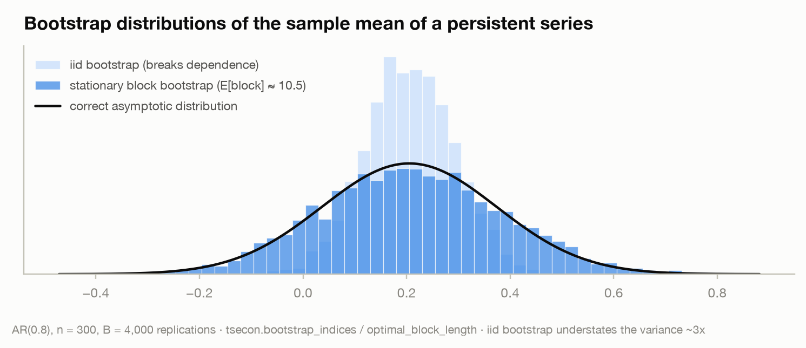

The bootstrap distribution of the sample mean of an AR(0.8) series, 4,000
replications: the iid bootstrap (light) is dramatically overconfident —
about 3× too narrow — while the stationary block bootstrap (dark) with the
automatically selected block length lands on the correct asymptotic
distribution (black curve). Wild bootstrap weights (Rademacher, Mammen) are
also available for regression settings. Same seed ⇒ bit-identical draws at
any thread count.

---

## 5 · State-space models and the Kalman filter

**Use case:** extracting an unobserved signal from noisy measurements —
trend extraction, missing-data interpolation, and the estimation engine
under ARIMA, unobserved-components, and nowcasting models. This is the
library's single most load-bearing component: exact diffuse initialization,
missing data handled natively.

```python
r = tsecon.local_level_smooth(y, sigma2_eps=4.8, sigma2_eta=0.5)
r["smoothed_state"]       # E[level_t | all data]  — NaNs bridged automatically
r["smoothed_state_var"]   # honest uncertainty, wider where data are missing
tsecon.ar_loglik(y, [0.6, -0.2], sigma2=1.4, intercept=1.5)  # exact MLE kernel
```

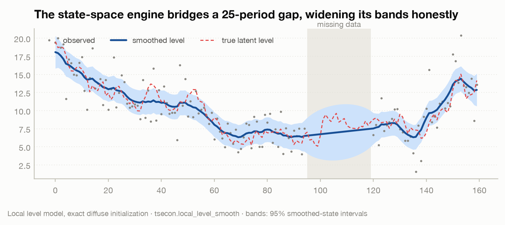

A local-level model with a 25-period gap in the observations: the smoother
bridges the gap, the 95% band balloons exactly where information is missing,
and the true latent path (dashed, never seen by the model inside the gap)
stays within the band. Matches statsmodels' exact-diffuse results at ~1e-11.

---

## 6 · VAR: impulse responses and variance decomposition

**Use case:** the workhorse of empirical macro — how does a system of
variables respond dynamically to a shock in one of them? Fit a VAR, identify
shocks (Cholesky here; the full identification suite is Module 06), and read
off impulse responses and variance decompositions.

```python
r    = tsecon.var_fit(data, lags=2)                 # params, sigma_u, ICs, stability
irf  = tsecon.var_irf(data, lags=2, horizon=16)     # [h][response][shock]
fevd = tsecon.var_fevd(data, lags=2, horizon=16)
g    = tsecon.var_granger(data, caused=[0], causing=[1], lags=2)
fc   = tsecon.var_forecast(data, lags=2, steps=8)   # point + intervals
```


The synthetic system has a built-in causal story (demand moves first, output
responds with a lag, the policy rate leans against both), and the estimated
IRF grid recovers it — including the near-zero response of demand to output
shocks that the recursive ordering implies. Every array matches statsmodels
at 1e-8.

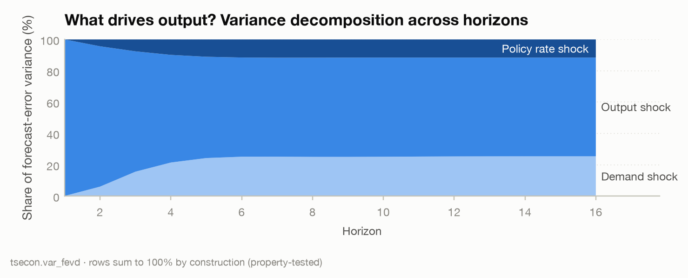

---

## 7 · Trend-cycle filters

**Use case:** separating the business cycle from the trend. This is a
methodological minefield — Hamilton (2018) famously argued "why you should
never use the HP filter" — so the library ships the alternatives side by
side and makes their disagreement visible rather than hiding it.

```python
hp  = tsecon.hp_filter(gdp, lamb=1600.0)       # + one_sided=True real-time variant
ham = tsecon.hamilton_filter(gdp, h=8, p=4)    # the modern alternative
bk  = tsecon.bk_filter(gdp, low=6, high=32, k=12)
cf  = tsecon.cf_filter(gdp, low=6, high=32)
```

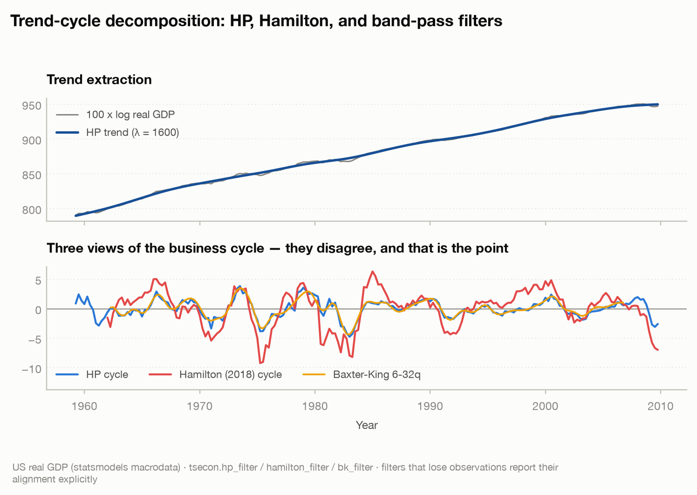

Real US GDP: the HP and Baxter-King cycles broadly agree; the Hamilton
filter reads recessions deeper and turns later — a genuine methodological
difference, not a bug. Filters that lose observations return explicit
alignment metadata (`first_index`) so nothing silently misaligns. HP runs
through an O(n) pentadiagonal solver, never a dense matrix.

---

## 8 · Forecast evaluation

**Use case:** the discipline layer. Never report a forecast without a
benchmark and never claim superiority without a test. MASE scales errors by
an in-sample naive forecast (1.0 = "no better than naive"); the
Diebold-Mariano test asks whether an accuracy difference is statistically
real, with the Harvey-Leybourne-Newbold small-sample correction.

```python
fc  = tsecon.theta_forecast(y, steps=20, period=4)   # the M3-winning benchmark
acc = tsecon.accuracy(actual, fc, insample=train, period=4)  # rmse/mae/mase/...
dm  = tsecon.dm_test(e_benchmark, e_model, h=1, loss="squared")
```

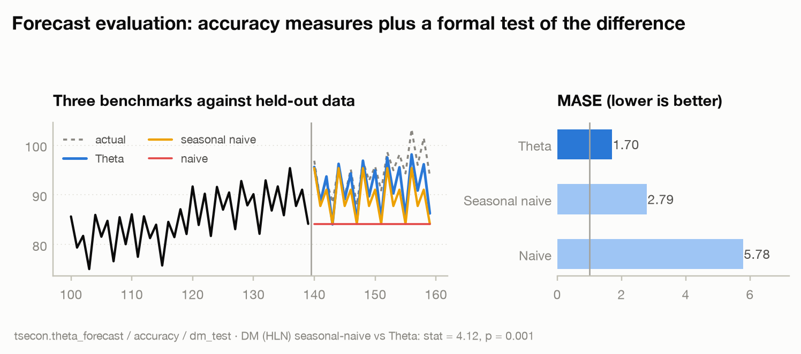

Theta beats the seasonal naive decisively here (MASE 1.23 vs 2.15, DM p =
0.001) — and the plot shows *why*: it captures both the trend and the
seasonal shape. The DM statistic matches the documented reference case at
1e-10.

---

## 9 · GARCH: volatility and risk

**Use case:** any application where the *size* of movements matters —
risk management, option pricing, portfolio construction. Volatility
clusters (calm and stormy periods alternate), which makes it forecastable
even when returns themselves are not.

```python
r = tsecon.garch_fit(returns, vol="garch", dist="normal", forecast_horizon=60)
r["params"], r["se_robust"]         # QMLE + Bollerslev-Wooldridge robust SEs
r["conditional_volatility"]         # the fitted sigma_t path
r["variance_forecast"]              # analytic multi-step, mean-reverting
# also: vol="gjr" (asymmetry), vol="egarch", dist="t" (fat tails)
```

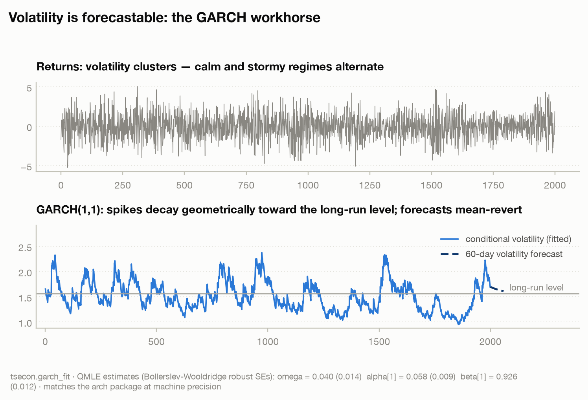

The fitted persistence (α + β ≈ 0.98) says volatility shocks take months to
die out — the long-run anchor and mean-reverting forecast fan follow
directly. Fixed-parameter likelihoods match Kevin Sheppard's `arch` package
at machine precision, and our optimizer's fits match or beat arch's optimum
on every golden case.

---

## 10 · Bayesian VAR: posterior impulse responses

**Use case:** VARs have many parameters and macro samples are short — the
frequentist answer is noisy IRFs. The Bayesian answer is *shrinkage*: the
Minnesota prior pulls coefficients toward a random-walk baseline, and the
conjugate Normal-inverse-Wishart structure gives the entire posterior in
closed form — no MCMC, no convergence worries, with the log marginal
likelihood available to tune prior tightness on the evidence.

```python
post = tsecon.bvar_fit(data, lags=2, lambda1=0.2)      # closed-form posterior
post["log_marginal_likelihood"]                         # evidence, for tuning
draws = tsecon.bvar_irf_draws(data, lags=2, horizon=12,
                              n_draws=800, seed=42)     # [draw][h][var][shock]
bands = np.quantile(draws, [0.05, 0.16, 0.5, 0.84, 0.95], axis=0)
```

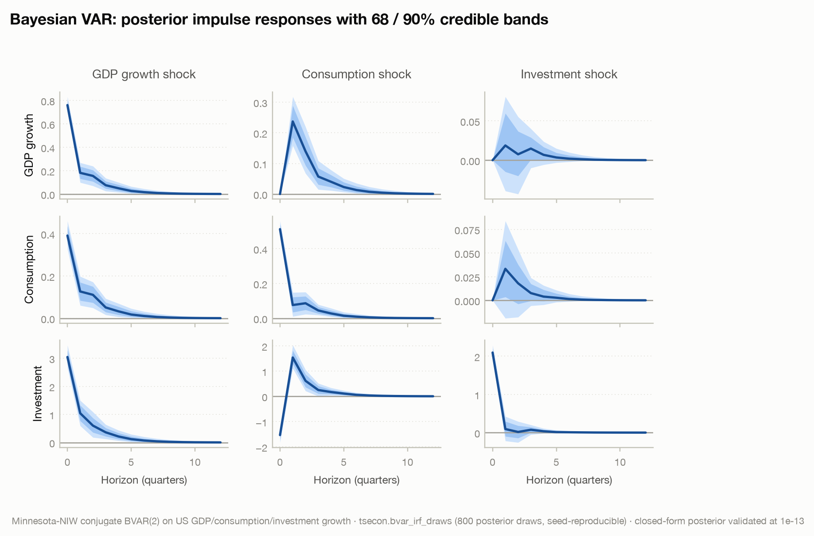

Real US data (GDP, consumption, investment growth): posterior medians with
nested 68/90% credible bands from 800 seed-reproducible posterior draws.
The analytic posterior is validated against the documented conjugate
updating equations at 1e-13; MCMC diagnostics (`tsecon.mcmc_diagnostics`:
ArviZ-exact R-hat and ESS) stand ready for the sampler-based models that
follow.

---

## 11 · ARIMA: fit, forecast, fan chart

**Use case:** the default univariate forecasting model. Difference to
stationarity, capture short-run dynamics with AR and MA terms, forecast,
and undifference — with uncertainty that compounds correctly across the
integration.

```python
r = tsecon.arima_fit(y, p=1, d=1, q=1, constant=True, forecast_steps=16)
r["params"], r["loglik"], r["aic"]      # exact MLE via the Kalman engine
r["forecast_mean"], r["forecast_se"]     # undifferenced, exact cumulative variance
tsecon.ljung_box(r["residuals"])         # adequacy check: residuals ~ white noise?
```


Fitted by exact maximum likelihood (Monahan-transformed L-BFGS with
Hannan-Rissanen starting values), the fan widens like √h exactly as the
random-walk-plus-dynamics theory requires. A validation note worth
telling: on the Nile benchmark our optimizer found a *better* optimum than
the one statsmodels' default fit had stored in our golden fixture — the
fixture had pinned a non-converged artifact, which independent
cross-checking confirmed. Validation-first development cuts both ways.

---

## Advanced

The numbered sections showed the methods one at a time. This wing *composes*
them: four figures from the sophisticated end of applied practice, each built
entirely from the primitives above. All regenerate with one command:

```sh
.venv/bin/python docs/examples/showcase_advanced.py
```

### Local projections (Jordà 2005), from primitives

**Use case:** the modern default for estimating impulse responses without
committing to a full VAR's dynamics — run one regression *per horizon* of
`y[t+h]` on the shock (plus lag controls) and read the IRF straight off the
shock coefficients. The h-step regression error is MA(h) by construction, so
HAC standard errors are not optional — which is exactly what `tsecon.ols`
provides.

```python
for h in range(13):
    t = np.arange(4, n - h)
    X = np.column_stack([np.ones(len(t)), shock[t]]
                        + [y[t - lag] for lag in range(1, 5)])
    r = tsecon.ols(y[t + h], X, se_type="hac", maxlags=h + 1)
    irf[h], se[h] = r["params"][1], r["bse"][1]   # band: irf ± 1.645·se
```

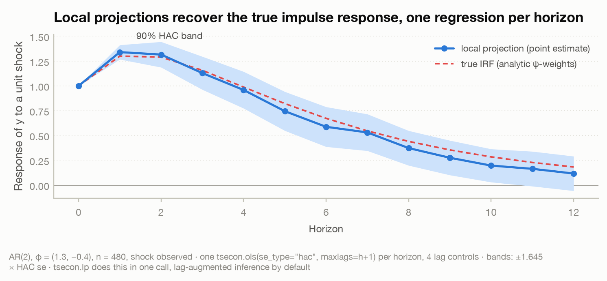

The test bed is an AR(2) whose true impulse response is computable
analytically (the ψ-weights, dashed red), and the local projection tracks it
inside its 90% HAC bands at every horizon — including the hump at h = 1 and
the long geometric tail. This is Jordà (2005) built from tsecon primitives
today; the dedicated module ([Module 07](../roadmap/07-local-projections.md))
hardens the inference with lag augmentation and joint sup-t bands.

### News impact curves: is volatility asymmetric?

**Use case:** in equity markets, bad news famously raises tomorrow's
volatility more than good news of the same size. The news impact curve
(Engle-Ng 1993) makes the question visual: plot the fitted σ²(ε) against the
shock ε, holding the lagged variance at its unconditional level. GARCH is a
symmetric parabola by construction; GJR adds a `gamma` term that kinks the
curve at zero.

```python
gj = tsecon.garch_fit(ret, vol="gjr", mean="zero")     # and vol="garch"
om, al, ga, be = gj["params"]
s2 = om / (1 - al - ga / 2 - be)                       # unconditional variance
nic = om + (al + ga * (eps < 0)) * eps**2 + be * s2    # the curve
```

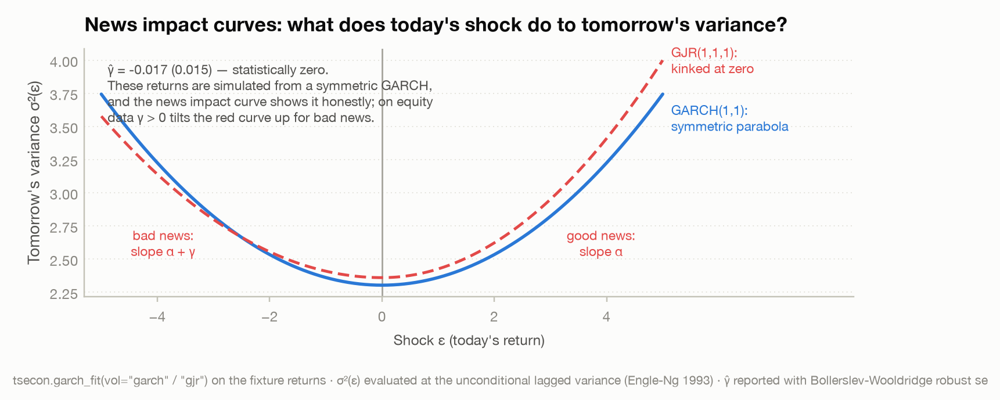

An honest negative result, on purpose: the fixture returns are simulated from
a *symmetric* GARCH, and the fitted GJR says so — γ̂ = −0.017 with a robust
standard error of 0.015, statistically zero, so the two curves nearly
coincide. That is the diagnostic working as designed: fit GJR, draw the
curve, and let the kink (or its absence) tell you whether the leverage effect
is in your data. On real equity returns γ̂ > 0 tilts the curve up steeply on
the bad-news side.

### The volatility term structure

**Use case:** risk over *horizons* — option pricing, margin setting, VaR at
one day versus six months. A GARCH fit implies a whole term structure of
expected volatility: from any starting state, forecasts decay toward the
long-run anchor at rate α + β per period, and the fitted persistence tells
you how slowly.

```python
r = tsecon.garch_fit(ret, vol="garch", mean="zero", forecast_horizon=120)
term = np.sqrt(r["variance_forecast"])        # from the end-of-sample state
om, al, be = r["params"]
lr = om / (1 - al - be)                       # the long-run anchor
what_if = lr + (al + be) ** (h - 1) * (3 * lr - lr)   # closed-form, any state
```

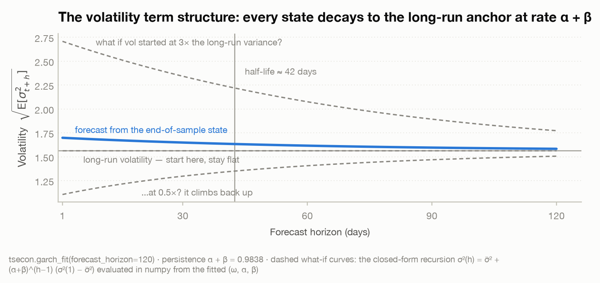

The solid blue curve is the library's own `variance_forecast`, launched from
the actual end-of-sample state. The API forecasts only from that state, so
the dashed what-if curves (starting at 0.5×, 1×, and 3× the long-run
variance) are the same closed-form recursion evaluated in numpy from the
fitted (ω, α, β) — labelled as such. With persistence α + β = 0.9838 the
half-life of a volatility shock is about 42 trading days: spikes are not
noise, they are two-month weather systems.

### BVAR prior tightness in one picture

**Use case:** the Minnesota prior's λ₁ is the shrinkage knob — how hard the
data must argue against the random-walk baseline. Set it by eye and you're
guessing; the conjugate NIW posterior gives the log marginal likelihood in
closed form, so the *evidence* can pick it. This figure shows what the choice
does where it matters: the impulse response and its uncertainty.

```python
for lam in [0.05, 0.2, 1.0]:
    draws = np.array(tsecon.bvar_irf_draws(data, lags=2, horizon=12,
                                           n_draws=500, seed=42, lambda1=lam))
    gg = draws[:, :, 0, 0]                    # GDP response to a GDP shock
    lo, med, hi = np.quantile(gg, [0.05, 0.5, 0.95], axis=0)   # 90% band
    lml = tsecon.bvar_fit(data, lags=2, lambda1=lam)["log_marginal_likelihood"]
```

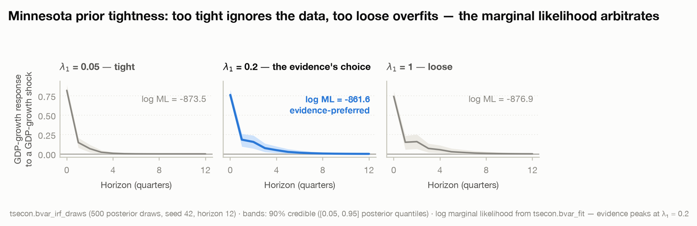

Too tight (λ₁ = 0.05) squeezes the response toward the prior and understates
uncertainty; too loose (λ₁ = 1.0) is essentially OLS with wide, wobbly bands.
The log marginal likelihood arbitrates: −873.5, **−861.6**, −876.9 — the
evidence decisively prefers the middle setting, drawn in house blue. Same
seed, same 500 draws per panel, so the differences you see are the prior,
not Monte Carlo noise.

---

## Structural & shrinkage

Three capabilities from the identification-and-regularization frontier —
set-identified structural inference, honest local-projection bands, and
penalized selection. Each figure is a real computation through the Rust core,
and they regenerate with one command:

```sh
.venv/bin/python docs/examples/showcase_structural.py
```

### Sign-restricted SVAR: the identified set

**Use case:** recursive (Cholesky) identification forces a variable ordering
you may not believe. Sign restrictions ask for less — only the *signs* of a
few impact responses, the kind of thing theory actually delivers ("a demand
shock raises output, consumption, and investment on impact") — and return
*every* impulse response consistent with them. The answer is not a point: it
is an interval at each horizon, the identified set.

```python
restr = [(0, 0, 0, "+"), (1, 0, 0, "+"), (2, 0, 0, "+")]  # (var, shock, horizon, sign)
r = tsecon.sign_restricted_svar(data, restrictions=restr, horizon=12, n_draws=800)
r["set_min"], r["set_max"]     # identified-set envelope       [h][var][shock]
r["quantiles"]                 # posterior 5/16/50/84/95 within the set
r["diagnostics"]               # rotations tried, acceptance rate
```

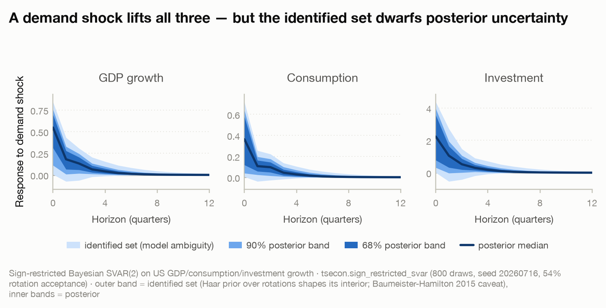

A demand shock lifts GDP growth, consumption, and investment on impact by
construction, then each decays. The figure keeps two very different kinds of
uncertainty visually separate: the lightest band is the **identified set** —
the range of responses the restrictions alone cannot rule out (model
ambiguity), and it is wide; the nested 68/90% bands inside it are **posterior**
(sampling) uncertainty *given* a rotation, and they are much narrower. The
Baumeister-Hamilton (2015) caveat is why the outer envelope, not the median,
is the honest object: the uniform (Haar) prior over rotations is not flat over
impulse responses, so it shapes the *interior* of the set even where the data
are silent. About 54% of candidate rotations satisfy the restrictions here,
reported in `diagnostics`.

### Local projections with honest bands

**Use case:** the modern default for impulse responses (Jordà 2005) — one
regression of `y[t+h]` on the shock per horizon, with no VAR dynamics to
commit to. The subtlety is inference: the h-step error is serially correlated,
and the naive HAC band is known to under-cover at longer horizons. Montiel
Olea and Plagborg-Møller (2021) show that a **lag-augmented** projection
restores valid, uniform coverage with a one-line fix — and it is `tsecon.lp`'s
default.

```python
la = tsecon.lp(y, shock, horizons=16)                 # se="lag_augmented" (the default)
hc = tsecon.lp(y, shock, horizons=16, se="hac")       # the older HAC alternative
lo, hi = la["irf"] - 1.6449 * la["se"], la["irf"] + 1.6449 * la["se"]   # 90% band
```

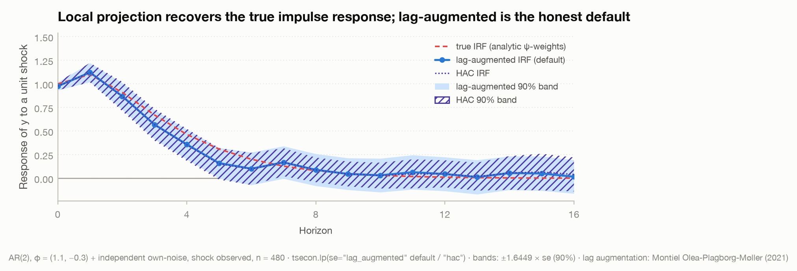

The test bed is an AR(2) driven by an *observed* shock, whose true impulse
response is the analytic ψ-weights (dashed red) — so the recovery is checkable
directly. Both the lag-augmented default and the HAC projection track the
truth at every horizon, and their point estimates all but coincide. What
differs is the **bands**: drawn with distinct fills, the two schemes disagree
about width, and lag augmentation is the one carrying the coverage guarantee.
Use it by default; reach for `se="hac"` only to reproduce older results.
`tsecon.lp_iv` extends the same machinery to instrumented shocks with a
first-stage F diagnostic.

### The lasso path: shrinkage as selection

**Use case:** many candidate predictors, most of them noise — the setting
where OLS overfits and you want the model itself to choose. The lasso's L1
penalty does double duty: it shrinks coefficients *and* sets most of them
exactly to zero, so fitting and variable selection happen in one step.
Sweeping the penalty α traces the classic coefficient path.

```python
alphas = np.logspace(-2, 0.5, 60)                     # weak (small) → strong (large)
paths = np.array([tsecon.lasso(Xs, y, alpha=a)["coef"] for a in alphas])
# same core, other objectives:
tsecon.ridge(Xs, y, alpha)                            # shrink, never select
tsecon.elastic_net(Xs, y, alpha, l1_ratio=0.5)        # the in-between
```

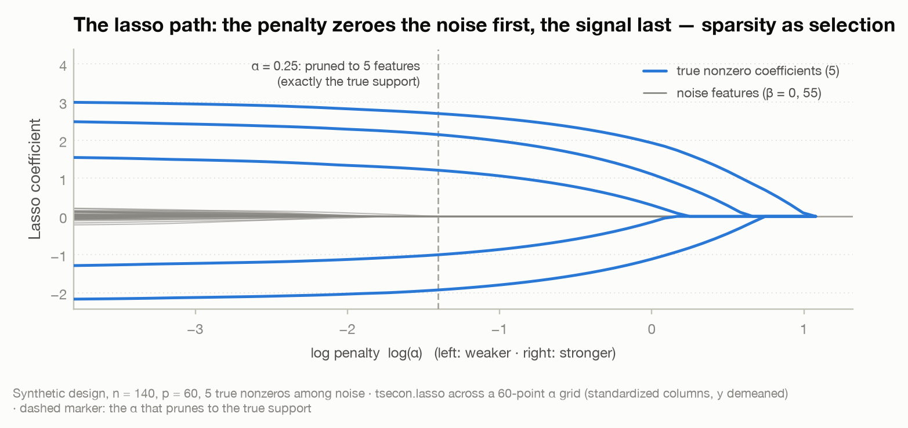

A synthetic design hides five true nonzero coefficients among 55 pure-noise
features. Read right to left as the penalty weakens: the five signal
coefficients (house blue) emerge in order of strength, while the noise
features (muted) stay pinned near zero until α is very small. The dashed
marker is the penalty that prunes the model to exactly five features — and
here those five are *exactly the true support*: sparsity delivering correct
selection, not merely a smaller model. Ridge (`tsecon.ridge`) and the elastic
net (`tsecon.elastic_net`) share the same coordinate-descent core for the
shrink-don't-select and in-between cases.

---

## Depth methods

### Score-driven volatility: the robust Student-t GAS

**Use case:** volatility estimation when returns have fat tails and the
occasional jump — the setting where a Gaussian GARCH-style filter over-reacts
to a single large shock and reports spurious persistence. A GAS (generalized
autoregressive score) model drives the variance by the *score* of the
observation density; with a Student-t density that score down-weights
outliers automatically.

```python
r = returns                                   # a return series with jumps
g  = tsecon.gas_volatility(r, density="gaussian")
st = tsecon.gas_volatility(r, density="student_t")   # estimates the dof nu
vol_gaussian = np.sqrt(g["variance"])
vol_student  = np.sqrt(st["variance"])        # far calmer at the jumps
```

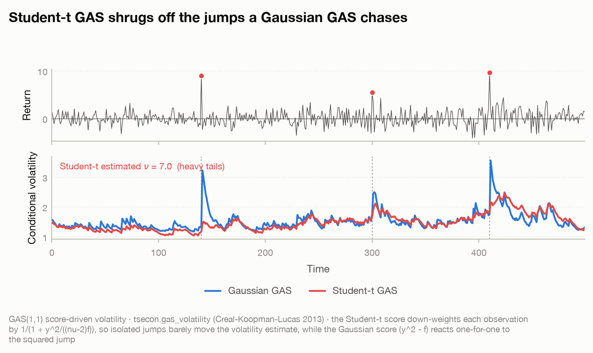

The return series (top) carries three isolated jumps (red). At each one
(dashed lines, bottom) the Gaussian GAS volatility (blue) spikes hard,
because its score `y² − f` reacts one-for-one to the squared shock; the
Student-t GAS (red) barely moves, because its score multiplies that shock by
`1/(1 + y²/((ν−2)f))` — a soft-thresholding weight that treats a jump as a
tail draw, not a change in the underlying volatility. The estimated `ν ≈ 7`
confirms the heavy tails the model exploits.
