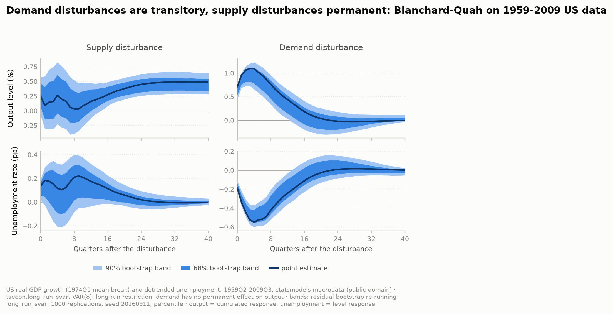
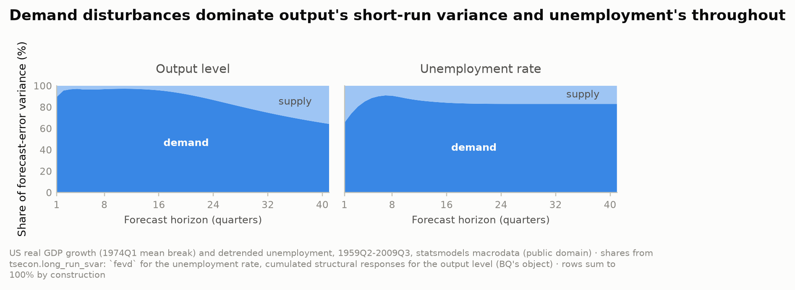
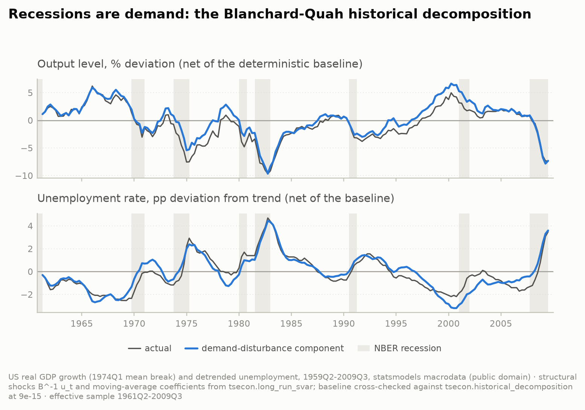

# Replication — Blanchard & Quah (1989)

The founding paper of long-run identification, and the first item the
roadmap's Phase-2 gate names. Blanchard and Quah (1989) put real output growth
and the unemployment rate in a bivariate VAR and separate two structural
disturbances with a single restriction that theory supplies without any stand
on within-quarter timing: **demand disturbances have no permanent effect on
the level of output**, so the supply disturbance is the only source of
output's stochastic trend. Their findings, read off their Figures 1–2 and
their variance-decomposition table: demand disturbances have a **hump-shaped**
effect on output that peaks after about a year and **vanishes** within a few
years; the effect on unemployment is, up to scale, a **mirror image**; the
effect of supply disturbances on output **builds to a permanent plateau**; a
favourable supply disturbance **raises unemployment on impact**; and demand
disturbances account for **most of the forecast-error variance** of output at
short horizons and of unemployment throughout. This page is the natural
flagship for
[`long_run_svar`](../reference/model-cards/structural-identification.md#long_run_svar-blanchard-quah-long-run-restrictions).

**What this is, and is not.** A **design replication at figure-reading
resolution**, not a numerical one. The paper used real GNP and unemployment
for 1948Q2–1987Q4; that vintage is not reachable from the build environment
(FRED and the institutional archives refuse the request), and the bundled
series is later-vintage real GDP over 1959–2009 — a different output measure,
a different deflator base, and a sample that adds the Great Moderation and the
2008–09 recession while losing the 1950s. So the page reproduces the paper's
*design* — the same transformations, lag order, restriction and objects — and
pins the *qualitative* findings with stated numerical bands. It makes no claim
of parity with the 1989 tables, and every assertion in the CI guard is a shape
claim, never a published digit.

```sh
.venv/bin/python docs/examples/replication_blanchard_quah.py
```

The data is the bundled `statsmodels.datasets.macrodata` — US real GDP
(billions of chained 2005 dollars) and the civilian unemployment rate,
quarterly 1959Q1–2009Q3, US-government statistics, public domain — committed
as a two-column extract at
[`fixtures/macrodata_bq.csv`](../../fixtures/macrodata_bq.csv) so the CI
guard runs offline like every other replication page (tsecon ships no data
loaders). `--write-fixture` regenerates the extract from the bundle, and the
guard checks equality with it whenever statsmodels is importable. The script
runs in about nine seconds, including 1,000 bootstrap replications and three
figures.

---

## The identification

Output growth is `100·Δlog(real GDP)`, **demeaned separately before and after
1974Q1** — Blanchard-Quah's own treatment of the post-1973 productivity
slowdown, and the part of the design everything hinges on (see the
sensitivity table below); the unemployment rate is **linearly detrended**, as
in the paper. The VAR carries a constant, so demeaning as such is inert — only
the break and the trend change anything. The lag order is the paper's
**eight**; on this sample the information criteria pick two (BIC, HQ) or
three (AIC), and the findings survive at those orders too (the CI guard
re-runs them). The VAR(8) is stable (smallest reciprocal-root modulus 1.153,
comfortably outside the unit circle — the Faust-Leeper fragility check the
model card asks for).

```python
bq = tsecon.long_run_svar(data, lags=8, horizon=40)   # trend="c" by default
```

`long_run_svar` returns the impact matrix `impact` (B), the long-run matrix
`long_run` (C(1)·B, lower-triangular by construction), the structural
responses `irf` and their running sums `cumulative_irf`, and `fevd`. With the
paper's ordering (output growth first, unemployment second) the default
recursive long-run pattern *is* the Blanchard-Quah restriction. One
convention to be explicit about: tsecon signs each disturbance so the
long-run diagonal is positive, which labels the demand disturbance by its
*cumulative* effect on unemployment; Blanchard-Quah sign it as expansionary —
output up on impact, unemployment down — so the script flips that column
(`flip = [1, −1]` here). A sign convention, not a different model; the
variance shares are invariant to it.

```text
long-run matrix C(1)B            impact matrix B (one-s.d. disturbances)
  [[+0.480   0.000]                [[+0.243  +0.708]
   [+3.136  −5.890]]                [+0.137  −0.188]]
```

The upper-right zero is the imposed neutrality; the supply disturbance's
permanent effect on output is +0.48 percent per one-standard-deviation
disturbance.

---

## The result



The objects the paper plots: output's **cumulated** response (the level) and
unemployment's plain response, in percent and percentage points per
one-standard-deviation disturbance, with 68% and 90% percentile bands from a
residual bootstrap (below).

| response | h = 0 | h = 2 | h = 4 | h = 8 | h = 12 | h = 20 | h = 40 | extremum (h) |
|---|---|---|---|---|---|---|---|---|
| output ← supply | +0.243 | +0.147 | +0.264 | +0.031 | +0.161 | +0.378 | +0.486 | +0.490 (34) |
| output ← demand | +0.708 | +1.063 | +1.095 | +0.761 | +0.439 | +0.037 | −0.004 | +1.100 (3) |
| unemployment ← supply | +0.137 | +0.176 | +0.116 | +0.210 | +0.175 | +0.059 | −0.003 | +0.220 (9) |
| unemployment ← demand | −0.188 | −0.445 | −0.550 | −0.421 | −0.241 | −0.026 | +0.003 | −0.550 (4) |

The paper's findings, read at figure resolution — each with the band the CI
guard ([`test_replication_blanchard_quah.py`](../../bindings/python/tests/test_replication_blanchard_quah.py))
pins it to:

1. **Demand → output is hump-shaped and transitory.** Impact +0.708, peak
   **+1.100 at h = 3** (the paper: "after about a year"), +0.037 at h = 20,
   **−0.004 at h = 40** — zero at infinity by construction, and effectively
   zero after five years. *Guard:* peak at h ∈ [1, 8] and at least 0.1 above
   the impact; |h = 20| < 0.15; |h = 40| < 0.05 and below 10% of the peak.
2. **Supply → output is permanent and positive.** Impact +0.243, +0.486 at
   h = 40 against a long-run value of +0.480, positive at every horizon
   (minimum +0.028 at h = 8). The rise to the plateau is not monotone on this
   vintage — it dips toward zero around h = 8 with a 68% band that includes
   zero — where the paper's Figure 1 rises steadily. *Guard:* impact > 0;
   h = 40 above the impact; |h = 40 − long run| < 0.02; minimum > 0; the
   90% band at h = 40 excludes zero.
3. **Demand → unemployment mirrors output.** Impact −0.188, trough
   **−0.550 at h = 4**, −0.026 at h = 20, +0.003 at h = 40; the trough sits
   one quarter after the output peak. *Guard:* impact < −0.1; trough at
   h ∈ [1, 8] and at least 0.1 below the impact; |h = 20| < 0.10;
   |h = 40| < 0.05; trough within two quarters of the output peak.
4. **A favourable supply disturbance raises unemployment on impact**
   (+0.137, 68% band [+0.055, +0.170]), stays positive through h = 20
   (+0.059) and dies out (−0.003 at h = 40). The paper's later *sign
   reversal* — unemployment eventually falling after a supply disturbance —
   is **not visible** here (the minimum is −0.005 at h = 34), and is not
   pinned. *Guard:* impact > 0.05; |h = 40| < 0.05; 68% lower band > 0.
5. **Demand dominates the short-run variance** — the table two sections down.

**Bootstrap bands.** `long_run_svar` is a point estimator, so the bands are
the script's own: a residual (iid) bootstrap of the reduced-form VAR that
resamples `var_fit`'s centered residuals with `bootstrap_indices` (one seed
per replication spawned from `SeedSequence(20260911)`), rebuilds each
pseudo-sample, and re-runs `long_run_svar` under the same sign convention.
The paper reports one-standard-deviation bands from a comparable Monte Carlo;
the 68% percentile band is the analogue. 1,000 replications, seed 20260911,
bit-reproducible:

| response | h | point | 68% band | 90% band |
|---|---|---|---|---|
| output ← supply | 0 | +0.243 | [+0.058, +0.461] | [−0.074, +0.571] |
| output ← supply | 4 | +0.264 | [−0.041, +0.610] | [−0.224, +0.825] |
| output ← supply | 12 | +0.161 | [−0.000, +0.365] | [−0.121, +0.472] |
| output ← supply | 40 | +0.486 | [+0.339, +0.547] | [+0.286, +0.640] |
| output ← demand | 0 | +0.708 | [+0.542, +0.714] | [+0.445, +0.757] |
| output ← demand | 4 | +1.095 | [+0.781, +1.120] | [+0.659, +1.229] |
| output ← demand | 12 | +0.439 | [+0.143, +0.524] | [+0.034, +0.650] |
| output ← demand | 40 | −0.004 | [−0.010, +0.058] | [−0.037, +0.108] |
| unemployment ← supply | 0 | +0.137 | [+0.055, +0.170] | [+0.014, +0.196] |
| unemployment ← supply | 4 | +0.116 | [−0.092, +0.240] | [−0.208, +0.323] |
| unemployment ← supply | 12 | +0.175 | [+0.032, +0.245] | [−0.035, +0.323] |
| unemployment ← supply | 40 | −0.003 | [−0.009, +0.012] | [−0.024, +0.030] |
| unemployment ← demand | 0 | −0.188 | [−0.212, −0.141] | [−0.225, −0.112] |
| unemployment ← demand | 4 | −0.550 | [−0.559, −0.420] | [−0.601, −0.372] |
| unemployment ← demand | 12 | −0.241 | [−0.291, −0.093] | [−0.360, −0.031] |
| unemployment ← demand | 40 | +0.003 | [−0.028, +0.007] | [−0.054, +0.024] |

Read the demand column: the 90% bands on output (h = 0, 4) sit entirely above
zero and on unemployment entirely below it, and by h = 40 output's band
straddles zero — the restriction, with its uncertainty. These are Efron
percentile bands, and they show the familiar downward bias of VAR-response
bootstraps in persistent systems: the point estimate sits near the *upper*
edge of the 68% band for the demand responses. No bias correction is applied
(`var_irf_bands` ships Kilian's `bias_correct` for recursive schemes only);
the bands are honest about that rather than tidied. The CI guard runs 200
replications at seed 0, where the percentiles move by at most 0.14 across
seeds 0, 1, 7 and 42 (measured); each band claim it pins carries at least
twice that margin.

---

## Variance decompositions



Share of the h-step forecast-error variance due to the **demand**
disturbance, in percent. The paper's output decomposition is for the
*level*, which the script computes from the cumulated structural responses
(`Σ_{s≤h} C_s²`, normalized across disturbances); `fevd` from `long_run_svar`
gives the growth and unemployment columns directly.

| horizon (steps) | output level | output growth | unemployment |
|---|---|---|---|
| 1 | 89.5 | 89.5 | 65.4 |
| 2 | 95.5 | 87.2 | 73.9 |
| 4 | 97.1 | 87.0 | 85.3 |
| 8 | 96.8 | 83.8 | 90.6 |
| 12 | 97.1 | 84.0 | 86.3 |
| 20 | 92.1 | 83.7 | 83.2 |
| 40 | 65.3 | 83.5 | 83.0 |

**Finding 5.** Demand accounts for 89.5% of output's one-step variance and
92–97% from two to twenty quarters, declining to 65% at ten years as the
supply disturbance's permanent effect accumulates — the shape of the paper's
table (near-total demand dominance at short horizons, falling with the
horizon) though it falls less far here. For unemployment the share rises
from 65% at one step to 85–91% and stays there. *Guard:* growth share at one
step > 0.5; level share > 0.8 at steps 1–12, lower at step 40 than at step 4
by at least 0.1, and above 0.4; unemployment share > 0.5 at one step and
> 0.7 from step 4; rows sum to one at 1e-12.

---

## Historical decomposition



`tsecon.historical_decomposition` takes Cholesky or sign identification, not
an arbitrary impact matrix, so the paper's decomposition is built in the
script from the structural shocks `B⁻¹u_t` and the structural moving-average
coefficients `long_run_svar` returns as `irf`. It is cross-checked against
the library: the deterministic `baseline` is identification-invariant and
agrees with `tsecon.historical_decomposition(identification="cholesky")` to
**9e-15**, the total shock contribution to **4e-15**, and the adding-up
identity `y = baseline + Σ_j hd_j` holds exactly.

The demand-disturbance component tracks detrended unemployment with a
correlation of **0.926** (the supply component: 0.129), and carries the bulk
of the rise in unemployment in every NBER recession inside the effective
sample (1961Q2–2009Q3):

| NBER recession | rise in unemployment (pp) | demand | supply |
|---|---|---|---|
| 1969Q4–1970Q4 | +2.19 | +2.06 | +0.13 |
| 1973Q4–1975Q1 | +3.40 | +2.68 | +0.72 |
| 1980Q1–1980Q3 | +1.40 | +1.25 | +0.14 |
| 1981Q3–1982Q4 | +3.29 | +3.42 | −0.12 |
| 1990Q3–1991Q1 | +0.90 | +0.88 | +0.02 |
| 2001Q1–2001Q4 | +1.30 | +0.93 | +0.37 |
| 2007Q4–2009Q2 | +4.39 | +3.73 | +0.66 |

Recessions are demand — the reading the paper draws from its own Figures 7–8
— including the 2008–09 recession the paper could not have seen, which this
identification attributes to demand at 85%. *Guard:* correlation > 0.8;
in each of the seven recessions the demand contribution exceeds the supply
contribution and more than half of the actual rise (achieved shares
0.71–1.04).

---

## What matches the paper's procedure, and what does not

**Same design.** Bivariate VAR in output growth and the unemployment rate;
eight lags; output growth demeaned with a break in mean at 1974Q1;
unemployment linearly detrended; the long-run neutrality of demand; the
objects reported — cumulated output responses, unemployment responses,
variance decompositions of the output level and of unemployment, and the
historical decomposition of both.

**Different data.** Real GDP (2005-dollar chained) over 1959Q1–2009Q3 in
place of real GNP over 1948Q2–1987Q4. The estimation sample (1961Q2–2009Q3,
194 observations after eight lags) overlaps the paper's for 27 years and adds
22 more. That is why the page is graded a design replication: the shapes are
the claim, not the numbers.

**Different bands.** The paper's one-standard-deviation Monte Carlo bands
versus the script's 68%/90% residual-bootstrap percentile bands, uncorrected
for bias.

**Where the shapes differ.** Two of the paper's finer readings are not
reproduced on this vintage and are not pinned: the supply effect on output
rises to its plateau *non*-monotonically (a dip toward zero at h = 8), and
unemployment's response to a supply disturbance never turns materially
negative. Demand's share of output variance at ten years (65%) is also higher
than the paper's long-horizon share.

**Sensitivity — what the design hinges on.** Every cell below is a full
re-fit; `p` is the lag order (8 = the paper, 2 and 3 = BIC/HQ and AIC).

| treatment | p | y←d impact | y←d peak (h) | y←d h = 40 | y←s impact | y←s long run | u←d h = 0 | u←s h = 0 | demand share at step 4: output | unemployment |
|---|---|---|---|---|---|---|---|---|---|---|
| constant only | 2 | +0.55 | +0.97 (4) | −0.001 | +0.58 | +0.56 | −0.24 | +0.03 | 59 | 98 |
| constant only | 3 | +0.43 | +0.74 (2) | +0.008 | +0.66 | +0.59 | −0.24 | −0.02 | 37 | 86 |
| constant only | 8 | +0.43 | +0.77 (3) | −0.012 | +0.64 | +0.72 | −0.23 | −0.00 | 40 | 88 |
| mean break only | 2 | +0.75 | +1.11 (3) | −0.001 | +0.22 | +0.53 | −0.20 | +0.14 | 98 | 82 |
| mean break only | 3 | +0.73 | +1.12 (3) | +0.008 | +0.24 | +0.45 | −0.20 | +0.14 | 96 | 88 |
| mean break only | 8 | +0.71 | +1.10 (3) | −0.004 | +0.24 | +0.48 | −0.19 | +0.14 | 97 | 85 |
| detrended u only | 2 | +0.57 | +0.99 (4) | −0.001 | +0.56 | +0.56 | −0.24 | +0.03 | 62 | 99 |
| detrended u only | 3 | +0.45 | +0.77 (2) | +0.007 | +0.65 | +0.58 | −0.24 | −0.01 | 41 | 88 |
| detrended u only | 8 | +0.45 | +0.81 (3) | −0.013 | +0.63 | +0.72 | −0.23 | +0.01 | 44 | 91 |
| **both (BQ)** | 2 | +0.75 | +1.11 (3) | −0.001 | +0.22 | +0.53 | −0.20 | +0.14 | 98 | 83 |
| **both (BQ)** | 3 | +0.73 | +1.11 (3) | +0.008 | +0.25 | +0.45 | −0.20 | +0.13 | 95 | 89 |
| **both (BQ)** | 8 | +0.71 | +1.10 (3) | −0.004 | +0.24 | +0.48 | −0.19 | +0.14 | 97 | 85 |

The hump, its vanishing, the permanent supply effect and the negative
unemployment impact survive every cell; the lag order barely matters. The
**break in mean growth is what the design hinges on**: without it the
long-run restriction reads the post-1973 slowdown as one enormous supply
disturbance, the supply impact on output doubles, the positive
supply-on-unemployment impact disappears, and demand's share of output
variance a year out collapses from 97% to about 40%. That is the
Faust-Leeper point made concrete — a long-run restriction inherits every
low-frequency feature of the data you did not model — and it is why the
paper spends a section on this choice. Detrending unemployment, by contrast,
changes nothing of substance.

**Library gaps this page works around.** `long_run_svar` has no native
confidence bands and `historical_decomposition` no arbitrary-impact-matrix
entry point; both objects are built in the script from shipped primitives
(`var_fit`, `bootstrap_indices`, `long_run_svar`) and validated as described
above. Both are roadmap items for the identification module.

---

## Cross-check: the closed form, independently

The identification itself is dual-checked on this data: an independent NumPy
transcription of the Blanchard-Quah closed form on a statsmodels
`VAR(data).fit(8)` — `C(1) = (I − ΣAᵢ)⁻¹`, `LR = chol(C(1) Σ C(1)ᵀ)`,
`B = C(1)⁻¹ LR`, with the df-adjusted `sigma_u` — agrees with `long_run_svar`
to **1.8e-13** on B, **2.3e-12** on the long-run matrix and **6.0e-12** on
C(1) (guard: 1e-9). The same transcription underlies the crate's golden
fixture ([`long_run_svar.json`](../../fixtures/long_run_svar.json)); here it
is run on real data rather than a synthetic system.

**What is being claimed.** This reproduces Blanchard-Quah's *economics* on a
later vintage of the same two US series — two disturbances with the published
dynamic signatures, the published ordering of variance shares, and recessions
that are demand — with every shape pinned to a stated band, and the
identification step verified against an independent implementation to
machine precision. It does not claim that any number matches a 1989 table,
and it says where the shapes differ.

**Citation.** Blanchard, O. J. and D. Quah (1989), "The Dynamic Effects of
Aggregate Demand and Supply Disturbances," *American Economic Review*
79(4):655–673. Read alongside Faust, J. and E. M. Leeper (1997), "When Do
Long-Run Identifying Restrictions Give Reliable Results?", *Journal of
Business & Economic Statistics* 15(3):345–353. Data: US-government statistics
(public domain), from statsmodels' bundled `macrodata`.

**See also.** [`long_run_svar` model card](../reference/model-cards/structural-identification.md#long_run_svar-blanchard-quah-long-run-restrictions) ·
[identification guide](../guide/08-causal-identification.md#long-run-restrictions-the-blanchard-quah-decomposition) ·
[Uhlig replication](replication-uhlig-monetary.md) ·
[Gertler-Karadi replication](replication-gertler-karadi.md).
