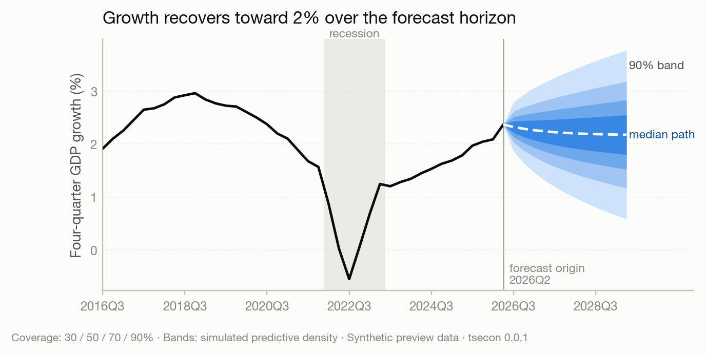

# Chapter 5 — Forecasting: Practice and Evaluation

> Part of [The tsecon Guide to Time Series Econometrics](README.md). Chapters mirror the library's modules; code runs against the current Python API unless marked otherwise.

**Prerequisites:** OLS regression and standard errors, plus the stationarity and autocorrelation ideas from the earlier chapters; comfort with numpy arrays.

**You will learn:**

- What a forecast actually claims — and why a point forecast, an interval, and a full density are three different promises.
- Why in-sample fit is a lie, and how pseudo-out-of-sample backtesting with rolling or expanding origins replaces it.
- Why naive benchmarks are scandalously hard to beat, and what fifty years of forecasting competitions proved.
- How to score forecasts without fooling yourself — MAPE's failure modes, why MASE exists, and what pinball loss and CRPS measure.
- How to test whether an accuracy difference is real (Diebold-Mariano with the HLN correction), when that test is invalid, and why averaging forecasts usually beats picking one.

## The idea

Suppose your model says inflation will be 2.4 percent next year. Should anyone believe you?

That question — not model estimation — is what forecasting practice is about. Producing a number is easy; every model in this guide will happily emit one. The hard discipline is measurement: how do you find out whether your forecasts are any good, whether they are better than an embarrassingly simple alternative, and whether an apparent improvement is real or a fluke of the particular years you tested on?

The central trap is that a model always looks best on the data it was fit to. Add lags, add predictors, add flexibility, and the in-sample errors shrink every time — that is arithmetic, not skill. The model is partly memorizing the noise in your sample, and noise does not repeat. So forecasters simulate the real situation instead: stand at some past date, fit the model using only data available then, forecast forward, and compare against what actually happened. Slide that origin date through history and you accumulate a track record of honest errors — a *backtest*. Everything else in this chapter is machinery built on that one picture: a vertical line sweeping left to right through your data, with the model repeatedly blindfolded to everything on the right of it.

The second trap is forecasting without a benchmark. The dumbest possible forecast — "tomorrow will be like today" — is, for many economic series, close to unbeatable. Exchange rates, stock returns, and (in some eras) inflation have humiliated generations of sophisticated models this way. A forecast error of 1.2 percentage points means nothing on its own; what matters is whether the no-thought benchmark scored 1.1. Never report a forecast without a benchmark, and never claim superiority without a test. That sentence is the whole chapter; the rest is how to do it properly.

## What a forecast claims: point, interval, density

A practitioner cares because these three objects answer different questions, and mixing them up produces real damage — a budget office that treats a central GDP projection as a certainty has no plan for the recession scenario that the same model assigned 20 percent probability.

Behind every forecast is a *predictive distribution*: given everything known at time $t$, the random variable $y_{t+h}$ has some conditional distribution $F_{t+h|t}$. The three kinds of forecast are three summaries of it:

- A **point forecast** $\hat{y}_{t+h|t}$ is a single number — one functional of $F_{t+h|t}$. Which functional is *not* a matter of taste: the point forecast that minimizes expected squared error is the conditional mean, while the one that minimizes expected absolute error is the conditional median (Gneiting 2011). A point forecast is only well-defined once you say which loss it is optimal for.
- An **interval forecast** $[l_{t+h|t},\, u_{t+h|t}]$ claims coverage: the realization should land inside with probability $1-\alpha$,

$$
P\left(l_{t+h|t} \le y_{t+h} \le u_{t+h|t}\right) = 1 - \alpha .
$$

- A **density forecast** hands over $F_{t+h|t}$ itself — the whole distribution, usually as a set of quantiles or simulation draws. Central banks publish these as *fan charts*: nested shaded bands, one per coverage level, widening with horizon.



The fan chart above is the library's house rendering of a density forecast: the darkest ribbon is the central band, each lighter ribbon adds coverage, and the widening fan is the honest admission that uncertainty grows with horizon.

In tsecon today, `var_forecast` produces point forecasts with interval bands from a vector autoregression:

```python
import numpy as np
import tsecon

rng = np.random.default_rng(42)
n = 240                                # two-variable system: "growth" and a leading "spread"
data = np.zeros((n, 2))
for t in range(1, n):
    data[t, 1] = 0.7 * data[t - 1, 1] + 0.5 * rng.standard_normal()
    data[t, 0] = 0.5 * data[t - 1, 0] + 0.3 * data[t - 1, 1] + 0.8 * rng.standard_normal()

fc = tsecon.var_forecast(data, lags=1, steps=8, alpha=0.05)
fc["point"]        # 8 x 2 central path
fc["lower"]        # 8 x 2 lower 95% band — widens with horizon
fc["upper"]
```

> ⚠ **Common mistake.** Reading pointwise interval bands as a statement about the whole path. The 95% band at each horizon says the realization at *that* horizon lands inside with 95% probability; the probability that the entire 8-step path stays inside all eight bands is well below 95%. Joint path bands are wider (Jordà and Marcellino 2010) and are a roadmap item.

## One step ahead or many: iterated vs direct

Multi-step forecasts can be built two ways, and the choice changes both accuracy and the statistics you are allowed to use afterward.

The **iterated** (or recursive) strategy fits a one-step model and feeds its own forecasts back in: forecast $t+1$, pretend it happened, forecast $t+2$, and so on. This is what `var_forecast` does internally. The **direct** strategy fits a separate regression for each horizon, projecting $y_{t+h}$ straight onto information at $t$:

$$
y_{t+h} = \beta_h' x_t + u_{t+h}, \qquad h = 1, 2, \dots, H,
$$

where $x_t$ collects the predictors known at $t$ and each horizon gets its own $\beta_h$. Marcellino, Stock and Watson (2006) ran the horse race across 170 US monthly series: iterated forecasts usually win when the one-step model is well specified, because they use the data more efficiently; direct forecasts are more robust when the model is misspecified, because each horizon's errors are minimized directly rather than compounded through a wrong recursion.

The statistical fine print: a direct $h$-step regression has overlapping forecast errors. Even if the one-step-ahead world is unpredictable white noise, $u_{t+h}$ is a moving average of order $h-1$ by construction — consecutive errors share $h-1$ of the same underlying shocks. Ordinary standard errors are therefore wrong, and you need the HAC machinery from the regression chapter with bandwidth at least $h-1$:

```python
h = 4                                   # direct 4-step projection
y = data[:, 0].copy()                   # contiguous 1-D array
T = len(y)
X = np.column_stack([np.ones(T - h), y[:T - h], data[:T - h, 1]])
r = tsecon.ols(y[h:], X, se_type="hac", maxlags=h - 1)
r["params"], r["bse"]                   # HAC because direct h-step errors are MA(h-1)
```

> ⚠ **Common mistake.** Running a direct multi-step regression and reporting textbook OLS standard errors. The overlap makes errors autocorrelated *by construction* — this is not a diagnostic finding you might get lucky on, it is guaranteed — and the naive t-statistics are inflated. Every multi-step evaluation regression in this chapter (Diebold-Mariano included) carries the same requirement.

## Backtesting: why in-sample fit lies

In-sample fit rewards memorization. A regression's $R^2$ never falls when you add a predictor; an AR model's residual variance never rises when you add a lag. Information criteria penalize this, but only crudely. The only measurement that directly answers "will this model forecast well?" is to make it forecast data it has never seen — repeatedly, so one lucky quarter cannot flatter it.

The standard design is the **pseudo-out-of-sample** (POOS) backtest. Split the sample of size $T$ into an initial training window of $R$ observations and an evaluation stretch of $P$ forecast origins. At each origin $t = R, R+1, \dots, T-h$: fit the model on data through $t$, forecast $\hat{y}_{t+h|t}$, and record the error

$$
e_{t+h|t} = y_{t+h} - \hat{y}_{t+h|t}.
$$

"Pseudo" because you are replaying history rather than truly waiting for the future — the design is honest exactly to the extent that nothing from after the origin leaks into the fit.

Two origin schemes dominate practice:

- **Expanding** (recursive): the training window grows — origin $t$ uses observations $1$ through $t$. Uses all available data; the natural choice when parameters are stable.
- **Rolling**: the training window has fixed width — origin $t$ uses observations $t-R+1$ through $t$. Throws away old data deliberately; the natural choice when you suspect the world changes and old observations mislead.

The choice is not cosmetic. It changes how parameter-estimation error behaves as the sample grows, which changes which comparison test downstream is valid — a point we return to in the frontier section. tsecon's roadmap makes the backtest object record its scheme so tests can check it; today, you write the loop yourself:

```python
rng = np.random.default_rng(7)                    # quarterly series: trend + season + AR noise
n = 160
t_idx = np.arange(n)
season = 4.0 * np.array([1.0, -0.4, 0.6, -1.2])[t_idx % 4]
noise = np.zeros(n)
e = rng.standard_normal(n)
for i in range(1, n):
    noise[i] = 0.6 * noise[i - 1] + 1.5 * e[i]
y = 50 + 0.3 * t_idx + season + noise

R = 80                                            # first forecast origin
e_theta, e_naive = [], []
for t in range(R, n - 1):                         # expanding window, 1-step ahead
    train = y[: t]
    e_theta.append(y[t] - tsecon.theta_forecast(train, steps=1, period=4)[0])
    e_naive.append(y[t] - train[-1])              # "tomorrow = today"
e_theta = np.array(e_theta)
e_naive = np.array(e_naive)
print(np.sqrt(np.mean(e_theta**2)), np.sqrt(np.mean(e_naive**2)))   # OOS RMSEs
```

Everything the model needs — transformations, seasonal adjustment, scaling, hyperparameter choices — must be recomputed inside each training window. Preprocessing on the full sample before the loop is the single most common backtesting bug, and it is silent: the backtest runs, the numbers look great, and the model quietly knows the future through a detrending line or a standard deviation computed on data it should not have seen.

> ⚠ **Common mistake.** Full-sample leakage. Detrending, deseasonalizing, or standardizing the whole series once and then backtesting on the transformed data gives every training window information from the evaluation period. The roadmap's backtesting engine is designed so preprocessing *cannot* run outside the training window; until it lands, treat every line above your backtest loop with suspicion.

## The benchmark zoo

Every evaluation needs a floor, and the floor is populated by methods so simple they feel like a joke:

- **Naive**: $\hat{y}_{t+h|t} = y_t$. Tomorrow equals today — the optimal forecast if the series is a random walk.
- **Seasonal naive**: $\hat{y}_{t+h|t} = y_{t+h-m}$ for seasonal period $m$. Next December equals last December.
- **Drift**: the naive forecast plus the average historical change — a straight line through the first and last observations.
- **Historical mean**: $\hat{y}_{t+h|t} = \bar{y}$. The optimal forecast if the series is white noise around a constant — and, per Goyal and Welch's famous demonstration, roughly unbeatable for the equity premium.

These are not straw men. The M-competitions — large-scale forecasting tournaments run by Spyros Makridakis since 1982, in which hundreds of methods forecast thousands of real series and are scored out of sample — delivered the same uncomfortable findings each round: simple methods routinely match or beat sophisticated ones, combinations beat their components, and in-sample fit predicts almost nothing about out-of-sample rank (Makridakis et al. 1982; Makridakis and Hibon 2000). In M4 (Makridakis, Spiliotis and Assimakopoulos 2020), with 100,000 series, pure machine-learning entries mostly lost to statistical benchmarks, and the winners were hybrids and combinations.

The star of this zoo is the **Theta method** (Assimakopoulos and Nikolopoulos 2000), which won the M3 competition outright. Its mystique evaporated when Hyndman and Billah (2003) showed it is equivalent to simple exponential smoothing with a drift term equal to half the slope of a linear trend — yet it remains a top-tier univariate benchmark two decades later: cheap, robust, and shockingly hard to beat. If your elaborate model cannot outforecast Theta, it is not ready.

```python
n, h = 140, 20
t_idx = np.arange(n + h)
season = 4.0 * np.array([1.0, -0.4, 0.6, -1.2])[t_idx % 4]
noise = np.zeros(n + h)
e = rng.standard_normal(n + h)
for i in range(1, n + h):
    noise[i] = 0.6 * noise[i - 1] + 1.5 * e[i]
y = 50 + 0.3 * t_idx + season + noise
train, test = y[:n], y[n:]

fc_theta  = tsecon.theta_forecast(train, steps=h, period=4)   # the M3 winner
fc_naive  = np.full(h, train[-1])
fc_snaive = np.tile(train[-4:], h // 4 + 1)[:h]
fc_drift  = train[-1] + np.arange(1, h + 1) * (train[-1] - train[0]) / (n - 1)
```


The gallery figure shows this exact exercise: Theta captures both the trend and the seasonal shape while the naive methods each miss one, and the MASE panel quantifies it (Theta 1.23 against the seasonal naive's 2.15, with a Diebold-Mariano p-value of 0.001 — both tools defined next).

> ⚠ **Common mistake.** Publishing a forecast evaluation with no benchmark column. An RMSE in isolation is uninterpretable; the reader cannot tell whether your model added anything over "tomorrow equals today." The macro literature's convention — report RMSE *ratios* against a random walk (Atkeson and Ohanian 2001 made this famous for inflation) — exists precisely because bare loss numbers hide the benchmark comparison.

## Scoring the errors: accuracy measures and their failure modes

You care about the choice of accuracy measure because measures disagree — a model can win on absolute error and lose on squared error, and cross-series comparisons are meaningless under the wrong measure. Given evaluation errors $e_i = y_i - \hat{y}_i$, $i = 1, \dots, P$:

$$
\text{MAE} = \frac{1}{P}\sum_{i=1}^{P} |e_i|, \qquad
\text{RMSE} = \sqrt{\frac{1}{P}\sum_{i=1}^{P} e_i^2}.
$$

RMSE punishes large errors disproportionately (it is the loss that the conditional *mean* forecast optimizes); MAE treats all errors linearly (the *median* forecast's loss). Both are **scale-dependent**: an RMSE of 0.4 is excellent for quarterly GDP growth and absurd for the level of the S&P 500, so neither can be averaged across series of different scales.

The traditional fix, **MAPE** (mean absolute percentage error), divides each error by the actual value — and fails exactly where practitioners need it. If any actual is zero the measure is undefined; if actuals are near zero it explodes; and it is asymmetric, penalizing over-forecasts more than under-forecasts of the same size because the actual, not the forecast, sits in the denominator (Goodwin and Lawton 1999; Hyndman and Koehler 2006). The "symmetric" sMAPE used in the M-competitions patches the zero problem but is not actually symmetric. tsecon computes both for compatibility and simply omits them from the result when a zero denominator would poison them.

Hyndman and Koehler (2006) proposed the clean solution, **MASE** (mean absolute scaled error): scale the out-of-sample errors by the in-sample MAE of the seasonal naive forecast,

$$
\text{MASE} = \frac{\frac{1}{P}\sum_{i=1}^{P}|e_i|}{\frac{1}{R-m}\sum_{t=m+1}^{R} |y_t - y_{t-m}|},
$$

where the denominator is computed on the *training* sample with seasonal period $m$. MASE is scale-free (safe to average across series — it is the official metric of the recent M-competitions, with its squared-error sibling RMSSE the M5 metric) and self-benchmarking: MASE $= 1$ means "exactly as accurate as a naive forecaster who saw only the training data," so anything above 1 is a red flag you can read without context.

```python
for name, fc in [("Theta", fc_theta), ("seasonal naive", fc_snaive), ("naive", fc_naive)]:
    acc = tsecon.accuracy(test, fc, insample=train, period=4)
    print(f"{name:16s} RMSE {acc['rmse']:6.2f}   MAE {acc['mae']:6.2f}   MASE {acc['mase']:5.2f}")
```

`accuracy` returns `me` (mean error — bias, worth checking separately: a model can have a small RMSE and still be systematically too high), `rmse`, `mae`, `mape`/`smape` when defined, and `mase`/`rmsse` when a training sample is supplied.

For interval and density forecasts the scoring logic generalizes. The **pinball loss** (quantile loss) scores a forecast of the $\tau$-quantile:

$$
\rho_\tau(e) = \left(\tau - \mathbf{1}\{e < 0\}\right) e,
$$

which penalizes being on the wrong side of the realization asymmetrically — exactly the asymmetry that makes the $\tau$-quantile the optimal forecast under it. Averaging pinball loss over a fine grid of quantiles approximates (half of) the **CRPS**, the continuous ranked probability score, which scores an entire predictive distribution at once: it is the squared distance between the forecast CDF and the degenerate "step function at the realization," and it collapses to absolute error when the forecast is a point. CRPS is *proper* — no forecaster can improve their expected score by reporting a distribution other than their honest belief (Gneiting and Raftery 2007) — which is the non-negotiable requirement for any density score. Pinball loss and CRPS are roadmap items; the concepts are here because you should demand them from any density forecast you are shown.

> ⚠ **Common mistake.** Averaging MAPE over a panel that contains near-zero actuals (inflation around zero, growth rates in recessions): a handful of exploding terms dominates the average, and the model ranking becomes a ranking of who got lucky on the small-denominator months. Use MASE. Relatedly: never average raw RMSE across series of different scales — the largest-scale series simply wins.

## Is the difference real? The Diebold-Mariano test

Your model's MASE is 1.23 and the benchmark's is 2.15. Over only 20 evaluation points, could that gap be luck? Accuracy tables without significance tests invite overreading — this is the forecasting analogue of reporting coefficients without standard errors.

Diebold and Mariano (1995) reduced the question to something elegant. Take two forecast error streams $e_{1t}$ and $e_{2t}$, pick a loss function $L$ (squared or absolute), and form the **loss differential**

$$
d_t = L(e_{1t}) - L(e_{2t}).
$$

The null of equal predictive accuracy is simply $E[d_t] = 0$ — a hypothesis about the mean of one observable series, no matter how complicated the models behind the forecasts are. The test statistic is a t-statistic on $\bar{d}$,

$$
\text{DM} = \frac{\bar{d}}{\sqrt{\widehat{\text{LRV}}(d_t) / P}},
$$

where the denominator uses a long-run variance (Chapter 3's HAC machinery) because $d_t$ is autocorrelated — mechanically so for $h$-step forecasts, whose errors overlap by MA($h-1$) as we saw. Harvey, Leybourne and Newbold (1997) showed the raw statistic over-rejects in small samples and derived a correction: rescale by $\sqrt{(P + 1 - 2h + h(h-1)/P)/P}$ and compare against Student-$t$ with $P-1$ degrees of freedom. tsecon applies HLN by default — it is not an option you can forget to enable:

```python
dm = tsecon.dm_test(test - fc_snaive, test - fc_theta, h=1, loss="squared")
dm["hln_stat"], dm["p_value"]      # HLN-corrected statistic, t(P-1) two-sided p
dm["mean_loss_diff"]               # positive: the SECOND stream (Theta) had lower loss
```

The sign convention: $d_t$ is loss of the first stream minus loss of the second, so a positive statistic favors the second argument. (This snippet, mirroring the gallery, pools all 20 horizons into one comparison for simplicity; a per-horizon evaluation from a proper backtest — one DM test per horizon, or the joint multi-horizon tests in the frontier — is the rigorous version.)

Two caveats keep DM honest. First, **nested models**: if model 2 is model 1 plus extra predictors, then under the null the extra coefficients are zero, the two forecasts converge to being *identical*, and $d_t$ degenerates — the DM statistic has no proper distribution and is biased against the larger model, whose estimation noise inflates its MSE. Clark and West (2006, 2007) fixed this with an adjusted loss differential,

$$
\widehat{d}_t^{\,CW} = e_{1t}^2 - e_{2t}^2 + \left(\hat{y}_{1t} - \hat{y}_{2t}\right)^2,
$$

which adds back the estimation-noise term. Clark-West is a roadmap item; until it lands, do not run plain DM on nested comparisons. Second, **multiple comparisons**: run DM against a benchmark for 50 candidate models and at the 5% level roughly two or three "significant" winners appear under the null by construction. The honest tools — White's (2000) Reality Check, Hansen's (2005) SPA test, and the Model Confidence Set of Hansen, Lunde and Nason (2011), which reports the *set* of models statistically indistinguishable from the best — are roadmap items, but the discipline costs nothing today: count every specification you tried, not just the survivors, and treat a lone marginal DM rejection from a large search as noise. Diebold's own retrospective (Diebold 2015) is blunt that the test compares *forecasts*, not models — it takes the error streams as given, which is exactly why it is so widely applicable and so widely misapplied.

> ⚠ **Common mistake.** Running a plain DM test on nested models (an AR(2) against the same AR(2) plus an unemployment gap, say). The comparison feels natural — it is the most common question in applied work — but it is precisely the degenerate case. The roadmap API routes nested comparisons to Clark-West rather than letting the DM test return a meaningless p-value.

## Combining forecasts: the free lunch that mostly is

When several plausible models disagree, the instinct is to pick the best one. Half a century of evidence says: don't — average them. Bates and Granger (1969) made the point analytically: any convex combination of two unbiased forecasts has an error variance no worse than the better component whenever the forecasts are not perfectly correlated, because their idiosyncratic errors partially cancel. The optimal weights depend on the error covariance matrix — and here practice delivered one of the field's great running jokes, the **forecast combination puzzle**: estimated "optimal" weights routinely forecast *worse* than a plain equal-weighted average. The resolution is not mysterious — optimal weights must be estimated, weight-estimation error swamps the modest gains the true weights would deliver, and $1/N$ has zero estimation error (Smith and Wallis 2009; Claeskens et al. 2016). Stock and Watson (2004), combining forecasts across seven countries' output growth, found simple averages hard to beat with anything clever.

```python
fc_combo = 0.5 * fc_theta + 0.5 * fc_snaive          # the humble 1/N combination
for name, fc in [("Theta", fc_theta), ("seasonal naive", fc_snaive), ("combo", fc_combo)]:
    print(name, round(tsecon.accuracy(test, fc, insample=train, period=4)["mase"], 3))
```

(On this synthetic series Theta is so much better than the seasonal naive that averaging dilutes it — combination shines when components are comparably good and differently wrong. That, too, is a lesson: combination is insurance, not alchemy.)

The practical hierarchy, encoded in the roadmap's combination module: start with equal weights; consider the median or a trimmed mean if some forecasters occasionally produce wild outliers; estimate inverse-MSE (Bates-Granger) weights only with few forecasts and long track records; and treat regression-based weights (Granger and Ramanathan 1984) with suspicion unless constrained, because near-collinear forecasts make unconstrained weights explode.

> ⚠ **Common mistake.** Estimating combination weights on the same evaluation window you then report performance on. Weight estimation is model fitting; it must live inside the backtest's training windows like every other estimated quantity, or the combination's track record is contaminated by lookahead.

## Are your densities honest? Calibration

A density forecast makes a quantitative promise at every probability level, and calibration checks whether the promises were kept: over many forecasts, realizations should fall below your reported 10th percentile 10 percent of the time, below the median half the time, and so on.

The universal diagnostic is the **probability integral transform** (PIT). For each forecast, evaluate your own predictive CDF at the realization:

$$
u_t = F_{t|t-1}(y_t).
$$

If the density forecasts are correct, the $u_t$ are independent uniform on $[0,1]$ at one-step horizons (Diebold, Gunther and Tay 1998). The histogram of PITs is then a lie detector with readable shapes: a hump in the middle means your densities are too wide (underconfident); a U-shape means too narrow (overconfident — realizations keep landing in your tails); a tilt means bias. Berkowitz (2001) sharpened this into a small-sample likelihood-ratio test by transforming PITs through the inverse normal CDF and testing for zero mean, unit variance, and no autocorrelation. One subtlety worth carrying even before the tools land: at horizons beyond one step, PITs are serially dependent *under the null* (overlapping errors again), so independence tests must be dropped and only uniformity tested.

Interval forecasts have their own proper score, worth knowing by name because it formalizes the intuition that a good interval is both *narrow* and *reliable*. The Winkler (1972) interval score for a central $(1-\alpha)$ interval $[l, u]$ charges the width plus a penalty of $\frac{2}{\alpha}$ times the miss distance whenever the realization escapes:

$$
S_\alpha(l, u; y) = (u - l) + \frac{2}{\alpha}(l - y)\,\mathbf{1}\{y < l\} + \frac{2}{\alpha}(y - u)\,\mathbf{1}\{y > u\}.
$$

A forecaster cannot game it: widening the interval buys fewer penalties but pays in width, and the exchange rate is calibrated so that reporting your honest quantiles is optimal.

Calibration alone is not enough — the unconditional historical distribution is perfectly calibrated and perfectly useless. The modern criterion is *maximize sharpness subject to calibration* (Gneiting's formulation): among honest densities, prefer the tightest. Proper scores like CRPS reward exactly this combination. PIT histograms, Berkowitz tests, and the scoring-rule battery are the density-evaluation core of Module 09.

*Roadmap preview — this API lands with Module 09:*

```python
bt   = tsecon.backtest(model, y, scheme="expanding", min_train=80, horizons=range(1, 9))
tab  = bt.accuracy()                      # per-horizon losses with HAC standard errors
test = bt.compare(benchmark, auto=True)   # scheme-appropriate DM / Clark-West, auto-selected
pits = bt.pit_histogram(bins=10)          # calibration diagnostics with binomial bands
```

> ⚠ **Common mistake.** Judging intervals by average coverage alone. A model can hit 95% coverage on average while its violations all cluster in recessions — precisely when the interval mattered. Conditional coverage (are violations independent over time?) is a separate, harsher question, and the clustered failures of Value-at-Risk models in 2008 are the canonical cautionary tale.

## Backtesting in one call: the `backtest` engine

The hand-rolled POOS loop earlier in this chapter is the thing you should never have to write twice — get the slicing off by one and the whole track record is quietly wrong. The first slice of Module 09's engine has now landed as `tsecon.backtest`, and it turns that loop into a single call. It is deliberately function-shaped for now — an array in, a dict out — while the typed `bt` object with `.compare()` and `.pit_histogram()` shown in the roadmap preview above is still being built. What has landed is the part that is easy to get wrong by hand: the rolling-origin bookkeeping, the expanding/rolling schemes, the refit cadence, and the per-horizon accuracy table.

The signature mirrors the POOS design one-for-one:

```python
tsecon.backtest(
    y,                       # the series (1-D)
    window="expanding",      # "expanding" (recursive) or "rolling" (fixed width)
    train=20,                # first training window (min_train if expanding, width if rolling)
    horizon=1,              # evaluate horizons 1..=horizon at every origin
    refit_every=1,           # re-estimate the forecaster every k origins (1 = every origin)
    forecaster="naive",     # naive | drift | mean | seasonal_naive | theta
    period=1,                # seasonal period for the seasonal forecasters
    insample_period=1,       # seasonal period for the MASE/RMSSE scaling denominator
)
```

The return dict carries `origins` (the origin indices $t$ actually evaluated), `n_origins`, `horizon`, `forecasts` and `targets` (each a list of `horizon` arrays, one row per horizon $h$, aligned so that `targets[h-1][i] - forecasts[h-1][i]` is the error at origin `origins[i]` for step $h$), and `accuracy` — one row per horizon with `me`, `mse`, `rmse`, `mae`, `mdae`, and `mape`/`smape`/`mase`/`rmsse` wherever a denominator makes them well-defined.

The engine evaluates a *rectangular* origins-by-horizons grid: it keeps only origins that have all `horizon` targets in sample (the first full training window through index $n-1-\text{horizon}$), so every horizon's error stream has the same length and the same origins. That is not tidiness for its own sake — it is precisely what lets the Diebold-Mariano machinery downstream consume equal-length, index-aligned streams.

### A per-horizon accuracy table

Reusing the quarterly trend-plus-season-plus-AR series from the backtesting section above:

```python
bt = tsecon.backtest(y, window="expanding", train=80, horizon=4,
                     forecaster="theta", period=4, insample_period=4)

print(f"origins {bt['origins'][0]}..{bt['origins'][-1]}  ({bt['n_origins']} of them)")
for row in bt["accuracy"]:
    print(f"{row['name']:5s}  RMSE {row['rmse']:5.2f}  MAE {row['mae']:5.2f}  MASE {row['mase']:5.2f}")
#   h=1   RMSE  2.01  MAE  1.62  MASE  0.85
#   h=2   RMSE  1.85  MAE  1.43  MASE  0.75
#   h=3   RMSE  2.39  MAE  1.93  MASE  1.01
#   h=4   RMSE  2.21  MAE  1.75  MASE  0.92
```

Read the table down the horizon column, not across the loss columns. Theta's one-step MASE of 0.85 says it beats the in-sample seasonal-naive scale by about 15 percent; the numbers stay near or below 1 out to a year, which is the honest signal that the method has captured the trend and the seasonal shape rather than memorizing them. A table that started below 1 and blew past it by $h=4$ would be telling you the method forecasts the next quarter but not the next year — a distinction the single-number RMSE from a one-step loop hides entirely.

### Expanding versus rolling: the scheme is a modeling choice

`window` picks the origin scheme, and `train` means different things under each: the *minimum* (first) training size when expanding, the *fixed* width when rolling.

```python
exp = tsecon.backtest(y, window="expanding", train=80, horizon=4, forecaster="theta", period=4, insample_period=4)
rol = tsecon.backtest(y, window="rolling",   train=60, horizon=4, forecaster="theta", period=4, insample_period=4)
exp["n_origins"], rol["n_origins"]      # (77, 97) — rolling starts earlier here (width 60 < min_train 80)
```

Expanding uses every observation and lets estimation error die away as the sample grows — the right default when you believe the parameters are stable. Rolling deliberately forgets, holding the window at a fixed width so old regimes cannot contaminate the fit — the right choice when you suspect the world changes. The choice is not only about robustness: as the frontier section notes, the Giacomini and White (2006) test of *forecasting-method* accuracy requires a fixed-width rolling window, because its asymptotics depend on estimation error *not* vanishing. If a Giacomini-White comparison is where you are headed, back-test rolling from the start.

### Refit cadence: `refit_every`

Refitting a model at every one of hundreds of origins is often the expensive part of a backtest. `refit_every=k` re-estimates the forecaster once every $k$ origins and rolls that fit's direct multi-step path forward in between — the horizon-$h$ forecast for the $s$-th origin after a refit is read off step $s+h$ of the fit made at the refit origin.

```python
fresh = tsecon.backtest(y, train=80, horizon=4, refit_every=1, forecaster="theta", period=4, insample_period=4)
stale = tsecon.backtest(y, train=80, horizon=4, refit_every=4, forecaster="theta", period=4, insample_period=4)
fresh["accuracy"][0]["rmse"], stale["accuracy"][0]["rmse"]   # (2.01, 2.17) — staleness costs a little accuracy
```

The default `refit_every=1` is the leakage-free ideal: every origin sees a model fit on exactly its own training window. Larger $k$ trades a little accuracy (the fit is up to $k-1$ origins stale) for a large speed-up, and is how you make a full-competition backtest tractable; report the cadence you used, because it is part of the experiment.

### The benchmark zoo, now callable

The five forecasters that populate the benchmark floor — `naive`, `drift`, `mean`, `seasonal_naive`, `theta` — are all reachable through the same call, so the mandatory "did I beat the dumb methods?" table is one loop:

```python
print(f"{'forecaster':15s}  RMSE(h=1)  MASE(h=1)")
for fc in ["naive", "drift", "mean", "seasonal_naive", "theta"]:
    bt = tsecon.backtest(y, window="expanding", train=80, horizon=4,
                         forecaster=fc, period=4, insample_period=4)
    h1 = bt["accuracy"][0]
    print(f"{fc:15s}   {h1['rmse']:6.2f}    {h1['mase']:6.2f}")
# naive             6.74      3.36
# drift             6.76      3.37
# mean             18.57      9.42
# seasonal_naive    2.45      1.01
# theta             2.01      0.85
```

The ranking is a compressed lesson in why the benchmark you pick matters. On a trending, seasonal series the historical `mean` is a disaster (MASE 9.42 — it forecasts a flat line through data that is climbing), `naive` and `drift` are mediocre because they ignore the season, `seasonal_naive` is respectable (MASE ≈ 1, by construction near the scaling benchmark), and only `theta` clears the bar with room to spare. Swap in a random walk with no drift and the ranking inverts — which is the whole point of always reporting against a *panel* of benchmarks rather than a single favorite.

### From the backtest straight into Diebold-Mariano

Because the grid is rectangular and index-aligned, wiring the backtest's error streams into the `dm_test` from earlier in the chapter is mechanical: run the benchmark and the challenger with the same scheme, subtract to get the per-horizon error streams, and hand them to `dm_test` with the matching `h` so the HLN correction uses the right MA($h-1$) overlap.

```python
H = 4
challenger = tsecon.backtest(y, train=80, horizon=H, forecaster="theta",          period=4, insample_period=4)
benchmark  = tsecon.backtest(y, train=80, horizon=H, forecaster="seasonal_naive", period=4, insample_period=4)
assert challenger["origins"] == benchmark["origins"]      # same scheme => same, aligned origins

print("h   DM(HLN)   p")
for h in range(1, H + 1):
    e_bench = np.array(benchmark["targets"][h - 1])  - np.array(benchmark["forecasts"][h - 1])
    e_chall = np.array(challenger["targets"][h - 1]) - np.array(challenger["forecasts"][h - 1])
    dm = tsecon.dm_test(e_bench, e_chall, h=h, loss="squared")   # positive stat favors the 2nd stream (theta)
    print(f"{h}   {dm['hln_stat']:6.3f}   {dm['p_value']:.4f}")
# h   DM(HLN)   p
# 1    2.111   0.0381
# 2    3.246   0.0017
# 3    0.407   0.6850
# 4    2.246   0.0276
```

This is the rigorous version of the pooled DM snippet from the Diebold-Mariano section: one test per horizon, each on a clean, equal-length error stream, rather than one comparison stapling all horizons together. Theta significantly beats the seasonal naive at $h=1,2,4$ but not at $h=3$ — the kind of horizon-specific verdict a single pooled statistic averages away. (Running $H$ separate tests reopens the multiple-comparison problem the DM section flagged; Quaedvlieg's (2021) joint multi-horizon test, a roadmap item, is the honest way to control family-wise error across the horizon block.)

> ⚠ **Common mistake.** Comparing two backtests run under *different* schemes or training windows and then subtracting their error streams. Change `window` or `train` and the surviving origins change, the two `origins` lists no longer match, and the differenced series is nonsense even though the arithmetic runs. Assert equal `origins` before differencing — as above — every single time.

A few caveats to carry. The built-in forecasters are point forecasters, so `backtest` scores point accuracy only; interval and density evaluation (PITs, CRPS, the interval score) arrive with the typed forecast objects still on the roadmap. The MASE and RMSSE denominators are computed once, from the first training window at `insample_period`, never from the test sample — the correct, leakage-free convention, but it means the scaling reflects the earliest window's seasonality. The engine refuses degenerate designs loudly rather than returning a short or empty track record: ask for a horizon so long that no origin has all its targets in sample and it raises a `ValueError` that names the exact index arithmetic and tells you to lengthen the series, shrink the window, or shorten the horizon. And the leakage guarantee here is structural only because the forecaster is a trusted built-in that sees a single training slice; when the roadmap opens the engine to user-supplied models, every transformation, scaling, and hyperparameter choice must live *inside* that closure — the same discipline the manual-loop warning demanded, now the engine's contract (Tashman 2000).

## The frontier

Three threads define the research edge of forecast evaluation.

**The scheme decides the test.** The DM test treats forecasts as primitives, but most forecasts come from *estimated* models, and estimation error contaminates the loss differential. West (1996) worked out the asymptotics when the null concerns population-level predictive ability: the correction depends on the ratio of evaluation to training sample sizes and on the origin scheme (recursive schemes let estimation error die away; fixed rolling windows keep it alive forever). Giacomini and White (2006) flipped the question — test the forecasting *method*, estimation window and all, in which case fixed-width rolling windows are not a nuisance but a requirement. Almost no software anywhere enforces the scheme-test match, which means published DM tests on nested, recursively estimated models — statistics whose asymptotics simply do not apply — are routine. Making the backtest object carry its scheme, and having tests refuse invalid combinations, is a central design commitment of [Module 09](../roadmap/09-forecasting-evaluation.md).

**Conformal prediction.** A distribution-free answer to interval forecasting: compute your model's recent absolute residuals on a calibration window, take their 95th percentile $q$, and report $\hat{y} \pm q$. Under exchangeability this has a finite-sample coverage *guarantee* with no distributional assumptions (Vovk et al. 2005) — but time series are not exchangeable, so the guarantee formally fails exactly where economists need it. The active frontier repairs it online: adaptive conformal inference (Gibbs and Candès 2021) nudges the working miscoverage level after every hit or miss, restoring long-run coverage under arbitrary distribution shift; EnbPI (Xu and Xie 2021) builds intervals from bootstrap-ensemble residuals without sample splitting; conformalized quantile regression (Romano, Patterson and Candès 2019) handles heteroskedastic series. These sit in Module 09's Tier 2–4 rows as the library's model-agnostic uncertainty layer.

**Honesty at scale and through time.** Quaedvlieg (2021) replaced $H$ separate per-horizon DM tests with joint multi-horizon comparisons controlling family-wise error across horizons. Giacomini and Rossi (2010) asked *when* rather than *whether* one model wins — a rolling DM statistic against sup-type bands that detects the breakdowns that full-sample averages wash out (predictability in macro is episodic; averaging over the Great Moderation and 2008 tells you little about either). Croushore and Stark (2001) showed model rankings can flip depending on which *vintage* of the data you evaluate against — GDP is revised for years, and a model evaluated against today's data saw numbers no real-time forecaster had. And anytime-valid e-value tests (Henzi and Ziegel 2022) let a dashboard ask "is the new model better yet?" every week without the repeated-testing penalty of classical p-values. All are roadmap items; none has a maintained open-source home today, which is much of the reason this module exists.

The honest open problems: evaluation under structural instability is unsolved in any general way (every full-sample average is a bet that the future resembles the *average* past); multiple-comparison corrections require knowing the true universe of specifications tried, which no tool can observe (the roadmap's evaluation registry is an attempt at infrastructure, not a solution); and conformal guarantees for genuinely nonstationary series remain partial — coverage bounds degrade with the drift, and quantifying the degradation is current research.

## Which method when

| Situation | Reach for | Because |
|---|---|---|
| First forecast of a new series | `theta_forecast` + naive benchmarks | The M3 winner and the mandatory floor; anything fancier must beat both |
| Comparing accuracy across series of different scales | MASE / RMSSE via `accuracy(..., insample=train)` | Scale-free, self-benchmarking (1.0 = in-sample naive); MAPE explodes near zero |
| Deciding if a two-model accuracy gap is real (non-nested) | `dm_test` (HLN correction is the default) | A t-test on the loss differential; HAC handles the overlap autocorrelation |
| Nested models (baseline vs baseline + extras) | Clark-West ([roadmap](../roadmap/09-forecasting-evaluation.md)) | Plain DM is degenerate under the null; CW adds back the estimation-noise term |
| Many candidate models against one benchmark | SPA / Model Confidence Set (roadmap) | Pairwise DM tests ignore the search; MCS reports the statistically-best set |
| Multi-step forecast evaluation regressions | `ols(..., se_type="hac", maxlags=h-1)` | Direct h-step errors are MA(h−1) by construction |
| Forecasting a small system of related variables | `var_forecast` | Iterated multi-step point + interval forecasts from joint dynamics |
| Several plausible models, none dominant | Equal-weight average | The combination puzzle: 1/N beats estimated weights out of sample |
| Judging interval or density forecasts | Coverage counts now; PITs, CRPS, Berkowitz (roadmap) | Point measures cannot see whether the promised probabilities were kept |
| Valid intervals without a trusted distributional model | Conformal prediction (roadmap) | Distribution-free calibration-window quantiles; adaptive variants handle drift |
| Suspecting the winner changed over time | Giacomini-Rossi fluctuation test (roadmap) | Full-sample averages hide episodic breakdowns in relative performance |

## What tsecon implements today

**Available now in Python** (`import tsecon`):

- `theta_forecast(y, steps, period=1)` — the Theta method, seasonal adjustment included; matches statsmodels' `ThetaModel`.
- `accuracy(actual, forecast, insample=None, period=1)` — ME, RMSE, MAE, MAPE and sMAPE (omitted on zero denominators rather than returning garbage), and MASE/RMSSE when a training sample is supplied.
- `dm_test(e1, e2, h=1, loss="squared")` — Diebold-Mariano with the HLN small-sample correction and $t(P-1)$ p-values as the default, not an option; `loss` is `"squared"` or `"absolute"`.
- `var_forecast(data, lags=2, steps=8, alpha=0.05, trend="c")` — iterated multi-step VAR forecasts with interval bands.
- Supporting cast from earlier chapters: `ols(..., se_type="hac", maxlags=...)` for evaluation regressions with overlapping errors, and `long_run_variance` — the same machinery inside the DM denominator.

**Built in Rust, awaiting Python bindings** (in the `tsecon-forecast` crate):

- The benchmark zoo with correct analytic prediction intervals: `naive`, `seasonal_naive`, `drift`, `historical_mean`.
- `mse` and `mdae` as standalone measures.
- `ForecastComparison` — a one-call report combining the full accuracy table, all pairwise HLN-corrected DM tests, and a plain-language interpretation naming the winner and the next methodological step.

**Roadmap** ([Module 09 — Forecasting and Evaluation](../roadmap/09-forecasting-evaluation.md)): the unified backtesting engine with fixed/rolling/expanding schemes and scheme-aware test routing; typed forecast objects (point/interval/density/path); CRPS, log score, and the interval score; Clark-West, Giacomini-White, SPA, and the Model Confidence Set; PIT histograms and the Berkowitz and Knüppel calibration tests; the full combination stack from Bates-Granger to online expert aggregation; conformal prediction (split, ACI, EnbPI); fan charts and conditional forecasting; hierarchical reconciliation; and the M4 reproduction harness that pins the whole stack to published competition numbers.

## Further reading

- **Diebold, F. X. and R. S. Mariano (1995), "Comparing Predictive Accuracy," *Journal of Business & Economic Statistics*.** The founding paper: reduces model comparison to a t-test on the loss differential.
- **Harvey, D., S. Leybourne and P. Newbold (1997), "Testing the Equality of Prediction Mean Squared Errors," *International Journal of Forecasting*.** The small-sample correction every DM test should carry — and in tsecon, does.
- **Diebold, F. X. (2015), "Comparing Predictive Accuracy, Twenty Years Later," *Journal of Business & Economic Statistics*.** The author's own retrospective on what the test is for (comparing forecasts) and how it gets misused (comparing models).
- **Clark, T. E. and K. D. West (2007), "Approximately Normal Tests for Equal Predictive Accuracy in Nested Models," *Journal of Econometrics*.** The standard fix for the nested-model degeneracy.
- **Hyndman, R. J. and A. B. Koehler (2006), "Another Look at Measures of Forecast Accuracy," *International Journal of Forecasting*.** The definitive dissection of MAPE's pathologies and the paper that introduced MASE.
- **Makridakis, S., E. Spiliotis and V. Assimakopoulos (2020), "The M4 Competition: 100,000 Time Series and 61 Forecasting Methods," *International Journal of Forecasting*.** The largest empirical evidence base in forecasting; humbling reading for model builders.
- **Assimakopoulos, V. and K. Nikolopoulos (2000), "The Theta Model," *International Journal of Forecasting*** — with **Hyndman, R. J. and B. Billah (2003), "Unmasking the Theta Method," same journal**, which revealed it as SES with drift. Read as a pair.
- **Bates, J. M. and C. W. J. Granger (1969), "The Combination of Forecasts," *Operational Research Quarterly*.** Two pages of algebra that launched fifty years of combination literature; Timmermann's (2006) *Handbook of Economic Forecasting* chapter is the modern survey.
- **Gneiting, T. and A. E. Raftery (2007), "Strictly Proper Scoring Rules, Prediction, and Estimation," *Journal of the American Statistical Association*.** The theory of scoring densities honestly: propriety, CRPS, and why improper scores corrupt evaluation.
- **Hyndman, R. J. and G. Athanasopoulos, *Forecasting: Principles and Practice* (3rd ed., OTexts).** The best practical introduction to the workflow — benchmarks, tsCV, accuracy measures; **Elliott, G. and A. Timmermann, *Economic Forecasting* (Princeton, 2016)** is the graduate-level treatment of the econometric theory behind this chapter.
