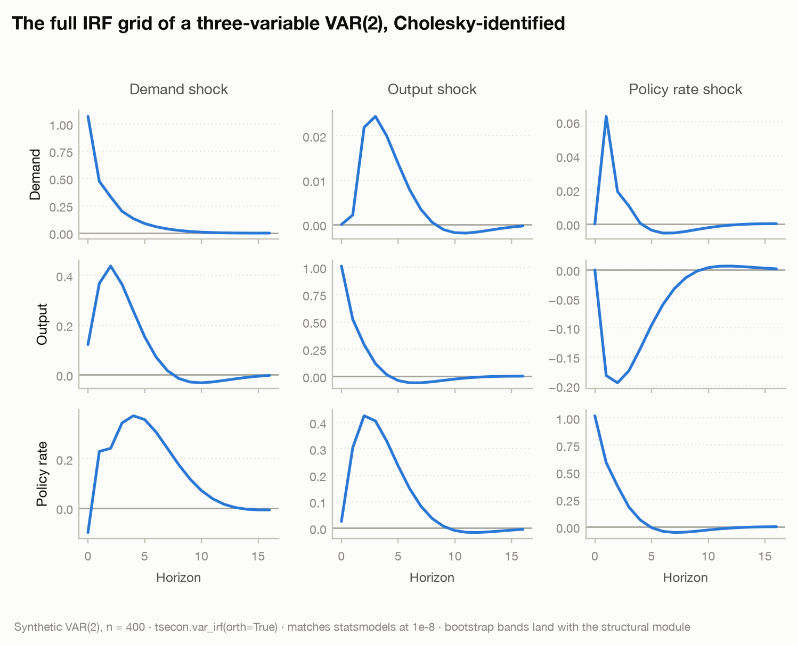
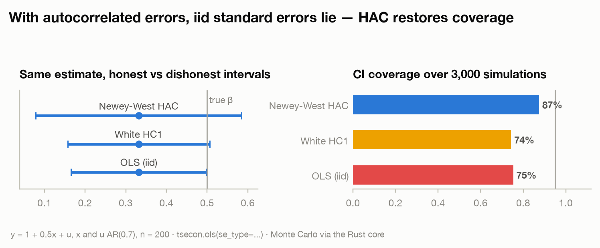

# Chapter 9 — Local Projections

> Part of [The tsecon Guide to Time Series Econometrics](README.md). Chapters mirror the library's modules; code runs against the current Python API unless marked otherwise.

**Prerequisites:** OLS regression, HAC/robust standard errors, and VAR impulse responses — all covered earlier in this guide.

**You will learn:**

- The Jordà idea: estimate an impulse response with one regression per horizon, no dynamic model required
- Why LP and VAR estimate the *same* object in population, and how to think about their finite-sample bias-variance tradeoff
- How to get LP inference right — why per-horizon HAC was the old default and lag augmentation is the new one
- How LP-IV and one-step cumulative multipliers work, with the Ramey-Zubairy fiscal multiplier as the running example
- How the LP framework extends to recessions-vs-expansions asymmetries, panels, and difference-in-differences

## The idea

Here is the question that launched a thousand papers: the government unexpectedly raises military spending — what happens to GDP over the next five years? Not just on impact, but quarter by quarter: the whole *path* of the response. That path is called an **impulse response function (IRF)**: the expected effect of a one-time shock today on an outcome at every future horizon.

The classical answer, which you met in the VAR chapter, is indirect. You fit a complete dynamic model of the economy — a vector autoregression, where every variable depends on lags of every other — and then *iterate* it forward: the model says what happens next period, feed that back in to get the period after, and so on. It works beautifully when the model is right. But the horizon-20 response is built by compounding the one-step model twenty times, so any small misspecification in the one-step dynamics compounds twenty times too.

Òscar Jordà's 2005 insight fits in one line: **if you want to know the effect of today's shock on GDP eight quarters from now, regress GDP eight quarters from now on today's shock.** Directly. No model of the intervening dynamics, no iteration. Run that regression once for each horizon — GDP next quarter on the shock, GDP two quarters out on the shock, ..., GDP twenty quarters out on the shock — and the sequence of shock coefficients *is* the impulse response, traced out one point at a time. Each regression is a "local projection" (LP): local because each one cares only about its own horizon.

Picture two ways of hiking to a viewpoint 20 kilometers away. The VAR way: build a precise map of the first kilometer, then extrapolate the remaining 19 by assuming the terrain repeats. The LP way: walk to each kilometer marker and look around. The VAR hiker is efficient if the terrain really does repeat; the LP hiker is slower and sees a noisier picture, but is never fooled by a map that was only ever accurate near the trailhead.

That robustness — plus the fact that a regression per horizon extends effortlessly to instrumental variables, interactions, and panel data — is why local projections have become the workhorse of modern empirical macroeconomics: fiscal multipliers, monetary transmission, credit cycles, growth-at-risk all run on LPs today.

## One regression per horizon

A practitioner cares because this is the fastest route from "I have a shock series" to "here is the dynamic causal effect, with standard errors." No system to specify, no stability conditions, no iteration.

Formally, let $y_t$ be the outcome (say, log GDP), $s_t$ the impulse variable (a fiscal shock, a monetary surprise), and $w_t$ a vector of controls — typically lags of $y$, lags of $s$, and lags of any other relevant variables. For each horizon $h = 0, 1, \dots, H$ run the regression

$$
y_{t+h} = \alpha_h + \beta_h \, s_t + \gamma_h' w_t + \xi_{t+h},
$$

where $\alpha_h$ is a horizon-specific intercept and $\xi_{t+h}$ is the error. The coefficient $\beta_h$ answers: holding the past fixed, how much higher is $y$ expected to be $h$ periods after a one-unit impulse? The impulse response function is the collection $\{\beta_0, \beta_1, \dots, \beta_H\}$ — one coefficient from each regression.

Two structural facts about this regression matter for everything that follows:

1. **The error is serially correlated by construction.** $\xi_{t+h}$ contains every shock that hits between $t+1$ and $t+h$ — events after the impulse but before the outcome is measured. Consecutive observations share most of those intervening shocks, so the errors follow a moving-average process of order $h$ (MA($h$)). This is *not* a specification failure; it is what "skipping over $h$ periods" means. But it does mean textbook OLS standard errors are wrong, which is where the inference section comes in.
2. **Each horizon loses observations at the end of the sample.** To regress $y_{t+h}$ on $s_t$, the last $h$ observations have no outcome. The horizon-20 regression has 20 fewer usable rows than the horizon-0 regression.

Local projections are buildable *today* from tsecon's primitives. Here is an honest hand-rolled LP on synthetic data where we know the true answer: an AR(1) with persistence $\phi = 0.7$, hit by an *observed* shock $\varepsilon_t$ and by other, unobserved disturbances. The true response of $y$ to a unit $\varepsilon$ shock at horizon $h$ is exactly $0.7^h$.

```python
import numpy as np
import tsecon

rng = np.random.default_rng(42)
T, H, phi = 400, 20, 0.7

# DGP: y_t = 0.7 y_{t-1} + eps_t + 0.5 eta_t.
# eps is the observed shock; eta stands in for everything else that moves y.
# True impulse response of y to a unit eps shock at horizon h: phi**h.
eps = rng.standard_normal(T)
eta = rng.standard_normal(T)
y = np.zeros(T)
for t in range(1, T):
    y[t] = phi * y[t - 1] + eps[t] + 0.5 * eta[t]

irf = np.zeros(H + 1)
se = np.zeros(H + 1)
for h in range(H + 1):
    yh   = y[1 + h:]        # outcome shifted h periods ahead: y_{t+h}
    s    = eps[1:T - h]     # the impulse at time t
    ylag = y[:T - 1 - h]    # control: y_{t-1}
    X = np.column_stack([np.ones_like(s), s, ylag])
    r = tsecon.ols(yh, X, se_type="hac", maxlags=h + 1)  # bandwidth grows with h
    irf[h], se[h] = r["params"][1], r["bse"][1]

print(np.round(irf[:6], 2))              # [0.98 0.74 0.49 0.3  0.24 0.19]
print(np.round(phi ** np.arange(6), 2))  # [1.   0.7  0.49 0.34 0.24 0.17]
```

The loop is the whole method: shift the outcome, align the shock and controls, regress, collect $\beta_h$. The `se_type="hac"` and the growing `maxlags` handle the MA($h$) errors — for now; the inference section will replace this with something better.

**What are the controls for?** Two jobs. First, *identification*: if your impulse series is not perfectly exogenous — it might be predictable from last quarter's economy — conditioning on lags of the system makes "shock" mean "the surprise component." Putting the shock variable first among the contemporaneous controls reproduces exactly the recursive (Cholesky) identification you met in the VAR chapter; Plagborg-Møller and Wolf (2021) prove the two are the same identification scheme. Second, *efficiency*: controls soak up forecastable variation in $y_{t+h}$, shrinking the residual and therefore the standard error on $\beta_h$. In the code above, dropping `ylag` would leave $\beta_h$ consistent (because `eps` is truly exogenous by construction) but noticeably noisier.

**What if the shock is measured with error?** Narrative shock series — someone reading newspapers and coding up spending news — are noisy measurements of the true shock. Under classical measurement error, the estimated IRF has the right *shape* but is attenuated by an unknown constant. The standard fix is **unit-effect normalization**: divide the whole IRF by the impact response of the policy variable itself, so you report "the response of GDP per unit move in spending" rather than "per unit of my noisy shock measure." The attenuation cancels in the ratio. This internal-instrument logic is why noisy proxies are usable at all, and why the normalization convention deserves a line in every table note.

> **⚠ Common mistake — sample alignment.** Horizon $h$ loses the last $h$ observations, so each horizon's *maximal* sample is different. If you let every regression use all the data it can (as the code above does, and as R's `lpirfs` does by default), the horizon-0 and horizon-20 estimates are computed on different samples — a subtle source of non-comparability. Ramey and Zubairy instead fix a **common sample** across all horizons. Results differ visibly between the two conventions. Neither is wrong, but you must choose deliberately and report which you chose. Sloppy index arithmetic in the shift-and-align step is the single most common hand-rolled-LP bug — off-by-one errors here silently give you the IRF at the wrong horizon.

The common-sample convention is a two-line change: fix the range of $t$ once, using the *largest* horizon's constraint, and reuse it everywhere.

```python
t = np.arange(1, T - H)      # the same t-range for every horizon
for h in range(H + 1):
    yh, s, ylag = y[t + h], eps[t], y[t - 1]
    X = np.column_stack([np.ones(t.size), s, ylag])
    r = tsecon.ols(yh, X, se_type="hac", maxlags=h + 1)
```

Every horizon now sees identical rows, so differences across $\beta_h$ are pure horizon effects — at the price of throwing away $H$ usable observations from the short-horizon regressions. That tradeoff *is* the convention choice.

## LP versus VAR: an honest comparison

Should you use LP or a VAR? For years this was argued like a sports rivalry. The modern answer is more interesting: **they estimate the same thing.**

Plagborg-Møller and Wolf (2021) proved that in population — with unrestricted lag structures — local projections and VARs recover *identical* impulse responses. Any identification scheme you can implement in one, you can implement in the other. Putting the shock first among the controls in an LP is the same identification as ordering it first in a Cholesky-identified VAR. LP versus VAR is not a debate about the estimand; it is purely a debate about finite-sample estimation.

And in finite samples the tradeoff is exactly the hiking metaphor:

- A VAR($p$) estimates a small number of one-step parameters and *extrapolates* them: the horizon-$h$ IRF is a nonlinear function of the lag matrices, compounded $h$ times. Low variance (few parameters), but any misspecification bias compounds with the horizon and never averages out.
- LP estimates each horizon freshly. Little extrapolation, so low bias even under misspecification — but each $\beta_h$ leans on fewer effective observations, so high variance, and LP impulse responses look jagged where VAR responses look smooth.

Li, Plagborg-Møller, and Wolf (2024) quantified this over *thousands* of empirically calibrated data-generating processes. The lessons: LP has the lower bias and much higher variance almost everywhere; VAR the reverse; at short horizons with matched lag lengths the two nearly coincide; and in mean-squared-error terms, *intermediate* estimators — LP shrunk toward the VAR, or VARs with more lags than information criteria suggest — dominate both endpoints. If you must pick a pure method: pick LP when you care most about not being systematically wrong, pick VAR when you care most about precision and trust your specification.

Because our synthetic DGP is exactly a VAR(1) in the pair $(\varepsilon_t, y_t)$, both estimators target the same $0.7^h$ — and tsecon can show it, since the VAR side already has bindings:

```python
data = np.column_stack([eps, y])                  # shock ordered first (recursive ID)
virf = tsecon.var_irf(data, lags=1, horizon=H)    # [h][response][shock], h = 0..H
var_irf_y = np.array([virf[h][1][0] for h in range(H + 1)])
var_irf_y = var_irf_y / virf[0][0][0]             # one-SD shock -> per-unit shock

print(np.round(var_irf_y[:6], 2))                 # [0.98 0.75 0.52 0.35 0.24 0.16]
print(np.max(np.abs(var_irf_y - irf)))            # ~0.19, all of it at long horizons
```

At short horizons the two lines are nearly on top of each other (gaps of 0.00–0.05 through $h = 5$). At long horizons they separate — not because either is wrong, but because the LP line wiggles around the VAR's smooth geometric decay. That is the bias-variance tradeoff in miniature: here the VAR's smoothness is pure gain because the DGP really is a VAR(1); on real data, that smoothness is exactly where extrapolation bias would hide.

Note the normalization line: `var_irf` returns **orthogonalized (one-standard-deviation) responses**, while our LP was normalized to a **unit shock**. Dividing by the shock's own impact response converts between conventions. Normalization mismatches are the classic way to "fail to replicate" a paper by a constant scale factor.

For a look at what the VAR comparator produces on a richer three-variable system, see the gallery's VAR section:



The practical upshot of the equivalence result: **fit both and overlay them.** When LP and VAR IRFs from the same specification diverge, that divergence is information — usually a sign the VAR's lag length is too short — not a reason to pick your favorite. The roadmap module makes this dual reporting a single call.

> **⚠ Common mistake — treating LP/VAR divergence as one method being "broken."** They are two estimators of one estimand. Divergence at long horizons is the expected signature of VAR extrapolation bias meeting LP noise, and its *pattern* is a useful specification diagnostic. Reporting only whichever line looks better is the field's version of p-hacking.

## Inference done right

Here is where existing tools fail and where the most has changed since 2005. Getting the point estimates right is easy; getting the standard errors right is the hard part, because those MA($h$) errors violate the OLS independence assumption at every horizon past zero.

**The old default: per-horizon HAC.** Since the errors are serially correlated up to order $h$, the traditional fix is Newey-West (HAC) standard errors, horizon by horizon, with a bandwidth that grows with $h$ — you saw it in the first code block. This works asymptotically, but it has known problems: HAC estimators undercover in small samples (the true 95% interval covers less than 95% of the time), the distortion worsens as the bandwidth grows — which it must, since the error order grows with $h$ — and the popular folklore bandwidth-equals-$h$ rule is exactly that: folklore. The gallery's robust-standard-errors figure shows the undercoverage phenomenon in its simplest form — nominal 95% intervals covering ~75% under naive standard errors, with Newey-West closing most but not all of the gap:



**The new default: lag augmentation.** Montiel Olea and Plagborg-Møller (2021) showed something surprising. Take the LP regression and *augment* it with $p$ lags of all system variables:

$$
y_{t+h} = \alpha_h + \beta_h \, \varepsilon_t + \sum_{j=1}^{p} \delta_{h,j}' Y_{t-j} + \xi_{t+h},
$$

where $Y_t$ stacks the outcome, the impulse, and any other system variables. If the impulse $\varepsilon_t$ is **innovation-like** — unpredictable from the past, as a properly identified shock should be — then the part of the regression score attached to $\beta_h$ becomes approximately a martingale difference sequence: serially *uncorrelated*, despite the MA($h$) errors. Plain heteroskedasticity-robust (Eicker-Huber-White) standard errors are then valid. No HAC, no bandwidth choice at all.

Better still, the result is **uniform**: it holds whether the data are mildly persistent or have an exact unit root, and it holds at horizons that are a nontrivial fraction of the sample — precisely the territory where HAC-based LP inference is known to break down. Simpler *and* more robust. This is why the tsecon roadmap module makes lag-augmented LP with robust standard errors the loud, documented default, with HAC as the explicit fallback.

The lag-augmented version of our example, using today's API:

```python
p = 2                                    # augmentation lags
irf_la = np.zeros(H + 1)
se_la = np.zeros(H + 1)
for h in range(H + 1):
    t = np.arange(p, T - h)              # t where all lags and leads exist
    yh   = y[t + h]
    s    = eps[t]
    lags = np.column_stack([y[t - j] for j in range(1, p + 1)])
    X = np.column_stack([np.ones(t.size), s, lags])
    r = tsecon.ols(yh, X, se_type="hc1")   # plain robust SEs -- no HAC needed
    irf_la[h], se_la[h] = r["params"][1], r["bse"][1]
```

The only changes from the first loop: extra lags in the design matrix, and `se_type="hc1"` instead of `"hac"`. That swap is the entire modern inference upgrade. Comparing the two ladders of standard errors on our synthetic data:

```python
hs = [0, 4, 12, 20]
print(np.round(se[hs], 3))     # per-horizon HAC:   [0.028 0.091 0.072 0.072]
print(np.round(se_la[hs], 3))  # lag-augmented EHW: [0.028 0.081 0.081 0.078]
```

Two things to notice. Both ladders *grow* with the horizon — at impact the regression explains almost everything, while at horizon 20 twenty periods of intervening shocks sit in the error, so uncertainty about long-horizon responses is intrinsically larger. And in this easy DGP — stationary, moderate persistence, 400 observations — the two ladders nearly coincide. That is expected: the case for lag augmentation is not that it gives different answers in easy problems, but that it *keeps* giving valid answers in the hard ones (persistence near or at a unit root, horizons that are a sizable fraction of the sample) where HAC-based intervals are known to undercover badly. You pay nothing in the easy case and you are protected in the hard case, which is what a good default looks like.

**When samples are small: the bootstrap, done carefully.** Below a couple hundred observations, even good asymptotic approximations strain, and the bootstrap becomes attractive — but LP is a minefield for naive resampling. Resampling per-horizon residuals independently is flat-out invalid: the residuals are dependent both within a horizon (the MA($h$) structure) and across horizons (they share intervening shocks). The schemes that work are the **wild bootstrap on the lag-augmented regression's scores** — the natural partner of the lag-augmented default, per Montiel Olea and Plagborg-Møller (2021) — and the **moving-block bootstrap on entire data tuples** $(y_{t+h}, s_t, w_t)$, which preserves dependence by resampling contiguous chunks. In either case, use studentized (percentile-t) intervals: Kilian and Kim (2011) showed plain percentile intervals for LP have poor coverage. You can experiment with the block machinery today via `tsecon.bootstrap_indices` and `tsecon.optimal_block_length`; the LP-specific schemes, wired to reproducible parallel RNG so thousands of replications take seconds, are what the roadmap module adds.

> **⚠ Common mistake — lag augmentation is not a free pass.** The EHW-validity result requires the impulse regressor to be innovation-like. If your "impulse" is a persistent observable — the level of the interest rate, an oil price — rather than an unforecastable shock, the score is *not* a martingale difference and HAC standard errors are still required. The inference mode must match what the impulse is. tsecon's LP module makes this an explicit, validated API choice rather than a silent default; when hand-rolling, you have to police it yourself. And in the other direction: never pair a small-bandwidth HAC estimator with long horizons on near-unit-root data and trust the bands — that is the configuration the Monte Carlo literature shows failing worst.

## Beyond pointwise: joint and simultaneous bands

Every IRF plot you have ever seen has a shaded band around the line. Almost all of them are **pointwise** 95% intervals: at each horizon *separately*, the interval covers the true response 95% of the time. But readers never use them pointwise — they ask "is the response significant over horizons 4 through 16?" or "is the whole path different from zero?" Those are **joint** statements across 13 or 21 horizons, and the probability that a true IRF escapes at least one of 21 pointwise intervals is far more than 5%. Pointwise bands systematically overstate joint significance.

The honest object is a **simultaneous confidence band**: a band that contains the *entire true IRF path* with 95% probability. The workhorse construction is the **sup-t band** (Montiel Olea and Plagborg-Møller 2019): estimate the joint covariance of the whole IRF vector $(\hat\beta_0, \dots, \hat\beta_H)$ — including the cross-horizon correlations induced by overlapping samples — then simulate the distribution of the *maximum* absolute t-statistic across horizons and widen every interval by that common critical value instead of 1.96. The result is wider than pointwise (it must be) but much narrower than a Bonferroni correction, because it exploits the strong positive correlation between adjacent horizons' estimates.

The prerequisite is the joint cross-horizon covariance matrix, which requires estimating all horizons as one stacked system rather than $H+1$ unrelated regressions. That machinery is the centerpiece of the roadmap module — it is a first-class internal object there precisely so that sup-t bands, path Wald tests ("is the IRF zero at all horizons?"), and multiplier delta methods all fall out of it. Computing per-horizon standard errors and pretending horizons are independent produces bands that are wrong in both width and shape.

A useful companion object is the **significance band** (Inoue, Jordà, and Kuersteiner 2023): instead of a band *around the estimate*, construct the band around *zero* that the estimated IRF would stay inside if the true response were nil, accounting for serial dependence under that null. It answers a different question — "is there any response at all?" versus the confidence band's "what responses are consistent with the data?" — exactly the way the Bartlett bands on an ACF plot work. When a referee asks whether your IRF is distinguishable from no effect, this is the clean answer; it comes nearly for free once the joint covariance exists.

> **⚠ Common mistake — reading pointwise bands as joint statements.** "The IRF is significant from quarter 2 to quarter 10" is a claim about 9 horizons at once; pointwise bands do not license it. Nearly every published LP paper commits this quietly. If your conclusion is about a stretch of the IRF or its shape, you need simultaneous bands — and if a result survives only under pointwise bands, that is worth knowing before a referee finds out.

## LP-IV and fiscal multipliers

Now the running example the whole modern fiscal literature is built on. Question: if the government spends an extra dollar, how many dollars of GDP do we get? The obstacle: government spending is not randomly assigned — it responds to the state of the economy — so regressing output on spending confuses cause and effect.

**Ramey and Zubairy (2018)** attack this with an instrument: *military news* — narrative-identified changes in expected defense spending driven by geopolitical events (wars, threats), which move government spending for reasons plausibly unrelated to the current business cycle. This is **LP-IV**: at each horizon, a two-stage least squares regression where the endogenous impulse (spending) is instrumented by the external shock (news). Writing $\tilde{\cdot}$ for variables residualized on the controls, the horizon-$h$ estimator is

$$
\hat\beta_h^{IV} = \frac{\sum_t \tilde z_t \, \tilde y_{t+h}}{\sum_t \tilde z_t \, \tilde x_t},
$$

with $z_t$ the instrument, $x_t$ the endogenous impulse, $y_{t+h}$ the shifted outcome. Validity requires more than the textbook IV conditions: Stock and Watson (2018) show LP-IV needs **lead-lag exogeneity** — the instrument must be uncorrelated with *past and future* structural shocks, not just contemporaneous ones — which in practice means the control set must be rich enough to absorb any autocorrelation in the instrument, and must be identical across both stages. A per-horizon first-stage effective F statistic (in the HAC-robust form of Montiel Olea and Pflueger) is the standard weak-instrument diagnostic; narrative instruments are frequently weak, so this is not optional. When the F is uncomfortably low, the honest reporting object is a weak-instrument-robust Anderson-Rubin confidence set rather than a point estimate with fictional precision — more on that in the frontier section.

The same design runs the monetary literature. Gertler and Karadi (2015) instrument the policy rate with **high-frequency surprises** — the jump in federal funds futures prices in a 30-minute window around FOMC announcements, too narrow a window for anything but the policy news itself to move prices. Swap the instrument and the endogenous impulse, keep every line of the LP-IV machinery, and the fiscal toolkit becomes a monetary one. This plug-compatibility across identification schemes is a large part of why LP displaced bespoke structural models as the default reporting device.

**Cumulative multipliers.** A fiscal multiplier is not a single-horizon object — "the effect of a dollar" should count all the output gained over, say, four years, per dollar of spending over those four years. The modern standard estimates this in **one step**: regress *cumulated* output on *cumulated* spending, instrumented by the shock,

$$
\sum_{j=0}^{h} y_{t+j} = \mu_h + \mathcal{M}_h \sum_{j=0}^{h} g_{t+j} + \gamma_h' w_t + u_{t+h},
$$

so the coefficient $\mathcal{M}_h$ *is* the horizon-$h$ multiplier, with correct IV inference built in. Ramey and Zubairy's headline number — a linear multiplier of roughly **0.6 to 0.7** at two-to-four-year horizons, below the "spend a dollar, get a dollar" threshold of 1 — comes from exactly this construction on 125+ years of US quarterly data, and it is the single most important validation target for tsecon's LP module.

One unglamorous detail that changes headline numbers: **units**. A multiplier should be "dollars of output per dollar of spending," but the natural regression variables are log GDP and log spending, whose coefficient is an elasticity — and converting an elasticity to a multiplier requires multiplying by the sample-average GDP/spending ratio, a number around 5 for the US, applied *ex post* and frozen at one value even though the ratio moves over a century of data. The **Gordon-Krenn transformation** avoids this: divide both output and spending by an estimate of trend GDP before running the LP, so both variables are already in "percent of trend GDP" units and the coefficient is a multiplier directly. Ramey and Zubairy use exactly this, and the roadmap module treats the transformation as a first-class option rather than a preprocessing chore.

Per-horizon 2SLS is not yet exposed in the Python API, so this one is a preview of the dedicated module.

*Roadmap preview — this API lands with Module 07 ([spec](../roadmap/07-local-projections.md)):*

```python
res = tsecon.lp_iv(
    y=output, x=spending, z=military_news,   # outcome, endogenous impulse, instrument
    controls=lagged_system, horizon=20,
    cumulative=True,                          # one-step Ramey-Zubairy multipliers
)
res["multiplier"][8]       # 2-year cumulative multiplier (quarterly data)
res["first_stage_F"]       # per-horizon effective F, HAC-robust
res["bands"]["supt"]       # simultaneous bands from the joint covariance
```

> **⚠ Common mistake — the ratio-of-IRFs multiplier.** It is tempting to estimate the cumulative output IRF and the cumulative spending IRF separately and report their ratio, delta-method standard errors attached. That is a *different estimator* from the one-step IV regression, and the two can differ materially in finite samples — the one-step version is the standard for good reason (Ramey and Zubairy 2018). The roadmap module implements the ratio version only as a labeled comparison, never as the headline number.

## State dependence, panels, and other extensions

The reason LP won the applied-macro market is that each extension below is just a variation on a regression — no new estimation theory required to *run* them (the theory shows up in the caveats).

**State-dependent LP.** Is the fiscal multiplier bigger in recessions, when idle resources make crowding-out weaker? Interact *everything* — impulse, controls, intercept — with a lagged state indicator $I_{t-1}$ (recession/expansion, high/low slack):

$$
y_{t+h} = I_{t-1}\!\left[\alpha_{A,h} + \beta_{A,h} s_t + \gamma_{A,h}' w_t\right] + \left(1 - I_{t-1}\right)\!\left[\alpha_{B,h} + \beta_{B,h} s_t + \gamma_{B,h}' w_t\right] + \xi_{t+h},
$$

giving one IRF per regime. The **smooth-transition** variant (Auerbach and Gorodnichenko 2012) replaces the on/off dummy with a logistic weight $F(z_t) = \exp(-\gamma z_t)/(1 + \exp(-\gamma z_t))$ on a standardized state variable $z_t$, so the IRF varies continuously with the depth of the recession; Auerbach and Gorodnichenko calibrate $\gamma = 1.5$. Ramey and Zubairy's state-dependent results combine the dummy-interaction design with the one-step IV multiplier, and are the module's headline validation target. Their substantive finding is worth knowing because it reversed the field's prior: where Auerbach and Gorodnichenko had reported recession multipliers well above 1, Ramey and Zubairy — with a longer sample, the one-step multiplier estimator, and careful attention to the state variable's construction — find little evidence that multipliers exceed 1 even in high-slack states. Methodological choices this chapter has been cataloging (estimator, sample convention, state timing) are exactly what separates the two conclusions.

*Roadmap preview — this API lands with Module 07:*

```python
res = tsecon.lp_state(
    y=output, shock=military_news, state=slack,   # state entered with a lag
    horizon=20, transition="logistic", gamma=1.5, # Auerbach-Gorodnichenko
)
```

> **⚠ Common mistake — a state variable that responds to the shock.** The state must be *predetermined*: use $I_{t-1}$, not $I_t$. But even lagging does not fully solve the deeper problem identified by Gonçalves, Herrera, Kilian, and Pesavento: if the shock itself can move the economy across regimes within the response horizon, the regime-specific "IRF" no longer means what you think it means — the estimand changes. Relatedly, building the state from a centered moving average or two-sided filter smuggles *future* information into the regime classification (the standard critique of Auerbach-Gorodnichenko's original state variable). tsecon's implementation emits diagnostics for both traps.

**Panel LP.** With many countries, firms, or households, run the LP within-units: unit fixed effects absorb permanent differences, time effects absorb common shocks, and the standard errors must respect the panel structure — clustered by unit, two-way, or Driscoll-Kraay when cross-sectional dependence is pervasive (which in macro panels it always is). This is the engine of the Jordà-Schularick-Taylor macrohistory literature: what follows credit booms, across 17 countries and 150 years, is a panel LP question. Watch for two panel-specific pathologies. Nickell bias — the familiar dynamic-panel bias from combining fixed effects with lagged outcomes — does not stay $O(1/T)$ in LP but grows with the horizon (effectively $O(h/T)$), dangerous exactly when your panel is short and your horizons long. And unbalanced panels develop *different* gaps at each horizon once outcomes are shifted $h$ periods, so the effective sample quietly changes shape across the IRF.

**LP-DiD.** Difference-in-differences event studies are LPs in disguise: regress the $h$-horizon change in the outcome on treatment switching. Dube, Girardi, Jordà, and Taylor (2023) formalize this and add the crucial **clean-control condition** — compare switchers only to not-yet-treated or never-treated units — which sidesteps the negative-weighting pathologies that plague two-way-fixed-effects event studies under staggered adoption. The LP framing also makes pre-trend checks natural: run the same regressions at *negative* horizons ($h < 0$), where a well-identified design should show flat responses before treatment. If you know the modern DiD literature, LP-DiD is the time-series native's route to the same destination; it is in the roadmap module's core scope.

**Smooth LP.** Raw LP estimates are jagged because each horizon is estimated separately — but true IRFs are smooth, and readers *will* interpret every wiggle ("the effect dies at quarter 9 and revives at quarter 11") even when the wiggles are pure noise. Barnichon and Brownlees (2019) estimate all horizons jointly with the IRF expanded in a B-spline basis and a ridge penalty on its second differences, shrinking the path toward a smooth polynomial: information is shared across neighboring horizons, and variance drops dramatically at modest bias cost. The catch: the penalty parameter must be tuned by *blocked* (time-series-aware) cross-validation — ordinary k-fold leaks the MA($h$) overlap across folds and systematically undersmooths — and post-shrinkage standard errors are not honest, so bands come from the bootstrap with explicit caveats.

## The frontier

The LP literature is one of the most active in econometrics; here is the current edge, all of it in the roadmap module's upper tiers.

**Efficiency without a VAR's bias.** The MA($h$) error structure is *known*, which OLS ignores. Lusompa (2023) exploits it with a recursive GLS transformation using earlier-horizon estimates, recovering large efficiency gains; inference must be by wild bootstrap because estimation error propagates across horizons. Bayesian LP (Ferreira, Miranda-Agrippino, and Ricco; Tanaka 2020) places VAR-based priors on the IRF path, landing the estimator on the LP-VAR bias-variance frontier by choice rather than accident. And Li, Plagborg-Møller, and Wolf (2024) show penalized LP-VAR averaging dominates both endpoints in MSE — with the honest caveat that *post-shrinkage inference remains an unsolved problem*: nobody knows how to build fully honest confidence bands after data-driven shrinkage, so these ship with bootstrap bands and loud warnings.

**Small-sample honesty.** LP point estimates carry a finite-sample bias analogous to the classic AR-coefficient bias, growing with horizon and persistence; Herbst and Johannsen (2024) derive a feasible analytical correction. On the bootstrap side, Kilian and Kim (2011) showed percentile intervals for LP have poor coverage — studentized (percentile-t) intervals on block or wild resampling are the standard, and naive iid residual resampling is simply invalid given the dependence within and across horizons.

**Why LP defaults won the argument.** Montiel Olea, Plagborg-Møller, Qian, and Wolf (2024) — the memorably titled "Unpleasant VARithmetic" paper — show lag-augmented LP is *doubly robust* to misspecification in a sense VARs cannot match: VAR bias does not vanish even as you widen the bands. This is the intellectual foundation under the library's lag-augmented default.

**Frontier variants awaiting anyone's implementation.** Weak-instrument-robust Anderson-Rubin confidence sets for LP-IV (which can be unbounded or disjoint — an honest API must represent that, not truncate it); quantile LP for growth-at-risk dynamics (how shocks move the *tails* of the GDP distribution, extending Adrian, Boyarchenko, and Giannone 2019); time-varying LP for unstable transmission mechanisms (Inoue, Rossi, and Wang 2024); doubly-robust IPW/AIPW LP treating policy as a treatment (Angrist, Jordà, and Kuersteiner 2018); policy counterfactuals assembled from estimated IRFs (McKay and Wolf 2023); and estimand diagnostics for nonlinear LPs — Kolesár and Plagborg-Møller (2025) characterize exactly what weighted average a misspecified nonlinear LP recovers. Essentially none of this exists in any maintained package in any language; it is the roadmap module's Tier 3 and 4 territory, and the honest reason a Rust core matters — the bootstrap- and simulation-heavy inference this literature now demands is too slow in interpreted loops to be anyone's default.

## Which method when

| Situation | Reach for | Because |
|---|---|---|
| Short horizons, small well-specified system, precision matters | VAR IRFs (`var_irf`) | Low variance; near-equivalent to LP at small $h$ with matched lags |
| Medium/long horizons, misspecification a live worry | Local projections | Bias does not compound with horizon; robustness is the point |
| Observed but possibly noisy shock series | LP with the shock ordered first among controls, unit-effect normalization | Equivalent to recursive identification; normalization survives classical measurement error |
| Impulse variable endogenous, external instrument available | LP-IV with effective-F diagnostics | Lead-lag exogeneity + per-horizon 2SLS is the modern identification standard |
| Fiscal (or any cumulative) multiplier | One-step IV on cumulated sums | The Ramey-Zubairy estimator; ratio-of-IRFs is a different, inferior estimator |
| Persistent data and/or long horizons | Lag-augmented LP with plain robust SEs | Uniformly valid across persistence (incl. unit roots) and horizon length |
| Impulse regressor is not innovation-like | Per-horizon HAC/HAR inference | Lag augmentation's EHW validity does not apply; HAC is the honest fallback |
| Claims about a *stretch* of the IRF or its shape | Sup-t simultaneous bands | Pointwise bands overstate joint significance |
| Recession-vs-expansion asymmetry | State-dependent LP with a *lagged* state | Predetermined states limit endogeneity; check the state isn't shock-responsive |
| Staggered policy adoption in a panel | LP-DiD with clean controls | Avoids TWFE negative-weight pathologies |
| IRF too jagged to present | Smooth LP (blocked CV) or LP-VAR shrinkage | Large variance reduction; accept bootstrap-only bands |
| LP and VAR disagree from the same spec | Dual reporting, then more VAR lags | Divergence is a specification diagnostic, not a horse race |

## What tsecon implements today

**Available now in Python** — everything the hand-rolled LP in this chapter needs:

- `tsecon.ols(y, X, se_type=...)` with `"hac"` (Newey-West, `maxlags` controls the bandwidth), `"hc0"`/`"hc1"` (the EHW standard errors that lag-augmented LP calls for), and `"nonrobust"`; returns `params`, `bse`, `tvalues`
- `tsecon.long_run_variance` — the kernel LRV machinery under HAC
- `tsecon.var_fit`, `tsecon.var_irf`, `tsecon.var_fevd`, `tsecon.var_forecast` — the VAR comparator for dual reporting
- `tsecon.bootstrap_indices`, `tsecon.optimal_block_length`, `tsecon.philox_uniforms` — block-bootstrap experiments with reproducible parallel RNG
- `tsecon.adf`, `tsecon.kpss`, `tsecon.check_stationarity` — the persistence pre-flight that tells you how much to worry about long-horizon inference

Both runnable loops in this chapter — per-horizon HAC and lag-augmented EHW — work against today's API.

**Built in Rust, awaiting Python bindings:** fixed-b/EWC (HAR) inference in the HAC crate — the modern small-sample answer where per-horizon HAC must be used, with the nonstandard critical values that make it size-correct.

**Roadmap:** the dedicated module ([docs/roadmap/07-local-projections.md](../roadmap/07-local-projections.md)) automates and hardens everything this chapter hand-rolled, and owns what cannot reasonably be hand-rolled: baseline LP with the lag-augmented EHW default and explicit sample-alignment policy, LP-IV with effective-F and Anderson-Rubin sets, one-step cumulative multipliers, the joint cross-horizon covariance with sup-t simultaneous bands, wild and block bootstrap schemes that are actually valid for LP, state-dependent and smooth-transition variants with endogeneity diagnostics, panel LP and LP-DiD, smooth/Bayesian/GLS LP, and LP-VAR dual reporting. Its validation bar: reproduce the Ramey-Zubairy multipliers and the `lpirfs`/Stata reference numbers to three-plus decimals.

## Further reading

- **Jordà (2005), *American Economic Review*** — the founding paper: impulse responses by per-horizon regression, and why robustness to misspecification is worth variance.
- **Ramey & Zubairy (2018), *Journal of Political Economy*** — the applied benchmark: military-news LP-IV, one-step cumulative multipliers, state dependence, 125+ years of US data.
- **Stock & Watson (2018), *Economic Journal*** — the LP-IV foundations, including the lead-lag exogeneity condition that separates LP-IV from textbook IV.
- **Plagborg-Møller & Wolf (2021), *Econometrica*** — LPs and VARs estimate the same impulse responses; the organizing result of the modern literature.
- **Montiel Olea & Plagborg-Møller (2021), *Econometrica*** — lag-augmented LP inference: simpler than HAC and uniformly valid across persistence and horizons; the reason for tsecon's default.
- **Montiel Olea & Plagborg-Møller (2019), *Journal of Applied Econometrics*** — sup-t simultaneous confidence bands: what an honest IRF band actually is.
- **Li, Plagborg-Møller & Wolf (2024), *Journal of Econometrics*** — the bias-variance tradeoff measured across thousands of DGPs; why intermediate estimators win in MSE.
- **Auerbach & Gorodnichenko (2012), *American Economic Journal: Economic Policy*** — smooth-transition state dependence; the design half the nonlinear-LP literature builds on.
- **Ramey (2016), "Macroeconomic Shocks and Their Propagation," *Handbook of Macroeconomics*** — the survey that doubles as the field's textbook: identification approaches, LP practice, and hard-won conventions.
- **Kilian & Lütkepohl (2017), *Structural Vector Autoregressive Analysis*, Cambridge University Press** — the reference text situating LP within the broader structural-IRF toolkit.
