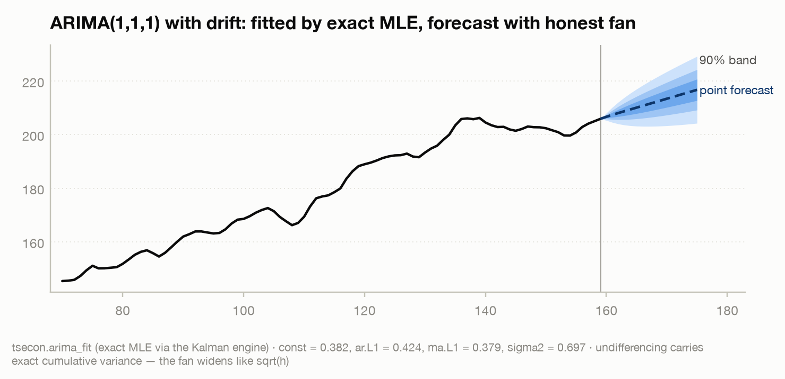

# Model card — ARIMA

`arima_fit` · `ar_loglik`

ARIMA is the flagship classical univariate model: the endpoint of the
AR → MA → ARMA → ARIMA ladder that turns two simple ideas — *the past predicts
the future* (autoregression) and *past surprises linger* (moving average) — into
one forecasting workhorse. The recipe is "difference `d` times to reach
stationarity, then fit an ARMA(p,q)":

```text
phi(L) (1 - L)^d y_t = c + theta(L) eps_t,        eps_t ~ iid N(0, sigma^2)
```

where `phi(L) = 1 - phi_1 L - ... - phi_p L^p` is the autoregressive polynomial,
`theta(L) = 1 + theta_1 L + ... + theta_q L^q` the moving-average polynomial, and
`(1 - L) y_t = y_t - y_{t-1}` the first difference. This card covers the full
exact-MLE estimator (`arima_fit`) and the fixed-parameter AR log-likelihood
helper (`ar_loglik`) that exposes the same likelihood kernel as a scoring
function. Both run on one state-space engine: the Harvey canonical form of the
ARMA process evaluated by the Kalman filter's prediction-error decomposition —
the same machinery that underlies `local_level_smooth` and the module's
exact-diffuse Kalman work. For end-to-end forecasting, evaluation, and
benchmarking, pair this card with the
[Forecasting card](forecasting.md).

---

## `arima_fit` — exact-MLE ARIMA(p,d,q) fit and forecast

**What it estimates.** The parameters of an ARIMA(p,d,q) model by **exact
maximum likelihood** — the AR coefficients `phi_1..phi_p`, the MA coefficients
`theta_1..theta_q`, an optional constant `c`, and the innovation variance
`sigma^2` — together with the log-likelihood, AIC/BIC, the one-step residuals,
and (optionally) multi-step point forecasts with prediction intervals that are
correctly **integrated back** to the original scale. Estimation differences the
series `d` times, maximizes the exact Gaussian likelihood of the differenced
ARMA process via the Kalman filter's prediction-error decomposition, and
undifferences the forecasts so their variance compounds across the integration.

**Assumptions.** After `d` differences the series is covariance-stationary and
invertible; the innovations are Gaussian white noise (the likelihood is exact
under Gaussianity and quasi-ML otherwise); the AR roots lie outside the unit
circle and the MA roots outside or on it. `d` is a modeling decision you make
*before* fitting — with unit-root tests, not an information criterion — because
likelihoods computed at different `d` are likelihoods of different datasets and
are not comparable. The exact likelihood additionally treats the initial
observations as draws from the process's own stationary distribution, which is
exactly the information CSS throws away and where the two estimators diverge in
small samples and near the unit circle.

**When to use (and when not).** Use it as the default forecast for a single
series with momentum: difference a trending level (GDP, prices, the money stock)
to stationarity with `d = 1` (rarely `d = 2`), capture short-run dynamics with a
*small* number of AR and MA terms, and read off point forecasts with honest
widening intervals. Prefer exact MLE over CSS or Yule-Walker whenever the sample
is short or persistence sits near a unit root — the initial conditions carry real
information and moment methods bias toward stationarity. Do **not** let AIC pick
`d` (choose it with `check_stationarity`); do not overfit ARMA orders — an
ARMA(2,2) on ARMA(1,1) data creates near-canceling AR/MA roots, a flat
likelihood, and fragile estimates with huge standard errors; do not difference
through missing values (fit in levels via the state-space form instead); and do
not reach here for **seasonal** structure — the SARIMA `(P,D,Q,s)` layer is not
yet in this estimator (it is on the Module 02 roadmap).

**Key arguments and defaults (and why).** `p`, `d`, `q` are the orders (all
default `0`). `constant = False` — a mean/drift term is *off* by default because
for a differenced (`d >= 1`) series a constant is a deterministic **drift**,
which you should add deliberately, not by accident; for `d = 0` it is the level
term, and note the fitted `const` is `c`, **not** the process mean, which is
`c / (1 - sum phi)`. `forecast_steps = 0` — set it to the horizon `h` to return
`h`-step forecasts. `conf_alpha = None` — leave it `None` for point forecasts and
standard errors only; set it (e.g. `0.05` for 95%) to also return symmetric
Gaussian prediction bands. `conf_alpha` requires `forecast_steps > 0` and must
lie in `(0, 1)`; both are validated (a `ValueError`, not a silent default).
Under the hood the optimizer uses Hannan-Rissanen (1982) starting values and the
Monahan (1984) reparameterization to keep the search inside the
stationary-and-invertible region (whose admissible set for `p, q > 1` is not a
box, so naive coefficient bounds fail) — you do not tune these, but they are why
the fit is robust.

**How to read the output.** A dict. `params` is the coefficient vector in the
order named by `param_names` — `["const"?, "ar.L1"..., "ma.L1"..., "sigma2"]`
(the constant appears only when `constant=True`, and `sigma2` is always last and
is counted as a free parameter in the ICs, matching statsmodels). `loglik` is the
maximized exact log-likelihood; `aic` and `bic` are `-2 loglik + 2k` and
`-2 loglik + k log T`. `residuals` are the one-step-ahead innovations (feed them
to `ljung_box` — remembering to dock the degrees of freedom by `p + q` — and to
`arch_lm`). When `forecast_steps > 0`: `forecast_mean` and `forecast_se` are the
`h`-step point forecasts and their standard errors on the original (undifferenced)
scale, `forecast_se` widening monotonically with the horizon. When `conf_alpha`
is set, `forecast_lower`/`forecast_upper` are `mean ± z(alpha) * se` and
`conf_alpha` echoes the coverage you asked for.

**Failure modes.** Overdifferencing injects an MA unit root (`theta ≈ -1`, the
likelihood piling on the invertibility boundary, first-lag autocorrelation of the
difference near `-0.5`) — the symptom of differencing an already-stationary
series. Overfit orders produce near-canceling roots and offsetting AR/MA
coefficients with inflated standard errors — shrink the model when you see them.
Comparing this log-likelihood to another package's without matching conventions
(the Gaussian constant, diffuse-term handling, whether `sigma2` is concentrated
out) manufactures phantom disagreements; a gap of exactly `(T/2) log 2pi` is a
convention, not a bug. Passing a series with NaNs, or one too short for the
requested orders, raises rather than guessing. And prediction intervals are
Gaussian and condition on the fitted parameters — they ignore parameter and
model-selection uncertainty and so are, like everyone's, somewhat too narrow near
unit roots and for `T < 100`.

**Validated against.** `statsmodels` 0.14.6 `SARIMAX`, on documented fixtures
(`fixtures/arima.json`) and live tests. The Rust golden pins fixed-parameter
exact log-likelihoods to **1e-8 relative** — ARMA(1,1) demeaned against
`SARIMAX(order=(1,0,1)).loglike`, and ARIMA(1,1,1) with simple differencing on
the Nile against `SARIMAX(order=(1,1,1), simple_differencing=True).loglike`. For
the full exact-MLE fit of ARMA(1,1)+constant on the Nile the estimator is held to
a **match-or-beat** floor on the log-likelihood and to **1e-4 relative** on the
parameters against an independently cross-verified maximizer. That gate has a
story worth telling: statsmodels' *default* fit stalls at `loglik = -638.117`
(a point where its own numerical gradient is O(1e-2)), while `tsecon` reaches the
genuine optimum at **`loglik = -637.039`** — a *better* fit than the reference,
confirmed by re-optimizing statsmodels' own objective from its stopping point.
The Python side (`test_smoke.py::test_arima_fit_beats_statsmodels_on_nile`,
`test_arima_d1_random_walk_law`, and the `test_intervals.py` interval round-trips)
asserts the beat, the monotone forecast SE, white-noise residuals, and the exact
`se_h = sigma * sqrt(h)` law for a random walk.

**References.** Box & Jenkins (1970, *Time Series Analysis: Forecasting and
Control*, Holden-Day); Harvey (1989, *Forecasting, Structural Time Series Models
and the Kalman Filter*, CUP, §3.3–3.4, the state-space form and prediction-error
decomposition); Hannan & Rissanen (1982, *Biometrika* 69:81–94, starting
values); Monahan (1984, *Biometrika* 71:403–404, the stationary/invertible
reparameterization); Durbin & Koopman (2012, *Time Series Analysis by State Space
Methods*, 2nd ed., OUP).

```python
import numpy as np, tsecon

# --- A synthetic stationary ARMA(1,1): mean 4, phi = 0.6, theta = 0.3 ---
rng = np.random.default_rng(11)
n, phi, theta, mu = 500, 0.6, 0.3, 4.0
eps = rng.standard_normal(n)
y = np.empty(n); y[0] = mu + eps[0]; e_prev = eps[0]
for t in range(1, n):
    y[t] = mu + phi * (y[t - 1] - mu) + eps[t] + theta * e_prev
    e_prev = eps[t]

fit = tsecon.arima_fit(y, p=1, d=0, q=1, constant=True,
                       forecast_steps=8, conf_alpha=0.05)
names = list(fit["param_names"])
for nm, v in zip(names, fit["params"]):
    print(f"{nm:8s} = {v:+.4f}")
print(f"loglik = {fit['loglik']:.2f}   AIC = {fit['aic']:.1f}   BIC = {fit['bic']:.1f}")
c, ar1 = fit["params"][names.index("const")], fit["params"][names.index("ar.L1")]
print(f"implied mean  c/(1-phi) = {c / (1 - ar1):.3f}")   # NOT the intercept itself
print(f"Ljung-Box(10) p-value   = "
      f"{tsecon.ljung_box(fit['residuals'], nlags=10)['lb_pvalue'][-1]:.3f}")
print("forecast_mean:", np.round(fit["forecast_mean"], 3))
print("forecast_se  :", np.round(fit["forecast_se"], 3))
print(f"95% band, step 1: [{fit['forecast_lower'][0]:.2f}, {fit['forecast_upper'][0]:.2f}]")
# const    = +1.9949
# ar.L1    = +0.5134
# ma.L1    = +0.3649
# sigma2   = +0.9343
# loglik = -692.87   AIC = 1393.7   BIC = 1410.6
# implied mean  c/(1-phi) = 4.100
# Ljung-Box(10) p-value   = 0.583
# forecast_mean: [4.227 4.165 4.133 4.117 4.109 4.104 4.102 4.101]
# forecast_se  : [0.967 1.286 1.358 1.377 1.381 1.383 1.383 1.383]
# 95% band, step 1: [2.33, 6.12]
```

The fitted `const` (1.995) is not the mean — the mean is `c / (1 - phi) = 4.10`,
recovering the true 4.0. The intervals widen monotonically toward the
unconditional variance, which is exactly the fan chart the gallery draws:



**The √h law, made visible.** For a pure random walk (`p=0, d=1, q=0`, no
constant) ARIMA theory says the forecast standard error must grow as
`sigma * sqrt(h)` — the variance of a sum of `h` independent innovations. The
integrated-back intervals reproduce it to machine precision:

```python
import numpy as np, tsecon

rng = np.random.default_rng(3)
rw = np.cumsum(rng.standard_normal(400)) * 1.7      # a pure random walk, I(1)
r = tsecon.arima_fit(rw, p=0, d=1, q=0, constant=False, forecast_steps=6)
print("forecast_se        :", np.round(r["forecast_se"], 4))
ratio = r["forecast_se"] / (r["forecast_se"][0] * np.sqrt(np.arange(1, 7)))
print("se_h / (se_1*sqrt h):", np.round(ratio, 8))
# forecast_se        : [1.7078 2.4152 2.958  3.4156 3.8187 4.1832]
# se_h / (se_1*sqrt h): [1. 1. 1. 1. 1. 1.]
```

---

## `ar_loglik` — exact AR(p) log-likelihood at fixed parameters

**What it estimates.** Nothing — it *evaluates*. Given a series and a fixed AR(p)
parameter vector, it returns the **exact Gaussian log-likelihood** of an AR(p)
model with optional intercept, computed via the same state-space form and
stationary initialization as the full ARIMA fit (and matching statsmodels
`SARIMAX(trend='c')` conventions). It is the scoring kernel the exact-MLE
estimator maximizes, exposed directly: a single number you can grid, profile, or
hand to your own optimizer.

**Assumptions.** The series is a stationary AR(p) with the supplied coefficients;
the innovations are Gaussian white noise with the supplied variance. Because the
initialization is the process's *stationary* distribution, the supplied
coefficients must define a stationary AR — the admissible region is the AR
stationarity simplex, **not** a coefficient box (for an AR(2), `phi_1 + phi_2 <
1`, `phi_2 - phi_1 < 1`, `|phi_2| < 1`), and the function *refuses* to evaluate
outside it rather than returning a meaningless number.

**When to use (and when not).** Use it to see the likelihood machinery move: to
score a candidate parameterization, to build a brute-force or profile MLE for
teaching or diagnostics, to compare the evidence for a persistent versus a
moderate model on a short stretch of data (the gap between two `ar_loglik` values
*includes* the information in the initial observations that CSS discards), or as
a fast, dependency-free likelihood inside a larger routine. Do **not** use it as
a fitter — for a real fit call `arima_fit`, which optimizes this same likelihood
with proper starting values and returns standard errors, ICs, and forecasts. It
has no MA terms and no differencing: it is AR(p) in levels only.

**Key arguments and defaults.** `y` the series; `coeffs` the length-`p` AR vector
`[phi_1, ..., phi_p]`; `sigma2` the innovation variance (`> 0`); `intercept =
0.0` the constant term `c` in `y_t = c + sum phi_j y_{t-j} + eps_t` — note again
that `c` is not the mean, which is `c / (1 - sum phi)`.

**How to read the output.** A single `float`: the exact Gaussian
log-likelihood. Larger (less negative) is a better-fitting parameterization on
the same data. Differences are the currency — the maximizer over a grid is an
exact MLE of whatever you varied.

**Failure modes.** Passing non-stationary coefficients raises a `ValueError`
(this is a guard, not a bug — the stationary initialization is undefined there).
A non-positive `sigma2` is rejected. Comparing `ar_loglik` values across
different data, different `p`, or against another package's AR likelihood without
matching the intercept/constant and Gaussian-constant conventions compares
incomparable numbers.

**Validated against.** `statsmodels` `SARIMAX`. The live test
(`test_smoke.py::test_ar_loglik_matches_sarimax`) pins the AR(2)-with-constant
exact log-likelihood to **1e-9 relative** against
`SARIMAX(order=(2,0,0), trend='c').loglike` at the same fixed parameters — the
tightest tolerance in the module, reflecting that this is the exact analytic
likelihood, not an approximation.

**References.** Harvey (1989, §3.3–3.4); Durbin & Koopman (2012); the AR
log-likelihood via the prediction-error decomposition is standard (e.g.
Hamilton, 1994, *Time Series Analysis*, Princeton, ch. 5).

```python
import numpy as np, tsecon

rng = np.random.default_rng(42)
n = 400
phi1, phi2 = 1.3, -0.4                       # a stationary AR(2)
y = np.zeros(n); eps = rng.standard_normal(n)
for t in range(2, n):
    y[t] = phi1 * y[t - 1] + phi2 * y[t - 2] + eps[t]

# The exact likelihood scores candidate parameters; the truth wins.
print(f"ar_loglik at truth  [ 1.3, -0.4] = {tsecon.ar_loglik(y, [1.3, -0.4], 1.0):.2f}")
print(f"ar_loglik at wrong  [ 0.9,  0.0] = {tsecon.ar_loglik(y, [0.9,  0.0], 1.0):.2f}")

# A brute-force 1-D exact MLE: profile phi1 with phi2 = -0.4 fixed.
grid = np.linspace(1.0, 1.39, 79)            # stationarity => phi1 + phi2 < 1
ll = [tsecon.ar_loglik(y, [g, -0.4], 1.0) for g in grid]
print(f"argmax phi1 (truth 1.3)          = {grid[int(np.argmax(ll))]:.4f}")

# The stationarity simplex is enforced, not a coefficient box.
try:
    tsecon.ar_loglik(y, [1.5, -0.4], 1.0)    # phi1 + phi2 = 1.1 > 1: non-stationary
except ValueError:
    print("non-stationary [1.5, -0.4]       -> ValueError (refused)")
# ar_loglik at truth  [ 1.3, -0.4] = -549.10
# ar_loglik at wrong  [ 0.9,  0.0] = -599.03
# argmax phi1 (truth 1.3)          = 1.2750
# non-stationary [1.5, -0.4]       -> ValueError (refused)
```

The profile lands near the true `phi_1 = 1.3` (the coarse 79-point grid resolves
to 1.275), and the truth out-scores the wrong model by ~50 log-likelihood units —
the exact-MLE kernel `arima_fit` maximizes, laid bare.

---

See also the [univariate models guide chapter](../../guide/04-univariate-models.md)
for the full AR → MA → ARMA → ARIMA → SARIMA ladder and the CSS-versus-exact-MLE
discussion, and the [Forecasting card](forecasting.md) for backtesting and
forecast-comparison tests to evaluate an ARIMA against benchmarks.
