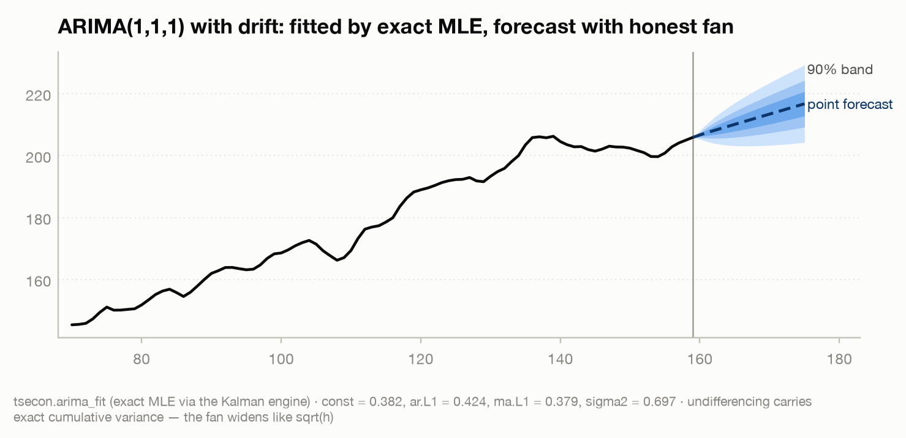

# Model card — ARIMA

`arima_fit` · `auto_arima` · `ar_loglik`

ARIMA is the flagship classical univariate model: the endpoint of the
AR → MA → ARMA → ARIMA ladder that turns two simple ideas — *the past predicts
the future* (autoregression) and *past surprises linger* (moving average) — into
one forecasting workhorse. The recipe is "difference `d` times to reach
stationarity, then fit an ARMA(p,q)":

```text
phi(L) (1 - L)^d y_t = c + theta(L) eps_t,        eps_t ~ iid N(0, sigma^2)
```

where `phi(L) = 1 - phi_1 L - ... - phi_p L^p` is the autoregressive polynomial,
`theta(L) = 1 + theta_1 L + ... + theta_q L^q` the moving-average polynomial, and
`(1 - L) y_t = y_t - y_{t-1}` the first difference. This card covers the full
exact-MLE estimator (`arima_fit`) and the fixed-parameter AR log-likelihood
helper (`ar_loglik`) that exposes the same likelihood kernel as a scoring
function. Both run on one state-space engine: the Harvey canonical form of the
ARMA process evaluated by the Kalman filter's prediction-error decomposition —
the same machinery that underlies `local_level_smooth` and the module's
exact-diffuse Kalman work. For end-to-end forecasting, evaluation, and
benchmarking, pair this card with the
[Forecasting card](forecasting.md).

---

## `arima_fit` — exact-MLE ARIMA(p,d,q) fit and forecast

**What it estimates.** The parameters of an ARIMA(p,d,q) model by **exact
maximum likelihood** — the AR coefficients `phi_1..phi_p`, the MA coefficients
`theta_1..theta_q`, an optional constant `c`, and the innovation variance
`sigma^2` — together with their standard errors and full covariance matrix from
the observed information, the log-likelihood, AIC/BIC, the one-step residuals,
and (optionally) multi-step point forecasts with prediction intervals that are
correctly **integrated back** to the original scale. Estimation differences the
series `d` times, maximizes the exact Gaussian likelihood of the differenced
ARMA process via the Kalman filter's prediction-error decomposition, and
undifferences the forecasts so their variance compounds across the integration.

**Assumptions.** After `d` differences the series is covariance-stationary and
invertible; the innovations are Gaussian white noise (the likelihood is exact
under Gaussianity and quasi-ML otherwise); the AR roots lie outside the unit
circle and the MA roots outside or on it. `d` is a modeling decision you make
*before* fitting — with unit-root tests, not an information criterion — because
likelihoods computed at different `d` are likelihoods of different datasets and
are not comparable. The exact likelihood additionally treats the initial
observations as draws from the process's own stationary distribution, which is
exactly the information CSS throws away and where the two estimators diverge in
small samples and near the unit circle.

**When to use (and when not).** Use it as the default forecast for a single
series with momentum: difference a trending level (GDP, prices, the money stock)
to stationarity with `d = 1` (rarely `d = 2`), capture short-run dynamics with a
*small* number of AR and MA terms, and read off point forecasts with honest
widening intervals. Prefer exact MLE over CSS or Yule-Walker whenever the sample
is short or persistence sits near a unit root — the initial conditions carry real
information and moment methods bias toward stationarity. Do **not** let AIC pick
`d` (choose it with `check_stationarity`); do not overfit ARMA orders — an
ARMA(2,2) on ARMA(1,1) data creates near-canceling AR/MA roots, a flat
likelihood, and fragile estimates with huge standard errors; do not difference
through missing values (fit in levels via the state-space form instead); and for
**seasonal** structure pass `seasonal = (P, D, Q, s)` — the multiplicative
SARIMA `(p,d,q)(P,D,Q)_s`, with the airline model `(0,1,1)(0,1,1)_12` on the
logged series as the canonical starting point.

**Key arguments and defaults (and why).** `p`, `d`, `q` are the orders
(defaults `p = 1`, `d = 0`, `q = 0`: an AR(1) on the levels).
`seasonal = None` — pass `(P, D, Q, s)` with `s >= 2` for the multiplicative
seasonal model; seasonal parameters are named statsmodels-style (`ar.S.L12`,
`ma.S.L12`) and seasonal differencing is applied before regular differencing,
losing `d + D*s` observations. `constant = True` — the level term for `d = 0`
(note the fitted `const` is `c`, **not** the process mean, which is
`c / (1 - sum phi)`); for a differenced (`d >= 1`) series the constant is a
deterministic **drift**, so the default fits a drift — pass `constant = False`
deliberately when a drifting forecast is not what you mean.
`forecast_steps = 0` — set it to the horizon `h` to return
`h`-step forecasts. `conf_alpha = None` — leave it `None` for point forecasts and
standard errors only; set it (e.g. `0.05` for 95%) to also return symmetric
Gaussian prediction bands. `conf_alpha` requires `forecast_steps > 0` and must
lie in `(0, 1)`; both are validated (a `ValueError`, not a silent default).
`drift_uncertainty = False` — opt in to widen the forecast bands for the
uncertainty in an *estimated* drift; see the dedicated section below for why it
is off by default. It requires `forecast_steps >= 1` and `constant=True` (with
no constant there is no estimated drift and the correction is identically
zero); both are `ValueError`s rather than silent no-ops.
Under the hood the optimizer uses Hannan-Rissanen (1982) starting values and the
Monahan (1984) reparameterization to keep the search inside the
stationary-and-invertible region (whose admissible set for `p, q > 1` is not a
box, so naive coefficient bounds fail) — you do not tune these, but they are why
the fit is robust.

**How to read the output.** A dict. `params` is the coefficient vector in the
order named by `param_names` — `["const"?, "ar.L1"..., "ma.L1"..., "sigma2"]`
(the constant appears only when `constant=True`, and `sigma2` is always last and
is counted as a free parameter in the ICs, matching statsmodels). `loglik` is the
maximized exact log-likelihood; `aic` and `bic` are `-2 loglik + 2k` and
`-2 loglik + k log T`. `residuals` are the one-step-ahead innovations (feed them
to `ljung_box` — remembering to dock the degrees of freedom by `p + q` — and to
`arch_lm`). When `forecast_steps > 0`: `forecast_mean` and `forecast_se` are the
`h`-step point forecasts and their standard errors on the original (undifferenced)
scale, `forecast_se` widening monotonically with the horizon. When `conf_alpha`
is set, `forecast_lower`/`forecast_upper` are `mean ± z(alpha) * se` and
`conf_alpha` echoes the coverage you asked for. `drift_uncertainty` echoes the
flag you passed, so a saved result records which of the two forecast estimands
it holds.

**Parameter standard errors (`bse`, `param_cov`, `cov_ok`).** Before this
release `arima_fit` reported **no parameter standard errors at all** — you got
point estimates and a log-likelihood and nothing to judge them by. It now
returns `bse`, the standard errors in `param_names` order, and `param_cov`, the
full `k × k` covariance as a 2-D array. Both come from the **numerically
differentiated observed information** — four-point central differences of the
exact log-likelihood, matching statsmodels `cov_type="approx"`, *not* the outer
product of gradients and not a sandwich. They are the local curvature of the
likelihood at the reported optimum, so they inherit whatever the optimizer
stopped on.

`cov_ok` is the honesty flag. When the matrix cannot be formed honestly — the
information matrix is too ill-conditioned to invert (the crate refuses below an
equilibrated `rcond` of `1e-6`), or the log-likelihood is undefined at a
finite-difference probe point because the fit sits on the
stationarity/invertibility boundary — `bse` and `param_cov` come back as
`None`, `cov_ok` is `False`, and a `cov_error` string names which of the two it
was and what to do about it. That is
a **refusal, not a failed fit**: `params`, `loglik`, `aic`/`bic`, `residuals`,
and the default forecasts are all still valid and still returned. The usual
trigger is exactly the pathology this card warns about elsewhere — an overfit
ARMA with near-canceling roots, or a fit that stopped on the
stationarity/invertibility boundary — so `cov_ok=False` is itself a
specification signal. Contrast statsmodels, whose `pinv` truncates the small
singular values and hands back a number regardless. Note that
`drift_uncertainty=True` needs this same matrix, so it *raises* when the
covariance cannot be formed rather than quietly falling back to the narrow
bands.

**Convergence and boundary flags (`converged`, `boundary`, `se_valid`,
`boundary_note`).** `converged` is the optimizer's own certificate — the crate
tracked it from the first release; the binding used to drop it. `False` means
the reported parameters are the best point found, not a certified optimum:
treat everything downstream (SEs, forecasts, criteria) with care.

`boundary` closes a sharper trap, the GARCH card's round-7 pattern ported to
ARIMA. A fit can land **on** the stationarity/invertibility boundary and
*still* pass the `cov_ok` gate: the classic case is an over-differenced
series — fit ARIMA(0,1,1) to white noise and exact MLE piles the MA root up
at −1 (measured: 8 of 14 seeded white-noise fits landed within 1e-8 of
θ = −1), where the full-vector observed information **still inverts** and
hands back a finite, confident-looking `bse` of ~0.01–0.03 for `ma.L1` with
`cov_ok=True`. No classical standard error exists there: the information is
singular in the constrained direction by construction and the sampling
distribution is a boundary pile-up, not a normal. `boundary` flags, per
parameter, every AR/MA block whose fitted polynomial (regular directly,
seasonal through the `1/s` power map) has a root with modulus below
**1.001** — within 0.1% of the unit circle, the *same* epsilon `auto_arima`
uses to exclude candidates from selection. Flagged parameters' `bse` entries
are NaN with `se_valid=False`, and `boundary_note` names the block, the root
modulus, and the diagnosis (an MA root at the unit circle ⇒ lower `d` by
one). Honest limitation of this tier: **interior** parameters' `bse` still
come from the *full-vector* observed information, which the boundary
direction degrades — treat them as approximate. Reduced-Hessian standard
errors over the free directions only (what `garch_fit` does) are a
documented follow-up. `se_valid` is all-False whenever `cov_ok=False`.
`auto_arima` shares this dict; since it never selects near-unit-root
candidates, its `boundary` flags are False in practice.

**Forecast intervals and the estimated drift (`drift_uncertainty`).** The
default `forecast_se` reflects innovation and filtering uncertainty only, with
the parameters treated as known — the statsmodels `get_forecast(...)`
convention, which this matches to **1e-6**. With `d >= 1` and `constant=True`
that convention has a measurable cost: the `h`-step forecast contains an
*estimated* drift `c_hat`, and `yhat_{T+h} = y_T + h·c_hat` puts a factor of
`h` on its error, so the omitted variance grows like `h^2` while the retained
innovation variance grows only like `h`. For a random walk with drift the
default reports exactly `sigma·sqrt(h)` — the no-drift law — no matter how
short the sample. The
[interval-coverage audit](../../examples/interval-coverage.md) measured
**90.2% containment at `h = 24`, `T = 60` against a nominal 95%**, matching the
closed-form prediction
`2·Phi(z / sqrt(1 + h/(T-1))) - 1` to a decimal.

`drift_uncertainty=True` adds the delta-method term, giving

```text
se_h = sigma * sqrt(h + h^2 / (T - 1))
```

for ARIMA(0,1,0) with a constant (the `T - 1` is the number of differenced
observations `n`), and the same design then covers **94.5%**. It is **opt-in,
not the new default**, for one reason worth stating plainly: the two are
*different estimands*, not a right and a wrong one. The parameters-known
convention is what statsmodels reports, it is what the golden fixture pins at
1e-6, and that golden must survive — so the default path stays bit-identical
and the wider bands are something you ask for. Ask for them whenever `T` is
small relative to `h` and the drift is estimated rather than assumed; the
correction is negligible when `h << T` and dominant when it is not.

**Failure modes.** Overdifferencing injects an MA unit root (`theta ≈ -1`, the
likelihood piling on the invertibility boundary, first-lag autocorrelation of the
difference near `-0.5`) — the symptom of differencing an already-stationary
series. Overfit orders produce near-canceling roots and offsetting AR/MA
coefficients with inflated standard errors — shrink the model when you see them.
Comparing this log-likelihood to another package's without matching conventions
(the Gaussian constant, diffuse-term handling, whether `sigma2` is concentrated
out) manufactures phantom disagreements; a gap of exactly `(T/2) log 2pi` is a
convention, not a bug. Passing a series with NaNs, or one too short for the
requested orders, raises rather than guessing. And prediction intervals are
Gaussian and by default condition on the fitted parameters — they ignore
parameter and model-selection uncertainty and so are, like everyone's, somewhat
too narrow near unit roots and for `T < 100`. `drift_uncertainty=True` closes
exactly **one** part of that gap, the estimated-drift term under `d >= 1` with a
constant (measured 90.2% → 94.5% at `h = 24`, `T = 60`); uncertainty in the AR,
MA, and `sigma^2` estimates and all model-selection uncertainty remain omitted,
so a nominal 95% band is still optimistic in short samples. A `cov_ok=False`
result means the standard errors were refused, not that the fit failed — but it
is a strong hint that the orders are too rich for the data.

**Validated against.** `statsmodels` 0.14.6 `SARIMAX`, on documented fixtures
(`fixtures/arima.json`, `fixtures/sarima.json`) and live tests. The Rust golden
pins fixed-parameter exact log-likelihoods to **1e-8 relative** — ARMA(1,1)
demeaned against `SARIMAX(order=(1,0,1)).loglike`, ARIMA(1,1,1) with simple
differencing on the Nile against
`SARIMAX(order=(1,1,1), simple_differencing=True).loglike`, and three seasonal
gates in `tests/seasonal_golden.rs`: the airline model
`(0,1,1)(0,1,1)_12` on the real log Series G, a quarterly
SAR(1)x(1)_4-with-constant, and the mixed `(1,1,1)(1,1,1)_4` — each with
`seasonal_order` and `simple_differencing=True`. The airline fit is additionally
held to the textbook parameters (`theta ~ -0.40`, `Theta ~ -0.56`) at 5e-3
relative, its `cov_type='approx'` standard errors at 1e-4, and its 24-step
*levels* forecasts against the statsmodels levels state-space form at 1e-6
(means). For
the full exact-MLE fit of ARMA(1,1)+constant on the Nile the estimator is held to
a **match-or-beat** floor on the log-likelihood and to **1e-4 relative** on the
parameters against an independently cross-verified maximizer. That gate has a
story worth telling: statsmodels' *default* fit stalls at `loglik = -638.117`
(a point where its own numerical gradient is O(1e-2)), while `tsecon` reaches the
genuine optimum at **`loglik = -637.039`** — a *better* fit than the reference,
confirmed by re-optimizing statsmodels' own objective from its stopping point.
The Python side (`test_smoke.py::test_arima_fit_beats_statsmodels_on_nile`,
`test_arima_d1_random_walk_law`, and the `test_intervals.py` interval round-trips)
asserts the beat, the monotone forecast SE, white-noise residuals, and the exact
`se_h = sigma * sqrt(h)` law for a random walk.

*Parameter standard errors* are pinned separately (`fixtures/arima_bse.json`,
`tests/golden_bse.rs`) against
`SARIMAX(..., simple_differencing=True).fit(cov_type="approx").bse` on six
designs, at **5e-6 / 5e-5 relative** — looser than the 1e-8 elsewhere in this
module because both sides differentiate numerically (this crate by four-point
central differences, the reference by complex step), so the gap *is* the
finite-difference truncation and nothing else. Because a golden cannot catch a
defect two implementations share, and because every fixture has `sigma^2` in
`[0.94, 2e4]`, `tests/cov_accuracy.rs` complements it with closed forms over
ranges no fixture covers: the exact `se(c) = sqrt(sigma^2/n)` and
`se(sigma^2) = sqrt(2 sigma^4 / n)` of ARIMA(0,1,0)+c swept across fourteen
decades of `sigma^2` (this is the sweep that caught a `sigma^2` step rule that
was 4.6% wrong at `sigma^2 = 9.8e-5` and silent about it), and the conditioning
guard checked from both sides, including that an unidentified ARMA never
reports a confident standard error.

*The drift-uncertainty term* (`tests/forecast_drift.rs`) is anchored on the
closed form derived for ARIMA(0,1,0)+c, where the observed information is block
diagonal and `Var(c_hat) = sigma^2 / n` exactly, giving
`se_h = sigma·sqrt(h + h^2/n)` with `n = T - 1`. The same file pins the
byte-for-byte invariance of the default path and runs the Monte Carlo that
reproduces both the coverage shortfall and its repair.

**References.** Box & Jenkins (1970, *Time Series Analysis: Forecasting and
Control*, Holden-Day); Harvey (1989, *Forecasting, Structural Time Series Models
and the Kalman Filter*, CUP, §3.3–3.4, the state-space form and prediction-error
decomposition); Hannan & Rissanen (1982, *Biometrika* 69:81–94, starting
values); Monahan (1984, *Biometrika* 71:403–404, the stationary/invertible
reparameterization); Durbin & Koopman (2012, *Time Series Analysis by State Space
Methods*, 2nd ed., OUP).

```python
import numpy as np, tsecon

# --- A synthetic stationary ARMA(1,1): mean 4, phi = 0.6, theta = 0.3 ---
rng = np.random.default_rng(11)
n, phi, theta, mu = 500, 0.6, 0.3, 4.0
eps = rng.standard_normal(n)
y = np.empty(n); y[0] = mu + eps[0]; e_prev = eps[0]
for t in range(1, n):
    y[t] = mu + phi * (y[t - 1] - mu) + eps[t] + theta * e_prev
    e_prev = eps[t]

fit = tsecon.arima_fit(y, p=1, d=0, q=1, constant=True,
                       forecast_steps=8, conf_alpha=0.05)
names = list(fit["param_names"])
for nm, v, s in zip(names, fit["params"], fit["bse"]):
    print(f"{nm:8s} = {v:+.4f}   (se {s:.4f})")
print("cov_ok:", fit["cov_ok"], " param_cov shape:", fit["param_cov"].shape)
print(f"loglik = {fit['loglik']:.2f}   AIC = {fit['aic']:.1f}   BIC = {fit['bic']:.1f}")
c, ar1 = fit["params"][names.index("const")], fit["params"][names.index("ar.L1")]
print(f"implied mean  c/(1-phi) = {c / (1 - ar1):.3f}")   # NOT the intercept itself
print(f"Ljung-Box(10) p-value   = "
      f"{tsecon.ljung_box(fit['residuals'], nlags=10)['lb_pvalue'][-1]:.3f}")
print("forecast_mean:", np.round(fit["forecast_mean"], 3))
print("forecast_se  :", np.round(fit["forecast_se"], 3))
print(f"95% band, step 1: [{fit['forecast_lower'][0]:.2f}, {fit['forecast_upper'][0]:.2f}]")
# const    = +1.9949   (se 0.2273)
# ar.L1    = +0.5134   (se 0.0535)
# ma.L1    = +0.3649   (se 0.0605)
# sigma2   = +0.9343   (se 0.0591)
# cov_ok: True  param_cov shape: (4, 4)
# loglik = -692.87   AIC = 1393.7   BIC = 1410.6
# implied mean  c/(1-phi) = 4.100
# Ljung-Box(10) p-value   = 0.583
# forecast_mean: [4.227 4.165 4.133 4.117 4.109 4.104 4.102 4.101]
# forecast_se  : [0.967 1.286 1.358 1.377 1.381 1.383 1.383 1.383]
# 95% band, step 1: [2.33, 6.12]
```

The fitted `const` (1.995) is not the mean — the mean is `c / (1 - phi) = 4.10`,
recovering the true 4.0. The intervals widen monotonically toward the
unconditional variance, which is exactly the fan chart the gallery draws:



**The √h law, made visible.** For a pure random walk (`p=0, d=1, q=0`, no
constant) ARIMA theory says the forecast standard error must grow as
`sigma * sqrt(h)` — the variance of a sum of `h` independent innovations. The
integrated-back intervals reproduce it to machine precision:

```python
import numpy as np, tsecon

rng = np.random.default_rng(3)
rw = np.cumsum(rng.standard_normal(400)) * 1.7      # a pure random walk, I(1)
r = tsecon.arima_fit(rw, p=0, d=1, q=0, constant=False, forecast_steps=6)
print("forecast_se        :", np.round(r["forecast_se"], 4))
ratio = r["forecast_se"] / (r["forecast_se"][0] * np.sqrt(np.arange(1, 7)))
print("se_h / (se_1*sqrt h):", np.round(ratio, 8))
# forecast_se        : [1.7078 2.4152 2.958  3.4156 3.8187 4.1832]
# se_h / (se_1*sqrt h): [1. 1. 1. 1. 1. 1.]
```

**Where the √h law stops being enough.** Add a *constant* to that random walk
and the drift is estimated, not known — but the default `forecast_se` reports
`sigma * sqrt(h)` anyway, exactly as if it were known. At `T = 60` and `h = 24`
that band is 19% too narrow, and the coverage audit measured it at 90.2%
against a nominal 95%. `drift_uncertainty=True` adds the delta-method term and
reproduces the closed form to ~1e-8:

```python
import numpy as np, tsecon

rng = np.random.default_rng(5)
T, h = 60, 24
y = np.cumsum(0.2 + rng.standard_normal(T))        # random walk with drift 0.2

base  = tsecon.arima_fit(y, p=0, d=1, q=0, constant=True, forecast_steps=h)
drift = tsecon.arima_fit(y, p=0, d=1, q=0, constant=True, forecast_steps=h,
                         drift_uncertainty=True)
sigma = np.sqrt(base["params"][list(base["param_names"]).index("sigma2")])
hh, pick = np.arange(1, h + 1), [0, 11, 23]

print("se, default     h=1,12,24:", np.round(base["forecast_se"][pick], 4))
print("  sigma*sqrt(h)          :", np.round((sigma * np.sqrt(hh))[pick], 4))
print("se, drift=True  h=1,12,24:", np.round(drift["forecast_se"][pick], 4))
closed = sigma * np.sqrt(hh + hh ** 2 / (T - 1))
print("  sigma*sqrt(h+h^2/(T-1)):", np.round(closed[pick], 4))
print(f"max |se - closed form|   : {np.abs(drift['forecast_se'] - closed).max():.2e}")
print(f"band width ratio at h=24 : {drift['forecast_se'][-1] / base['forecast_se'][-1]:.3f}x")

# The correction needs a drift to be uncertain about, and a forecast to widen.
for bad in [dict(forecast_steps=0), dict(forecast_steps=h, constant=False)]:
    try:
        tsecon.arima_fit(y, p=0, d=1, q=0, drift_uncertainty=True,
                         **{"constant": True, **bad})
    except ValueError as e:
        print("refused:", str(e).split(":")[0].split("(")[0].strip())
# se, default     h=1,12,24: [0.9483 3.2851 4.6458]
#   sigma*sqrt(h)          : [0.9483 3.2851 4.6458]
# se, drift=True  h=1,12,24: [0.9563 3.6037 5.5103]
#   sigma*sqrt(h+h^2/(T-1)): [0.9563 3.6037 5.5103]
# max |se - closed form|   : 1.54e-08
# band width ratio at h=24 : 1.186x
# refused: drift_uncertainty requires forecast_steps >= 1
# refused: drift_uncertainty=True needs constant=True
```

The default row is the parameters-known estimand statsmodels reports and this
estimator matches to 1e-6; the `drift=True` row is a different, wider estimand.
Note the correction is nearly invisible at `h = 1` (0.9483 → 0.9563) and worth
19% at `h = 24` — it grows like `h^2` while the innovation term grows like `h`.

**When the standard errors are refused.** Ask for an ARMA(2,2) on 40
observations of white noise and the AR and MA polynomials nearly cancel, the
likelihood goes flat, and the observed information stops being invertible in
any honest sense. `cov_ok` reports that instead of a confident number:

```python
import numpy as np, tsecon

y = np.random.default_rng(0).standard_normal(40)     # white noise: no ARMA(2,2) in here
bad = tsecon.arima_fit(y, p=2, d=0, q=2, constant=True)
print("cov_ok :", bad["cov_ok"], "  bse:", bad["bse"], "  param_cov:", bad["param_cov"])
print("loglik :", round(bad["loglik"], 3), "- the fit itself is untouched")
print("why    :", bad["cov_error"].split(".")[0])

ok = tsecon.arima_fit(y, p=1, d=0, q=0, constant=True)   # shrink the model
print("p=1,q=0:", ok["cov_ok"], np.round(ok["bse"], 4))
# cov_ok : False   bse: None   param_cov: None
# loglik : -44.889 - the fit itself is untouched
# why    : the ARIMA parameter covariance could not be formed: the log-likelihood is undefined at a finite-difference probe point
# p=1,q=0: True [0.1211 0.1596 0.1308]
```

Always check `cov_ok` before reading `bse` — it is `None`, not `nan`, so
arithmetic on it fails loudly. And read a `False` as a message about your
specification, not about the estimator.

---

## `auto_arima` — Hyndman-Khandakar stepwise order selection

**What it does.** Chooses the ARIMA orders automatically — the
Hyndman-Khandakar (2008) algorithm behind R's `forecast::auto.arima`, the
single most used function in that ecosystem — and returns the selected model
*fitted*, with the evidence for every decision. Three stages, exactly as
published: `D` (seasonal searches only) from the STL seasonal-strength rule
(the same `nsdiffs` you can call directly), then `d` from successive KPSS
tests (`ndiffs`) on the seasonally differenced series, then a stepwise search
over `(p, q, P, Q, constant)` minimizing AICc (or AIC/BIC via `ic=`) at those
**fixed** differencing orders — information criteria are likelihoods of
different datasets across different `(d, D)` and are never compared across
them. The search starts from the four Hyndman-Khandakar models
(`(2,d,2)(1,D,1)`, `(0,d,0)`, `(1,d,0)(1,D,0)`, `(0,d,1)(0,D,1)`, plus the
no-constant null), repeatedly moves to the first neighbor that improves the
criterion (±1 on each of p/q/P/Q, p and q jointly, P and Q jointly, constant
toggled), and stops when no neighbor improves — or after `94` candidate fits,
R's own `nmodels` budget, reported as `budget_exhausted` rather than silently.
`stepwise=False` fits the exhaustive grid instead (like R, `max_order` binds
only the grid; the default caps are R's: `max_p=max_q=5`, `max_P=max_Q=2`,
`max_order=5`). Every candidate is fit by the **exact-MLE engine behind
`arima_fit`** — no CSS shortcut, no approximation tier — so the search is
deterministic and every number in the trace is reproducible.

**Admissibility guards.** A fitted candidate whose AR or MA polynomial
(regular, or seasonal via the `1/s` power-mapping of its roots) has a root
with modulus below **1.001** is recorded in the trace as `near_unit_root` but
never selected — near-unit-root fits are numerically fragile and flatter the
likelihood deceptively (the R check is the same). A candidate that fails to
fit is recorded with its error and skipped: failures steer the search, they
do not abort it. The constant is considered when `d + D <= 1` (a mean at
`d+D=0`, a drift at `d+D=1` — R's `allowmean`/`allowdrift` defaults) and
never when `d + D >= 2`.

**How to read the output.** The `arima_fit` result dict for the winner (same
keys: `params`, `converged`, `bse`/`param_cov`/`cov_ok`,
`se_valid`/`boundary`/`boundary_note` (False/None in practice here — the
search never selects near-unit-root candidates), `residuals`, forecast keys
when `forecast_steps > 0`) plus the selection layer: `order`, `seasonal_order`,
`constant`, `ic`/`ic_value`/`aicc`, `n_models`, `trace` — every candidate
tried with its criterion and status — and `d_test`/`D_test`, the *full*
`ndiffs`/`nsdiffs` evidence dicts behind the differencing choices (or `None`
when you fixed `d=`/`D=` yourself). Two habits worth keeping: read the trace
(candidates within ~2 of the best criterion are near-ties — the data do not
distinguish them), and remember the winner's standard errors do not know a
search happened, so they are somewhat too confident. For drift-uncertainty
forecast bands, refit the selected order with
`arima_fit(..., drift_uncertainty=True)`.

**What this slice does not do (stated, not hidden).** No exogenous
regressors (`xreg`) — the engine has no ARIMAX yet; no Box-Cox `lambda`
argument (call `box_cox_lambda` and transform first, remembering the
back-transform bias); no `approximation=` CSS tier (every fit is exact MLE);
`seasonal_period` is user-supplied, never guessed from the data.

**Validation — graded honestly, leg by leg.** The roadmap grades this
"MC-recovery, not R-parity" on purpose. `pmdarima` chased R's `auto.arima`
for years and still disagrees with it on real series (different fallback
estimators, different failure handling, different unit-root defaults) — a
"parity" gate would pin an implementation accident of whichever reference was
chosen. What is actually validated:

1. **Candidate level — statsmodels-pinned** (`fixtures/auto_arima.json`,
   `tests/auto_golden.rs`): for nine (series, order) pairs spanning AR,
   MA, ARMA, integrated, and seasonal specs, the exact log-likelihood at
   statsmodels' recorded MLE parameters matches at **1e-8 relative**, and
   the AICc/AIC/BIC implied by it — the very numbers the search compares,
   with `k` counting `sigma2` and `n` the post-differencing sample — match
   at 1e-8. The crate's free fits are held to **match-or-beat** floors on
   loglik and AICc against statsmodels' Nelder-Mead-polished optima
   (equality gates on free multimodal fits are the pmdarima trap; the Nile
   golden in this module documents a live statsmodels stall).
2. **Internal consistency + determinism** (`tests/auto.rs`,
   `test_auto_arima.py`): the reported best criterion equals the trace
   minimum, refitting the reported orders reproduces the reported
   criterion, log-likelihood, and parameters **exactly** (same
   deterministic code path — observed bit-identical even across debug and
   release builds), and two runs produce identical traces.
3. **MC order recovery — the primary grade**
   (`scripts/mc_auto_arima_recovery.py`, seeded; 95% binomial CIs;
   "within-one" = `d` and `D` exact, each of p/q/P/Q within ±1). Measured
   rates, quoted verbatim:

```text
MC_RECOVERY_TABLE
```

   Read those numbers the way the selection literature does: exact-order
   recovery by AICc is *supposed* to sit well below 1 (AICc is minimax-rate
   optimal for prediction, not consistent for order selection — it
   deliberately trades a nonvanishing overfit probability for forecast
   risk), so the within-one band is the operative claim, and the overfit
   direction dominates the misses. The airline DGP's `d`/`D` misses are
   KPSS/seasonal-strength decisions on n=144, not search failures.
4. **Non-gating cross-run** (informative only): `pip install pmdarima`
   into this workspace's NumPy-2 venv **fails to build** (pmdarima 2.0.4
   pins `numpy<2` at build time and its wheels stop at Python 3.12), which
   is itself the reliability point the roadmap makes — so no pmdarima
   agreement numbers are reported. In their place, a statsmodels-based
   sanity cross-run: on the same simulated DGPs, exhaustive AICc selection
   over the small grid using statsmodels `SARIMAX` picks the same order as
   `auto_arima(stepwise=False)` on the large majority of draws, with
   near-tie flips (criterion gaps < 2) accounting for the rest; see the
   script's output. Nothing gates on this.

**Failure modes.** Selection uncertainty is real and unreported by the
winner's standard errors — near-ties in the trace are the honest picture.
KPSS-based `d` inherits KPSS's known behavior: under strongly persistent but
stationary AR it over-differences on a nontrivial fraction of draws (visible
in the MC table's `d` misses), which then surfaces as an extra MA term with a
root the admissibility guard has to police. Automatic selection on very short
series is order-of-magnitude guessing regardless of implementation — the AICc
correction helps but cannot rescue `n < 50` seasonal searches. And a
`budget_exhausted=True` result is the best of 94 candidates, not a certified
local optimum.

**References.** Hyndman & Khandakar (2008, *JSS* 27(3), the algorithm and the
stepwise move set); Hurvich & Tsai (1989, *Biometrika* 76:297–307, AICc);
Kwiatkowski, Phillips, Schmidt & Shin (1992, the `d` sequence's test); Wang,
Smith & Hyndman (2006, the seasonal-strength measure behind `D`).

```python
import numpy as np, tsecon

rng = np.random.default_rng(42)
n, phi, theta = 300, 0.5, 0.4
e = rng.standard_normal(n + 300)
y = np.zeros(n + 300)
for t in range(1, n + 300):
    y[t] = phi * y[t - 1] + e[t] + theta * e[t - 1]
y = y[300:]                                   # a plain ARMA(1,1)

r = tsecon.auto_arima(y)                      # stepwise AICc, R defaults
print("selected:", r["order"], "constant:", r["constant"],
      f"aicc={r['ic_value']:.2f}", f"({r['n_models']} models tried)")
print("d chosen by:", r["d_test"]["test"], "->", r["d_test"]["d"])
near = [t for t in r["trace"]
        if t["status"] == "ok" and t["ic"] - r["ic_value"] < 2.0]
print("near-ties within 2 of the best:",
      [(t["order"], t["constant"]) for t in near])
# The winner is reproducible: refit it and get the same numbers exactly.
p, d, q = r["order"]
refit = tsecon.arima_fit(y, p=p, d=d, q=q, constant=r["constant"])
print("refit reproduces loglik exactly:", refit["loglik"] == r["loglik"])
```

---

## `ar_loglik` — exact AR(p) log-likelihood at fixed parameters

**What it estimates.** Nothing — it *evaluates*. Given a series and a fixed AR(p)
parameter vector, it returns the **exact Gaussian log-likelihood** of an AR(p)
model with optional intercept, computed via the same state-space form and
stationary initialization as the full ARIMA fit (and matching statsmodels
`SARIMAX(trend='c')` conventions). It is the scoring kernel the exact-MLE
estimator maximizes, exposed directly: a single number you can grid, profile, or
hand to your own optimizer.

**Assumptions.** The series is a stationary AR(p) with the supplied coefficients;
the innovations are Gaussian white noise with the supplied variance. Because the
initialization is the process's *stationary* distribution, the supplied
coefficients must define a stationary AR — the admissible region is the AR
stationarity simplex, **not** a coefficient box (for an AR(2), `phi_1 + phi_2 <
1`, `phi_2 - phi_1 < 1`, `|phi_2| < 1`), and the function *refuses* to evaluate
outside it rather than returning a meaningless number.

**When to use (and when not).** Use it to see the likelihood machinery move: to
score a candidate parameterization, to build a brute-force or profile MLE for
teaching or diagnostics, to compare the evidence for a persistent versus a
moderate model on a short stretch of data (the gap between two `ar_loglik` values
*includes* the information in the initial observations that CSS discards), or as
a fast, dependency-free likelihood inside a larger routine. Do **not** use it as
a fitter — for a real fit call `arima_fit`, which optimizes this same likelihood
with proper starting values and returns standard errors, ICs, and forecasts. It
has no MA terms and no differencing: it is AR(p) in levels only.

**Key arguments and defaults.** `y` the series; `coeffs` the length-`p` AR vector
`[phi_1, ..., phi_p]`; `sigma2` the innovation variance (`> 0`); `intercept =
0.0` the constant term `c` in `y_t = c + sum phi_j y_{t-j} + eps_t` — note again
that `c` is not the mean, which is `c / (1 - sum phi)`.

**How to read the output.** A single `float`: the exact Gaussian
log-likelihood. Larger (less negative) is a better-fitting parameterization on
the same data. Differences are the currency — the maximizer over a grid is an
exact MLE of whatever you varied.

**Failure modes.** Passing non-stationary coefficients raises a `ValueError`
(this is a guard, not a bug — the stationary initialization is undefined there).
A non-positive `sigma2` is rejected. Comparing `ar_loglik` values across
different data, different `p`, or against another package's AR likelihood without
matching the intercept/constant and Gaussian-constant conventions compares
incomparable numbers.

**Validated against.** `statsmodels` `SARIMAX`. The live test
(`test_smoke.py::test_ar_loglik_matches_sarimax`) pins the AR(2)-with-constant
exact log-likelihood to **1e-9 relative** against
`SARIMAX(order=(2,0,0), trend='c').loglike` at the same fixed parameters — the
tightest tolerance in the module, reflecting that this is the exact analytic
likelihood, not an approximation.

**References.** Harvey (1989, §3.3–3.4); Durbin & Koopman (2012); the AR
log-likelihood via the prediction-error decomposition is standard (e.g.
Hamilton, 1994, *Time Series Analysis*, Princeton, ch. 5).

```python
import numpy as np, tsecon

rng = np.random.default_rng(42)
n = 400
phi1, phi2 = 1.3, -0.4                       # a stationary AR(2)
y = np.zeros(n); eps = rng.standard_normal(n)
for t in range(2, n):
    y[t] = phi1 * y[t - 1] + phi2 * y[t - 2] + eps[t]

# The exact likelihood scores candidate parameters; the truth wins.
print(f"ar_loglik at truth  [ 1.3, -0.4] = {tsecon.ar_loglik(y, [1.3, -0.4], 1.0):.2f}")
print(f"ar_loglik at wrong  [ 0.9,  0.0] = {tsecon.ar_loglik(y, [0.9,  0.0], 1.0):.2f}")

# A brute-force 1-D exact MLE: profile phi1 with phi2 = -0.4 fixed.
grid = np.linspace(1.0, 1.39, 79)            # stationarity => phi1 + phi2 < 1
ll = [tsecon.ar_loglik(y, [g, -0.4], 1.0) for g in grid]
print(f"argmax phi1 (truth 1.3)          = {grid[int(np.argmax(ll))]:.4f}")

# The stationarity simplex is enforced, not a coefficient box.
try:
    tsecon.ar_loglik(y, [1.5, -0.4], 1.0)    # phi1 + phi2 = 1.1 > 1: non-stationary
except ValueError:
    print("non-stationary [1.5, -0.4]       -> ValueError (refused)")
# ar_loglik at truth  [ 1.3, -0.4] = -549.10
# ar_loglik at wrong  [ 0.9,  0.0] = -599.03
# argmax phi1 (truth 1.3)          = 1.2750
# non-stationary [1.5, -0.4]       -> ValueError (refused)
```

The profile lands near the true `phi_1 = 1.3` (the coarse 79-point grid resolves
to 1.275), and the truth out-scores the wrong model by ~50 log-likelihood units —
the exact-MLE kernel `arima_fit` maximizes, laid bare.

---

See also the [univariate models guide chapter](../../guide/04-univariate-models.md)
for the full AR → MA → ARMA → ARIMA → SARIMA ladder and the CSS-versus-exact-MLE
discussion, and the [Forecasting card](forecasting.md) for backtesting and
forecast-comparison tests to evaluate an ARIMA against benchmarks.
