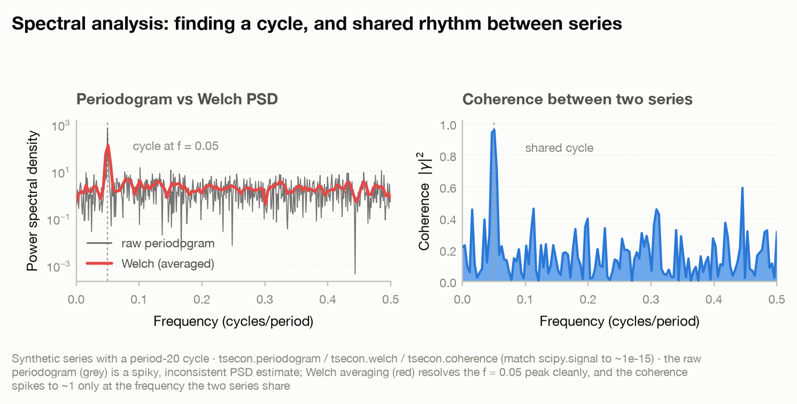

# Model card — Spectral analysis

`periodogram` · `welch` · `coherence`

Most of this library works in the *time* domain — autocovariances, lags,
one-step forecasts. Spectral analysis re-expresses the same second-moment
information in the *frequency* domain: it takes a series' variance and asks how
that variance is distributed across cycles of every speed, from the slowest
swing the sample can resolve up to the Nyquist frequency. The object it
estimates is the **power spectral density** (PSD), the Fourier transform of the
autocovariance function (Wiener-Khinchin), and its single most useful reading is
direct — a *peak in the PSD at frequency `f` is a cycle of period `1/f`* buried
in the series. This family gives you three views. The raw **periodogram** is the
one-FFT estimate: asymptotically unbiased but *inconsistent*, its variance never
shrinks no matter how much data you add. **Welch** trades a little frequency
resolution for a consistent, low-variance PSD by averaging periodograms over
overlapping segments. And **coherence** is the frequency-domain analogue of a
squared correlation between two series: at each frequency it asks how much of the
two series' co-movement is shared *at that cycle*.



All three are one-sided, density-scaled estimators that match `scipy.signal`
(`periodogram`, `welch`, `coherence`) to ~1e-15 in relative terms — the crate is
a from-scratch Rust reimplementation pinned to the SciPy reference, not a
wrapper. They share one input contract and two string knobs:

```text
x  (and y)  : real 1-D arrays, sampled at rate fs (cycles per unit time)
returns     : freqs on [0, fs/2]  (one-sided, length nperseg//2 + 1)
window      : "boxcar" (no taper) or "hann" (the only two supported)
detrend     : "none" | "constant" (remove the mean) | "linear" (remove a line)
```

Two contract notes that bite in practice. First, the **default `detrend` is
`"none"`**, unlike SciPy's `"constant"` — a series with a nonzero mean or a
trend will dump enormous power into the lowest-frequency bins and drown the
cycles you are hunting, so pass `detrend="constant"` (or `"linear"`) whenever
`x` is not already zero-mean/detrended. Second, only `"boxcar"` and `"hann"` are
recognized windows; anything else (`"hamming"`, …) raises `ValueError` rather
than being silently accepted.

---

## `periodogram` — the one-FFT PSD estimate

**What it estimates.** The power spectral density of `x` from a single FFT of the
whole (optionally windowed, optionally detrended) series:
`P(f_k) = |X(f_k)|^2 / (fs · Σ w_i^2)`, returned one-sided on the grid
`f_k = k·fs/n` for `k = 0 … n/2`. It is the textbook periodogram of Schuster,
density-scaled to match `scipy.signal.periodogram(scaling="density")`. The area
under `P` approximates the variance of `x`; a tall narrow spike at `f` says a
sinusoid of period `1/f` is present.

**Assumptions.** A real, (weakly) stationary, evenly-sampled series. The estimate
is *asymptotically unbiased* — each ordinate `P(f_k)` centres on the true
spectral density `S(f_k)` as `n` grows — but it is **not consistent**: the
variance of each ordinate stays of order `S(f_k)^2` no matter how large `n`
becomes (each `P(f_k)` behaves like `S(f_k)` times a `χ²₂/2` variate). More data
buys you a *finer* frequency grid, not a *less noisy* estimate at each frequency.
That is the whole reason `welch` exists. A finite record also leaks power through
the FFT's sidelobes, so a strong cycle bleeds into neighbouring bins — a Hann
window suppresses that leakage at the cost of widening the main lobe.

**When to use (and when not).** Use it to *detect* the presence and location of a
dominant periodicity — where is the peak, how sharp is it — and when you want the
finest possible frequency grid from a short record and are willing to eyeball a
spiky picture. Do **not** use the raw periodogram when you need a *quantitative,
low-variance* PSD estimate (the height of any single ordinate is essentially
one noisy draw): reach for `welch`. Do not run it on a series with a trend or
nonzero mean without setting `detrend` — the leakage from the zero-frequency
term will dominate everything.

**Key arguments and defaults (and why).** `fs=1.0` sets the sampling rate and
hence the frequency units (with `fs=1`, `freqs` runs `0 … 0.5` in cycles per
sample and Nyquist is `0.5`). `window="boxcar"` is no taper — SciPy's periodogram
default, kept so leakage behaviour matches exactly; pass `window="hann"` to trade
resolution for lower sidelobes. `detrend="none"` does nothing to the series; use
`"constant"` to strip the mean or `"linear"` to strip a least-squares trend
before the FFT. There is no segmenting knob — the periodogram is, by definition,
one FFT over the entire input.

**How to read the output.** A dict with two equal-length arrays: `freqs`
(`0 … fs/2`, length `n//2 + 1`) and `psd` (the density, non-negative
everywhere). The peak location `freqs[psd.argmax()]` estimates the dominant
cycle's frequency; `1/that` is its period. Do not over-interpret the *height* of
a single ordinate — it is high-variance.

**Failure modes.** Reading one PSD ordinate as a precise number — it is not, its
sampling variance does not vanish with `n`. Forgetting to detrend, so a mean or
trend swamps the low-frequency bins. Passing an unsupported window string
(`ValueError: unknown window …; expected "boxcar" or "hann"`) or detrend
(`ValueError: unknown detrend …`). Expecting the peak to sit *exactly* on the
true frequency — it lands in the nearest FFT bin, `±fs/2n` away.

**Validated against.** `scipy.signal.periodogram(detrend=False, scaling="density",
window="boxcar")`, stored as the golden fixture `fixtures/spectral.json`
(generator `fixtures/generate_spectral_fixtures.py`) and checked in
`bindings/python/tests/test_spectral.py`: `freqs` to `atol 1e-10`, `psd` to
`rtol 1e-8, atol 1e-12`, with the non-negativity of the PSD asserted separately.
The realized relative match on that fixture is ~1e-14.

**References.** Schuster (1898, *Terrestrial Magnetism* 3:13-41, the
periodogram); Bartlett (1950, *Biometrika* 37:1-16, on its inconsistency);
Percival & Walden (1993, *Spectral Analysis for Physical Applications*,
Cambridge).

---

## `welch` — segment-averaged, consistent PSD

**What it estimates.** Welch's (1967) averaged-periodogram PSD: split `x` into
overlapping segments of length `nperseg`, window and periodogram each, then
average the periodograms across segments. Averaging `K` roughly-independent
segments cuts the sampling variance by about a factor of `K` (somewhat less with
overlap, since overlapping segments are correlated), turning the periodogram's
inconsistent estimate into a *consistent* one. The price is frequency
resolution: with segments of length `nperseg` the frequency grid is spaced
`fs/nperseg`, coarser than the full-length periodogram's `fs/n`.

**Assumptions.** The same real, stationary, evenly-sampled series — plus the
stationarity has to hold *across* segments (Welch averages them as repeated looks
at one spectrum, so a series whose spectral content drifts over the record
violates the premise). Enough length to form several segments: `nperseg ≤ n`
(a larger `nperseg` raises `ValueError: segment length … exceeds the sample
size …`), and you want `n` comfortably larger than `nperseg` so the average is
over more than a handful of segments.

**When to use (and when not).** This is the default choice whenever you want a
*PSD you can quantify* rather than just a peak to eyeball — a smooth, reproducible
spectrum whose ordinate heights mean something. The `nperseg` choice is the
**bias-variance dial**: a *long* segment gives fine frequency resolution (sharp,
well-separated peaks) but few segments to average, hence a noisier spectrum; a
*short* segment averages many segments (smooth, low-variance) but blurs nearby
peaks together and can bias a sharp line downward. Start around `nperseg = n/8`
and lengthen it if two peaks you care about are merging, shorten it if the
spectrum is too ragged. Do **not** use Welch when the record is too short to
segment meaningfully, or when you specifically need the finest grid a single FFT
can give — use `periodogram` there.

**Key arguments and defaults (and why).** `nperseg=256` is the segment length —
the resolution/variance dial above. `noverlap=None` defaults to `nperseg//2`
(50% overlap), Welch's standard choice: with a Hann taper, 50% overlap recovers
most of the data that windowing down-weights near the segment edges, so
successive segments stay nearly uncorrelated while wasting little of the record.
`window="hann"` is the default taper (SciPy's), because averaging many segments
makes leakage suppression matter more than main-lobe width; `"boxcar"` is
available for an untapered average. `fs` and `detrend` behave exactly as for
`periodogram`.

**How to read the output.** A dict of two arrays: `freqs` (`0 … fs/2`, length
`nperseg//2 + 1`) and `psd`. The spectrum is smoother and shorter than the
periodogram's; the peak `freqs[psd.argmax()]` still estimates the dominant cycle,
now with a stable, interpretable height. On a log-`y` axis a broadband noise
floor plus a clean spike at the cycle frequency is the canonical picture.

**Failure modes.** Setting `nperseg` too large — few segments, a spectrum barely
less noisy than the raw periodogram, or `nperseg > n` which raises. Setting it
too small — a heavily smoothed spectrum that merges distinct peaks and
underestimates a sharp line's height. Averaging over a series whose spectrum is
non-stationary (the segments are not repeated looks at *one* spectrum). Omitting
`detrend` on a trending series.

**Validated against.** `scipy.signal.welch(nperseg=128, detrend=False,
scaling="density")`, golden fixture `fixtures/spectral.json`, checked in
`bindings/python/tests/test_spectral.py` (`freqs` to `atol 1e-10`, `psd` to
`rtol 1e-8, atol 1e-12`). The realized relative match on that fixture is
~1e-15.

**References.** Welch (1967, *IEEE Transactions on Audio and Electroacoustics*
15:70-73); Percival & Walden (1993, *Spectral Analysis for Physical
Applications*, Cambridge); Priestley (1981, *Spectral Analysis and Time
Series*, Academic Press).

```python
import numpy as np, tsecon

rng = np.random.default_rng(7)
n = 1024
t = np.arange(n)
period = 20.0                                   # one cycle every 20 samples => f = 0.05
x = 1.5 * np.sin(2 * np.pi * t / period) + rng.standard_normal(n)

pg = tsecon.periodogram(x, window="boxcar", detrend="none")   # one FFT, high variance
wl = tsecon.welch(x, nperseg=256, detrend="none")             # segment-averaged, smoother
fp, psd_p = np.asarray(pg["freqs"]), np.asarray(pg["psd"])
fw, psd_w = np.asarray(wl["freqs"]), np.asarray(wl["psd"])

print(f"true cycle frequency        : {1/period:.3f}  (period {period:.0f} samples)")
print(f"periodogram peak frequency  : {fp[psd_p.argmax()]:.4f}   ({len(fp)} freq bins)")
print(f"Welch       peak frequency  : {fw[psd_w.argmax()]:.4f}   ({len(fw)} freq bins)")

off = lambda f, p: p[(f > 0.20) & (f < 0.45)].std()   # roughness away from the peak
print(f"off-peak PSD std, periodogram: {off(fp, psd_p):.3f}")
print(f"off-peak PSD std, Welch      : {off(fw, psd_w):.3f}   (averaging cuts the variance)")

from scipy import signal                            # one-line parity cross-check
_, psd_sp = signal.welch(x, nperseg=256, detrend=False, scaling="density")
print(f"max |Welch - scipy.signal|   : {np.max(np.abs(psd_w - psd_sp)):.1e}")
# true cycle frequency        : 0.050  (period 20 samples)
# periodogram peak frequency  : 0.0498   (513 freq bins)
# Welch       peak frequency  : 0.0508   (129 freq bins)
# off-peak PSD std, periodogram: 1.615
# off-peak PSD std, Welch      : 0.655   (averaging cuts the variance)
# max |Welch - scipy.signal|   : 2.8e-14
```

Both estimators put the peak on the period-20 cycle (`f ≈ 0.05`), so either one
*finds* the cycle. The difference is everywhere else: the raw periodogram has 513
noisy ordinates whose off-peak scatter is `1.615`, while Welch's 128-fold
averaging (fewer, coarser bins) drops the off-peak scatter to `0.655` — a
quieter, quantifiable spectrum. And the Welch PSD reproduces `scipy.signal.welch`
to `~1e-14`, confirming the from-scratch estimator is the SciPy quantity to
machine precision.

---

## `coherence` — shared rhythm between two series

**What it estimates.** The magnitude-squared coherence between `x` and `y`,
`C_xy(f) = |S_xy(f)|² / (S_xx(f) · S_yy(f))`, computed from Welch-averaged auto-
and cross-spectra. It is the frequency-domain analogue of a *squared*
correlation coefficient, lying in `[0, 1]` at every frequency: `C_xy(f) ≈ 1`
means the two series' variation at cycle `f` is (up to a linear filter / phase
shift) perfectly shared, `C_xy(f) ≈ 0` means their fluctuations at that cycle are
unrelated. It answers "at which *frequencies* do these two series move together?"
— a question a single time-domain correlation cannot resolve.

**Assumptions.** Two real, jointly stationary, evenly-sampled series of equal
length (unequal lengths raise `ValueError: cross-spectral inputs differ in length
…`). Critically, coherence **must be estimated by averaging over segments**: with
a single segment the cross-spectrum and the two auto-spectra collapse so that the
ratio is identically `1` at every frequency — a degenerate, meaningless result.
So `nperseg` has to be small enough (relative to `n`) that several segments are
averaged; the more segments, the lower the variance of the coherence estimate and
the smaller its upward small-sample bias.

**When to use (and when not).** Use it to ask whether two series share a
*specific* cyclical component — a common business-cycle frequency across two macro
aggregates, a shared seasonal, a lead-lag relationship that operates only at
certain periods — rather than a single scalar "are they correlated?" It is not a
causality or a direction test: coherence is symmetric in `x` and `y` and says
nothing about which leads (that information is in the cross-spectrum's *phase*,
which this function does not return). And it is not a substitute for averaging —
with too few segments the estimate biases toward 1.

**Key arguments and defaults (and why).** Same segmenting surface as `welch`:
`nperseg=256`, `noverlap=None` (→ `nperseg//2`, 50%), `window="hann"`, plus `fs`
and `detrend`. The one extra design consideration is that `nperseg` now has a
hard *statistical* floor as well as ceiling — pick it small enough that
`n/nperseg` gives you several segments, or the coherence is trivially 1.

**How to read the output.** A dict with `freqs` (`0 … fs/2`) and `coherence`
(each entry in `[0, 1]`). Scan for frequencies where `coherence` rises toward 1:
those are the cycles the two series share. Low coherence at a frequency where one
series has a strong spectral peak means that peak is *private* to that series.

**Failure modes.** Using too few segments (large `nperseg` relative to `n`), which
biases coherence toward 1 — the single-segment limit is *identically* 1. Reading
coherence as directional or causal (it is symmetric; phase carries the lead-lag).
Feeding mismatched-length series (raises). Forgetting `detrend` when a shared
trend would inflate low-frequency coherence spuriously.

**Validated against.** `scipy.signal.coherence(nperseg=128, detrend=False)`,
golden fixture `fixtures/spectral.json`, checked in
`bindings/python/tests/test_spectral.py` (`coherence` to `rtol 1e-8, atol 1e-10`,
with the `[0, 1]` bound asserted). The realized match on that fixture is ~1e-16.

**References.** Carter, Knapp & Nuttall (1973, *IEEE Transactions on Audio and
Electroacoustics* 21:337-344, estimation of magnitude-squared coherence);
Percival & Walden (1993, *Spectral Analysis for Physical Applications*,
Cambridge); Brockwell & Davis (1991, *Time Series: Theory and Methods*, 2nd
ed., Springer).

```python
import numpy as np, tsecon
from scipy import signal

rng = np.random.default_rng(11)
n = 2048
t = np.arange(n)
shared = np.sin(2 * np.pi * 0.02 * t)               # a slow cycle both series share
x = shared + 0.8 * rng.standard_normal(n)
y = 0.9 * shared + np.sin(2 * np.pi * 0.15 * t) + 0.8 * rng.standard_normal(n)  # y also has a PRIVATE cycle

co = tsecon.coherence(x, y, nperseg=256, detrend="none")   # 2048/256 -> several segments to average
fc, coh = np.asarray(co["freqs"]), np.asarray(co["coherence"])
at = lambda f0: coh[np.abs(fc - f0).argmin()]

print(f"coherence at f=0.02 (shared) : {at(0.02):.3f}   -> near 1: series move together here")
print(f"coherence at f=0.15 (y only) : {at(0.15):.3f}   -> near 0: no shared power there")
print(f"coherence stays in [0, 1]    : [{coh.min():.3f}, {coh.max():.3f}]")

_, coh_sp = signal.coherence(x, y, nperseg=256, detrend=False)
print(f"max |coherence - scipy|      : {np.max(np.abs(coh - coh_sp)):.1e}")
# coherence at f=0.02 (shared) : 0.955   -> near 1: series move together here
# coherence at f=0.15 (y only) : 0.001   -> near 0: no shared power there
# coherence stays in [0, 1]    : [0.000, 0.955]
# max |coherence - scipy|      : 3.3e-16
```

The two series share one slow cycle (`f = 0.02`) and `y` carries a second cycle
(`f = 0.15`) that `x` does not. Coherence reads this correctly: it rises to
`0.955` at the shared frequency and sits at `0.001` at `y`'s private one — a
distinction no single time-domain correlation could draw. The estimate never
leaves `[0, 1]`, and it reproduces `scipy.signal.coherence` to `~1e-16`.
