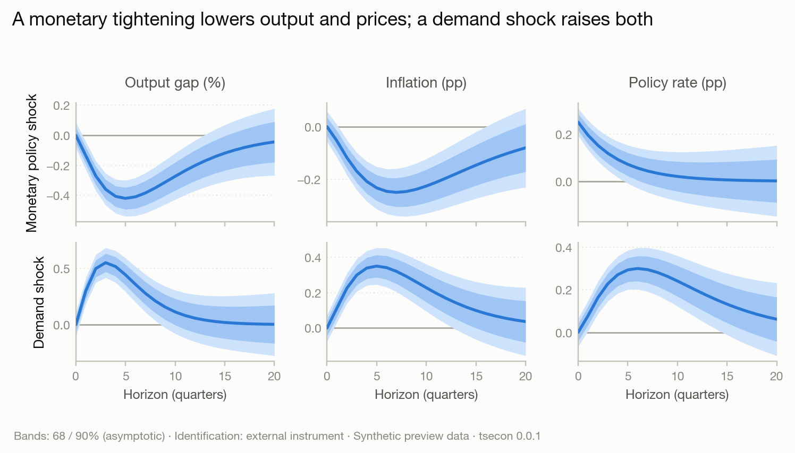
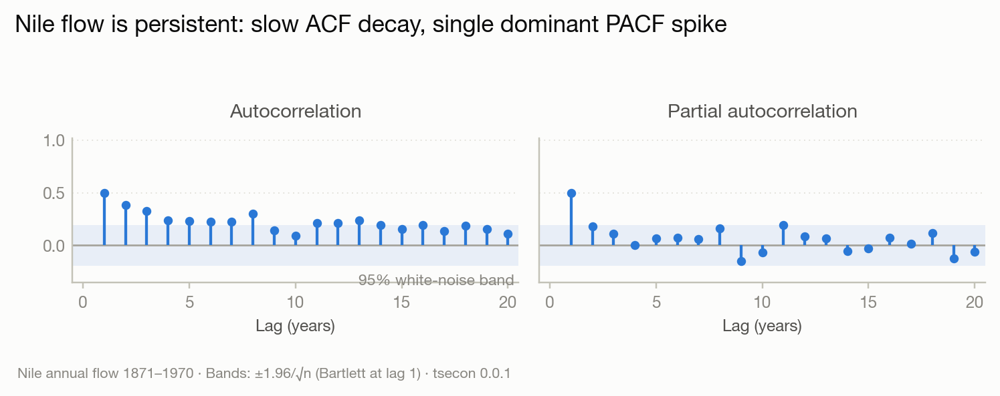
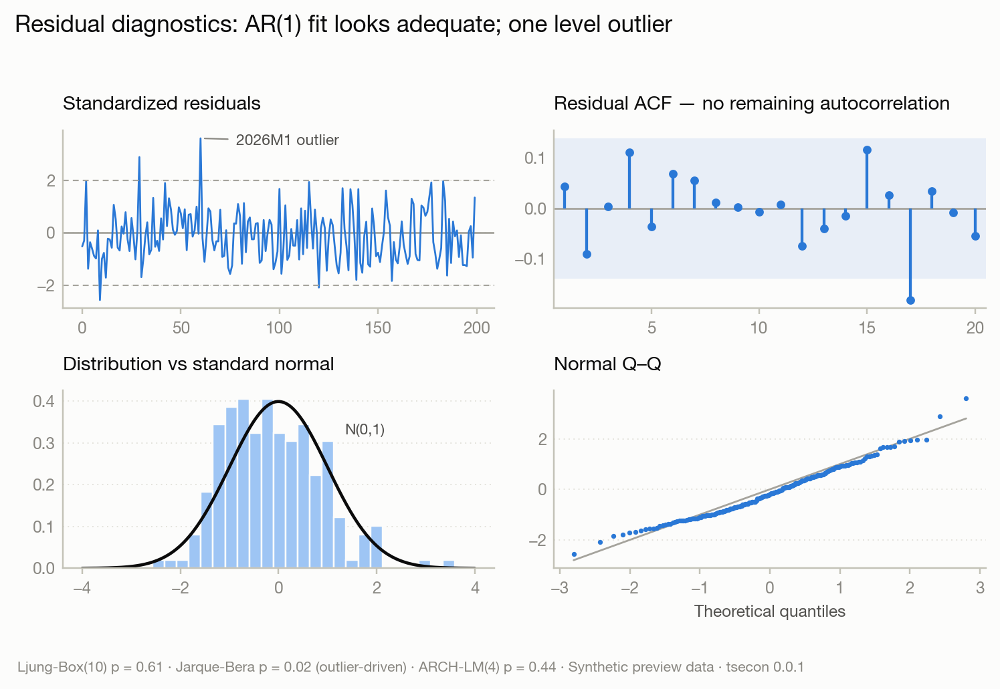

# Module 13 — Visualization

> Part of the time series econometrics library roadmap. Master plan: [ROADMAP.md](../../ROADMAP.md).

**Every figure the library produces should be publication-ready by default: a referee could drop it into a journal submission, a central banker into a briefing deck, without touching a style option.** Most econometrics software treats plotting as an afterthought — default matplotlib output looks like a debugging artifact, R base graphics look dated, and every applied economist maintains a private folder of plotting boilerplate to make IRF panels presentable. This module deletes that folder: a designed visual identity, a catalog of the field's canonical chart types, and one rule everywhere — tidy data first, beautiful default second, full customization third.

## Prototype of the visual identity

A working prototype of the style system lives in [prototypes/viz/](../../prototypes/viz/) (design tokens + matplotlib theme + generator script); the palette passes computational colorblind-safety validation (worst adjacent CVD ΔE 24.2 against a ≥ 12 target). Rendered previews:

| | |
|---|---|
|  |  |
|  |  |

## Purpose and scope

The visualization layer has three jobs:

1. **A designed style system** — one visual identity (typography, color, spacing, annotation conventions) applied consistently across every chart the library emits, with professionally designed themes: `paper` (journal-ready, serif-friendly, grayscale-safe), `presentation` (larger type, higher contrast), `dark` (dashboards/terminals), and `draft` (adds reproducibility stamps: seed, spec, timestamp).
2. **The chart catalog** — the canonical figures of time series econometrics, each implemented once, correctly: IRF panel grids, fan charts, decomposition stacks, diagnostic dashboards, regime shading, news waterfalls. Each Results object's `.plot_*()` methods dispatch into this catalog.
3. **The tidy-data contract** (ratified in Module 00) — every plottable quantity is available as a tidy DataFrame before any figure is drawn, so users of plotnine/altair/ggplot2/D3 are first-class citizens and nothing about the catalog locks anyone in.

Matplotlib remains an **optional** dependency (`pip install tsecon[plots]`): the core wheel never imports it; `.plot()` raises a teaching ImportError naming the extra when it is absent. The catalog is pure Python on top of the tidy-data contract — no plotting code in Rust.

## Design principles (the style contract)

These are binding on every chart in the catalog:

- **Data-ink first (Tufte).** No chartjunk: no heavy grids, no box frames on all four sides, no 3-D, no gradient fills for single series. Despine top/right; light dotted y-grid only where it aids reading values.
- **Colorblind-safe always.** The categorical palette must pass deuteranopia/protanopia/tritanopia simulation with pairwise distinguishability; sequential/diverging ramps are perceptually uniform. Series are additionally distinguishable by line style/marker in grayscale print — color is never the only channel.
- **Uncertainty is the point.** Bands, not whiskers, for IRFs and forecasts; nested translucent bands for multiple coverage levels (e.g., 68/90); credible vs confidence vs sup-t bands visually distinct and always labeled with their method — the band-method stamp comes free from the results object (ROADMAP: confidence intervals carry their method).
- **Zero-lines and reference lines are semantic.** IRF zero-lines, unit-root boundaries, test critical values: drawn in a consistent muted reference style, never the same weight as data.
- **Annotations teach.** Recession/regime shading with labels, break dates with confidence intervals drawn as top-rug intervals, "identification: sign restrictions (Uhlig 2005)" stamps available on IRF panels — figures should be self-documenting.
- **Typography.** One type scale (title/label/tick/caption); sentence-case titles stating the finding ("Output falls for six quarters after a monetary tightening"), not variable names ("resp_y_shock_r"); tabular numerals on axes; no rotated x-labels — thin the ticks instead.
- **Layout at export size.** Figures are designed at their final physical size (single-column 3.25 in, double-column 6.75 in, slide 10 in) so fonts never end up microscopic after scaling — the theme sets sizes per target, and `save(target="aer-single-column")` presets exist.

## Where existing tools fall short

- **statsmodels**: `plot_acf`/IRF plots are unstyled matplotlib defaults; no fan charts; no consistent identity across submodules; every applied paper restyles them from scratch.
- **R `vars`/`lpirfs`**: base-graphics or inconsistent ggplot defaults; IRF panel composition (variables × shocks grids with shared axes) is manual labor everywhere.
- **arch**: minimal plotting; no news-impact curves, no VaR backtest visuals out of the box.
- **Dynare/Matlab**: notoriously 1990s output; economists routinely re-plot Dynare IRFs by hand.
- **Nixtla/darts**: modern-looking but forecasting-only — no structural charts (IRF, FEVD, HD) at all.
- Nothing anywhere ships **visual regression testing**, so plot correctness (band coverage drawn right, shading aligned to dates) silently rots.

## Inventory

### Tier 1 — Core (v1-blocking)

| Chart / capability | What it is / when to use it | Difficulty | Implementation notes and validation target |
|---|---|---|---|
| Style system + themes | The four themes (`paper`, `presentation`, `dark`, `draft`) as matplotlib style contexts plus a token file (colors, type scale, spacing) that other backends can consume. | Medium | Ship as both `mpl` style sheets and a JSON design-token file. Palette validated with a colorblind simulator in CI (colorspacious); grayscale distinguishability test renders to L\* only and checks pairwise ΔL. |
| Tidy-data contract enforcement | Every `.plot_*()` has a `.tidy_*()` twin returning the exact DataFrame the chart consumes. | Low | CI test: catalog functions accept ONLY tidy frames — guarantees the contract never drifts. |
| Time series line plot | The base single/multi-series plot with correct date axis handling (business gaps, quarterly ticks), NaN gap rendering, and event/recession shading. | Medium | Date tick logic is the hard part: quarter/annual locators that never collide, and NBER-style shading from bundled recession dates (Module 11 datasets). |
| ACF/PACF stem panels | Paired panels with Bartlett bands, lag-zero handling, and a Ljung-Box p-value strip beneath. | Low | The first chart every user sees — must match textbook conventions exactly (stems, not bars; bands as translucent ribbon). |
| Forecast fan chart | Point path + nested coverage bands (68/90 default) with history window control, origin marker, and back-transformation awareness. | Medium | Bands from the unified forecast object; two-piece normal and quantile-path parameterizations (Module 09). Validate visually against Bank of England fan chart conventions; band nesting must never invert (monotone coverage). |
| IRF panel grid | The workhorse: variables × shocks grid of IRFs with shared/free axis policy, zero-lines, multiple band types (asymptotic/bootstrap/sup-t/credible) visually distinct, cumulative toggle, identification stamp. | High | One implementation consumed by VAR, SVAR, BVAR, and LP results (the typed IRF object makes this possible). Overlay mode for LP-vs-VAR dual reporting (Module 07) — the two estimators distinguished by line style, bands by fill pattern. Validate: reproduce the exact panel layout of Ramey-Zubairy and Gertler-Karadi figures in the replication gallery. |
| Residual diagnostic dashboard | One-call 2×2/2×3 figure: standardized residuals, ACF, histogram + fitted density, QQ plot; extends with squared-residual ACF for volatility models. | Medium | The `.plot_diagnostics()` every Results object exposes; matches and beats statsmodels' equivalent. QQ envelope via pointwise simulation bands, not the naive straight line alone. |
| Decomposition stack | Trend/seasonal/cycle/remainder stacked panels (STL, UC, BN, X-13 output) with shared x-axis and per-component y-scaling policy. | Low | Component ordering and free-y conventions from R `feasts::autoplot` — the best existing implementation; improve typography. |
| Export presets | `fig.save("name", target=...)` with targets: `aer-single`, `aer-double`, `slide-16x9`, `png-web`; embeds fonts in PDF/SVG; sets dpi, size, and type scale per target. | Low | The feature that makes "publication-ready by default" literal. Reproducibility stamp (seed/spec hash) in PDF metadata always, visible footer only in `draft` theme. |
| Visual regression harness | Image-hash (perceptual) comparison of every catalog chart against blessed baselines in CI. | Medium | matplotlib's `image_comparison` machinery with per-platform font pinning; regenerate-baseline workflow documented. This is what keeps 60 chart types from silently rotting. |

### Tier 2 — Standard

| Chart / capability | What it is / when to use it | Difficulty | Implementation notes and validation target |
|---|---|---|---|
| FEVD area/bar chart | Stacked shares of forecast-error variance by shock across horizons. | Low | Stacked area with the categorical palette; shares must visibly sum to one (no rounding gaps). |
| Historical decomposition bars | Signed stacked bars of shock contributions with the actual series overlaid — the standard structural narrative figure. | Medium | Bar stacking with mixed signs done right (positive/negative stacks separated); consumed by SVAR/BVAR/LP-HD results. |
| Regime/state plots | Smoothed regime probabilities as filled ribbons with regime shading on the data panel (MS-AR, MS-VAR, threshold/STAR transition functions). | Medium | Dual-panel: data with shading above, probability ribbon below; STAR transition function plotted over the threshold variable's histogram. |
| News-impact curve | Volatility asymmetry visual for the GARCH zoo (Module 03). | Low | Engle-Ng conventions; overlay multiple fitted models for comparison. |
| VaR/ES backtest chart | Returns with VaR line, exception markers, and traffic-light summary strip (Basel convention). | Low | Exceptions color-coded by cluster; Kupiec/Christoffersen results in the caption block automatically. |
| Nowcast news waterfall | Banbura-Modugno news decomposition of nowcast revisions by release, over the nowcasting calendar. | Medium | Waterfall bars by data release with running nowcast line; the NY-Fed-style weekly update figure, done properly. Validate against the published NY Fed nowcast charts' semantics. |
| Forecast evaluation dashboard | Cumulative loss differentials (Giacomini-Rossi fluctuation bands), rolling RMSE ratios, and MCS membership over time. | Medium | Consumed from Module 09 result objects; fluctuation test critical bands drawn as reference regions. |
| PIT histogram + calibration plots | Density-forecast evaluation visuals: PIT bars with uniform band, reliability diagrams (CORP), sharpness insets. | Low | Bands via Rossi-Sekhposyan/pointwise binomial; caption auto-reports Berkowitz p-value. |
| Break/stability plots | CUSUM/MOSUM paths with crossing boundaries, Bai-Perron break dates with CIs as top-rug intervals, qLL/fluctuation statistics. | Low | Boundary crossing shaded and labeled with the test decision. |
| Spectrum/periodogram plots | Raw + smoothed periodogram with business-cycle band shading (6–32 quarters), coherence/phase panels. | Low | Log-scale conventions, harmonic reference lines for seasonal frequencies. |
| Connectedness heatmap + network | Diebold-Yilmaz spillover tables as ordered heatmaps and directed network diagrams (node size = net transmitter). | Medium | Force layout optional (networkx optional dep); heatmap ordering by net spillover; rolling total-connectedness line panel. |
| Model comparison table-figures | Coefficient/IC comparison across specifications as dot-and-interval plots (never bare tables of stars). | Low | The "specification curve lite" — estimates with CIs across model variants, sorted. |

### Tier 3 — Advanced (differentiators)

| Chart / capability | What it is / when to use it | Difficulty | Implementation notes and validation target |
|---|---|---|---|
| Interactive backend (plotly/bokeh adapter) | Same catalog, interactive rendering for dashboards and notebooks: hover values, band toggling, zoom-linked panels. | High | Adapter pattern over the tidy-data contract — the catalog describes charts declaratively enough that a second backend renders them; plotly as optional extra. Never let interactivity drive the catalog's design. |
| Diagnostic report page | `check_series()` (Module 01) renders its full battery as a one-page composed figure/HTML report: the series, ACF/PACF, tests table with teaching interpretations, decomposition, recommendations. | Medium | The "first five minutes with your data" artifact; HTML variant with the same design tokens. |
| Prior/posterior visualization suite | BVAR prior-vs-posterior densities, shrinkage visualizations (Minnesota tightness), trace/rank plots wired to ArviZ interop (Module 05). | Medium | Delegate MCMC internals to ArviZ where possible, restyle to house identity; prior-predictive fan charts as first-class. |
| Identified-set visuals | Sign-restriction IRF bounds (Giacomini-Kitagawa robust-Bayes bands vs single-prior bands), rotation-cloud scatter diagnostics (Module 06). | Medium | The honest-set-identification figure no tool ships; bounds vs bands visually distinct by construction. |
| Scenario/conditional forecast plots | Multi-scenario fan overlays with scenario labeling and conditioning-path markers (Waggoner-Zha, covariate scenario paths). | Medium | Consumes the covariate contract's scenario objects; scenarios distinguished by hue with one shared history. |
| Vintage/real-time triangle plots | Revision triangles and vintage-path spaghetti for real-time data (Module 08). | Low | Heatmap triangle + selected vintage paths; release-calendar strip charts. |
| Wavelet/time-frequency heatmaps | Scalograms and wavelet coherence with cone-of-influence shading (Module 01 advanced). | Medium | Perceptually uniform sequential ramp mandatory; significance contours from surrogate simulation. |
| Animation support | IRF evolution over rolling windows / TVP parameter paths as animations for teaching and presentations. | Low | matplotlib FuncAnimation to mp4/gif with theme-consistent styling; strictly sugar over tidy outputs. |

### Tier 4 — Frontier

| Chart / capability | What it is / when to use it | Difficulty | Implementation notes and validation target |
|---|---|---|---|
| Grammar-of-graphics declarative spec | Publish the catalog's internal chart descriptions as a documented declarative schema (Vega-Lite-adjacent) so third parties can render the catalog in any stack. | High | Only after the catalog stabilizes; the tidy contract plus a chart schema makes the library's figures fully portable. |
| Auto-figure-caption generation | Results objects draft figure captions ("Impulse response of output to a 25bp monetary shock; sup-t 90% bands; identification via external instrument (Gertler-Karadi 2015)") from their own metadata. | Low | All metadata already exists on results objects; a formatting exercise with large paper-writing payoff. |
| Publication figure bundles | One call exports every figure of a standard paper section (IRFs, FEVD, HD, robustness overlays) with consistent numbering, plus a `.tex` include file. | Medium | Pairs with Module 11's replication-bundle export. |

## Implementation warnings

- **Dates are where plotting libraries go to die.** Quarterly/annual tick locators, fiscal-year anchoring, and business-day gaps must come from the foundations time-index engine — never from matplotlib's auto-locators, which produce misaligned quarter labels and phantom weekend gaps.
- **Band nesting must be enforced, not assumed.** With bootstrap or quantile bands, 68% can cross 90% in finite samples; the fan/IRF renderers must monotonize coverage (rearrangement) or refuse, never silently draw inverted bands.
- **Mixed-sign stacked bars** (historical decomposition) are wrong in every naive implementation — positive and negative contributions must stack from zero separately per period.
- **Color is not a channel for meaning alone**: grayscale print and colorblind simulation tests in CI are gates, not suggestions.
- **Per-platform font differences** break image-based regression tests — pin fonts in CI (ship the font with the test suite) and compare perceptual hashes, not bytes.
- **Never plot through missing data**: NaN gaps render as gaps; interpolation for display is a lie about the data and is off everywhere, always.
- **Theme leakage**: style contexts must be scoped (context managers) so the library never mutates a user's global matplotlib rcParams.

## Dependencies and shared infrastructure

- **Consumes**: the tidy-data contract and design-token policy (Module 00, ratified); the typed IRF object (band methods and identification metadata drive the IRF grid); the unified forecast object (fan charts); the covariate contract's scenario objects (scenario plots); the time-index/calendar engine (all date axes); bundled recession dates and datasets (Module 11); results objects of every module (each declares its `.plot_*()` set in its model card).
- **Exposes**: the style system and export presets to every module's `.plot()` methods; the visual regression harness to CI; the design-token file to the docs site (docs and library figures share one identity).
- **Explicitly not owned here**: statistical computation of anything plotted (bands, decompositions, probabilities all arrive computed from their owning modules — this module renders, it never re-estimates).

## Validation gallery

- **Ramey-Zubairy (2018) and Gertler-Karadi (2015) IRF panel figures** — the replication-gallery reproductions must match the papers' layouts closely enough for side-by-side comparison.
- **Bank of England-convention fan chart** on the bundled GDP series — nested-band rendering audit.
- **statsmodels `plot_acf`/`plot_diagnostics` parity tests** — same statistical content, demonstrably better design (the before/after pair is a marketing asset).
- **NY Fed nowcast news figure semantics** on the Banbura-Modugno replication.
- **Colorblind + grayscale CI gates** — palette simulation checks pass for every theme.
- **Visual regression baselines** — every Tier 1/2 chart pinned against blessed images in CI.
